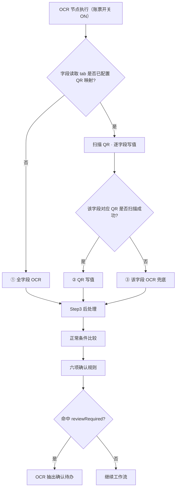
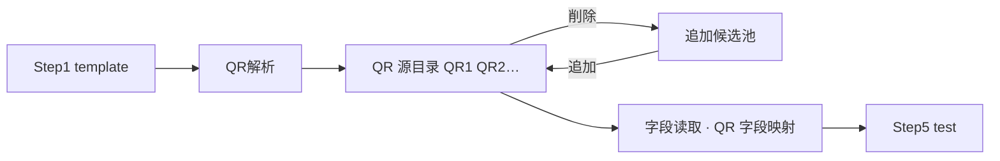

# NeosAI 日本保险 IDP — 产品需求文档（PRD · Phase2）

## 第 1 章｜文档基础与范围

### 1.1 文档定位

本 PRD 为第二期增量，面向 Z 客户保险金请求场景。未重写部分见第一期 PRD。


| 文档              | 链接                                                                    | 覆盖范围                     |
| --------------- | --------------------------------------------------------------------- | ------------------------ |
| 第一期总 PRD        | [neosai-idp-prd.vercel.app](https://neosai-idp-prd.vercel.app/)       | 平台背景、操作端、账票类型、实体状态、角色权限等 |
| 第一期业务场景与工作流 PRD | [idp-workflow-nwxh.vercel.app](https://idp-workflow-nwxh.vercel.app/) | 业务场景四步向导、工作流画布与节点        |


第 6 章写本期增量：业务场景设置、账票类型、我的任务。HTML 评审稿：`npm run build:prd:full` → `prd-public/index.html`。

### 1.2 第二期交付范围

本期在 Z 客户保险金请求场景下，补齐前处理节点内的画像不正検知、敏感情报检出，以及账票类型侧的 QR 字段读取与正常值校验。QR 字段映射、读取模式、正常值范围均在账票类型设置（Step2/Step3）维护；OCR 抽出节点配置面板沿用 P1（开关 + 对象账票），运行时引擎读取账票配置执行抽取。

#### 工作流


| 能力        | 说明                                                    |
| --------- | ----------------------------------------------------- |
| 前处理节点（增量） | 在 P1 前处理节点内新增画像不正検知、敏感情报检出；各模块可独立 ON/OFF，并按对象账票指定执行范围 |
| 业务场景通知扩展  | Step3 通知规则在前处理、OCR 等对象节点下配置处理状态/处理结果触发；站内信与邮件双渠道投递    |


推荐主链：开始 → 前处理 → 条件判断 → 人工确认 → OCR 抽出 → 条件判断 → 人工确认 → 数据映射 → AI 检证 → 条件判断 → 人工确认 → 自定义函数 → 终了。

#### 业务场景设置（增量）


| 步骤        | 本期追加                   |
| --------- | ---------------------- |
| Step2 工作流 | 前处理两子模块（画像不正検知、敏感情报检出） |
| Step3 通知  | 邮件渠道 + 多个邮件地址          |
| Step4 输出  | 勾选 UI 不变；运行时已脱敏则导出脱敏后值 |


#### 账票类型设置（增量）


| 步骤          | 本期追加                                                      |
| ----------- | --------------------------------------------------------- |
| Step1 AI 分类 | 分類信頼度閾値（必填）                                               |
| Step2 AI 读取 | OCR/QR 切换（仅字段读取tab）；OCR：マスク列；QR：源扫描与字段映射；                 |
| Step3 处理规则  | テキスト読取 / テーブル情報読取 双 tab；正常值范围（正常条件列）；读取模型弹窗新增第六项「正常值范围超出」 |
| Step5 效果测试  | QR/OCR 来源 读取综合 test                                       |


Step1 其余字段、Step4 图像处理及 Step2 读取模型弹窗主体沿用第一期。

#### 引擎与运行时


| 能力          | 说明                                                                                       |
| ----------- | ---------------------------------------------------------------------------------------- |
| 通用 QR 解析    | 配置端在 Step1 样张扫描 QR 源；运行时 OCR 节点执行时读取账票 Step2 配置，调用工具扫描/解码                                |
| 分类信頼度校验     | 账票 Step1 分類信頼度閾値；案件集约阶段比对 files[].classificationConfidence；低于阈值 → 集约确认待办                 |
| 正常值范围校验     | 账票 Step3 配置；OCR 节点执行时后处理完成后逐字段正常条件比较；数值/日期范围直接比对后处理产物与配置阈值；超出正常值触发 OCR 抽出确认待办            |
| QR 与 OCR 协同 | 账票 Step2 读取路由三种情况：① 未配置 QR 映射 → 全字段 OCR；② 已配置且 QR 扫到 → 映射写值；③ 已配置但某 QR 未扫到 → 对应字段 OCR 兜底 |
| 画像不正検知      | PS 加工、AI 生成、模板特征等检测；模型二值输出（是/否）；判「是」→ preprocessResult=reviewRequired → 前处理人工确认          |
| 敏感情报检出      | 对 Step2 マスク=ON 字段实例脱敏；脱敏在 OCR 前                                                          |
| 邮件分发        | Step3 规则命中且勾选邮件时投递；与站内信并行                                                                |


#### 范围边界


| 类别  | 第二期                                                    |
| --- | ------------------------------------------------------ |
| 配置端 | 前处理两子模块；账票 Step1～3、Step5 增量；业务场景 Step3 邮件、Step4 导出取值规则 |
| 操作端 | 不新增菜单；我的任务 OCR 确认规则扩展；前处理确认页脱敏预览                       |
| 引擎  | 画像不正検知、敏感情报检出、QR 工具、正常值校验、邮件分发                         |


画布建模定稿见 1.3；工作流与通知增量见 6.01。

### 1.3 工作流架构（前处理模块化）

画像不正検知、敏感情报检出作为前处理节点内子模块交付，不新增独立画布节点。运行时均在 OCR 抽出之前；模块顺序固定为：

```
画像不正検知 → 敏感情报检出 → 画像回転 → 画像補正 → 画像整列
```

（脱敏先于几何处理）

```
开始 → 前处理 → 条件判断 → … → OCR 抽出 → …
         ↑
    单一节点，内含 5 个子模块（各：模块开关 + 对象账票）
```


| 项         | 规则                                                                              |
| --------- | --------------------------------------------------------------------------------- |
| 配置 UI     | 前处理节点配置面板「前処理設定」；五模块均为开关 + 对象账票多选；敏感情报检出对象账票仅限 Step1 关联且 Step2 存在マスク=ON 的文本字段或表格列 |
| OCR 抽出节点  | 配置面板沿用 P1（开关 + 对象账票）；QR/正常值/后处理规则来自账票类型 Step2/Step3，运行时消费                         |
| 文件状态 | 沿用 P1 四段（前処理 / 前処理確認 / OCR抽出 / OCR抽出確認）；子模块不单独占段                                  |


### 1.4 本期里程碑

交付范围见 1.2；待确认假设见 1.5。


| 域   | 模块               | 里程碑                                                |
| --- | ---------------- | -------------------------------------------------- |
| 配置端 | 业务场景 · Step2 前处理 | 前处理节点含画像不正検知、敏感情报检出模块；OCR 抽出节点无配置变更                |
| 配置端 | 业务场景 · Step3 通知  | 前处理/OCR 等对象节点触发；站内信 + 邮件双渠道               |
| 配置端 | 业务场景 · Step4 输出  | 输出字段勾选 UI 不变；运行时已脱敏则导出脱敏后值；QR/OCR 写入值经后处理后正常导出     |
| 配置端 | 账票类型 · Step1     | 分類信頼度閾値必填；template 样张供 QR 扫描                       |
| 配置端 | 账票类型 · Step2     | OCR/QR 读取模式切换；OCR 模式维护字段主数据 + マスク；QR 模式配 QR 源与字段映射 |
| 配置端 | 账票类型 · Step3     | 正常值范围（正常条件列）；读取模型弹窗六项确认规则                          |
| 配置端 | 账票类型 · Step5     | 综合 test：QR/OCR 结果、正常值结论、マスク対象、读取来源标签               |
| 运行时 | 前处理链             | 不正検知 → 脱敏 → 回転 → 補正 → 整列；脱敏在 OCR 前                 |
| 运行时 | OCR 抽出           | 节点开关同 P1；引擎读账票 Step2/Step3 执行 QR/OCR 路由、后处理与正常值校验  |
| 运行时 | 我的任务             | 六项确认规则 → OCR 抽出确认；画像不正 → 人工确认；前处理确认页脱敏预览           |
| 验收  | 原型               | 上述配置与运行时路径可在 workflow-ph2 原型演示                     |


### 1.5 假设与依赖

平台假设见 1.1。

本期正文按下列假设编写，研发与原型可据此推进；标注「待确认」的条目须经客户确认后定稿。


| 能力模块       | 假设                                                                                                                | 状态  |
| ---------- | ----------------------------------------------------------------------------------------------------------------- | --- |
| 敏感情报检出     | 脱敏范围按 Step2 マスク=ON 的文本字段或表格列及前处理模块对象账票；验收样张与效果图由客户提供                                                              | 待确认 |
| 敏感情报检出     | 脱敏方式为黑块填充                                                                                                         | 待确认 |
| 敏感情报检出     | 脱敏后保留并可导出原图，同时保留脱敏后文件                                                                                             | 待确认 |
| 敏感情报检出     | OCR 前实例脱敏；OCR 抽出读取脱敏后实例；脱敏先于几何处理（回転 → 補正 → 整列）                                                                    | 待确认 |
| 敏感情报检出     | 敏感情报检出由本地部署大模型完成                                                                                                  | 待确认 |
| 正常值校验      | Step3「正常条件」支持：範囲内、<、≤、>、≥、列挙（枚举）；运行时在後処理完成后比较；数值/日期类后处理产物已与阈值同为无单位标准化值，正常条件比较不再做单位换算；列挙 做字符串归一化后匹配                | 待确认 |
| 正常值校验      | 字段超出正常值进 OCR 抽出确认；不设独立待办类型                                                                                        | 待确认 |
| 后处理        | 客户提出的单位/量纲统一在 Step3 **処理ルール**（后处理）阶段完成；数字类规则须支持去后缀与跨单位标准化（如 cm→m、万円→円）；实现以规则引擎为主，必要时读取模型（LLM）辅助；**不在**正常条件比较步重复换算 | 待确认 |
| QR Code 读取 | 账票 Step2 OCR設定 / QR設定；运行时三种路由：未配置映射全 OCR、QR 扫到写值、QR 未扫到对应字段 OCR 兜底                                                | 待确认 |
| QR Code 读取 | 本期 QR 解析与映射以 Z 客户诊断书 template 为主                                                                                  | 待确认 |
| QR Code 读取 | QR 与 OCR 路径汇合后统一后处理与人工确认规则判定；不设 QR 专属人工确认规则                                                                       | 待确认 |
| 画像不正検知     | 前处理模块按业务场景 Step1 关联账票逐行开关；具体 ON 列表由客户指定                                                                           | 待确认 |
| 画像不正検知     | 模板特征检测依赖 Step1 template 与客户提供的正常样张库                                                                               | 待确认 |
| 画像不正検知     | PS 加工、AI 生成、模板特征三类均纳入检测；UAT 试样集与客户共同定义                                                                            | 待确认 |


### 1.6 跨模块影响

通知与待办独立：通知仅提醒，待办须办结。


| 模块         | 画像不正 / 正常值 / QR                                            | 敏感情报检出                  | 通知（Step3）      |
| ---------- | ---------------------------------------------------------- | ----------------------- | -------------- |
| 我的任务       | 六项确认规则任一命中 → OCR 抽出确认；QR 与 OCR 路径汇合后统一判定；前处理确认页增加遮挡预览与字段打码 | 不新增脱敏专用待办               | 通知不生成待办；可与待办并行 |
| 案件详情       | 展示 QR/OCR 写入并经后处理的字段值                                      | 已脱敏时展示脱敏后字段/文件          | 案件状态随节点失败信号汇聚  |
| 导出         | 导出 OCR 字段含 QR 写入值                                          | 已脱敏则导出脱敏后值              | —              |
| 业务场景 Step2 | 前处理面板新增两子模块                                                | 敏感情报检出对象账票受 Step2 マスク约束 | Step3 新增邮件渠道   |
| 业务场景 Step4 | 导出字段含 QR 写入并经后处理的值                                         | 已脱敏则导出脱敏后值              | —              |
| 账票类型       | Step1 阈值；Step2 OCR/QR/マスク；Step3 正常范围                       | Step2 マスク定义脱敏对象         | —              |


---


## 第 2 章｜术语与词汇表


### 2.1 术语表（本期新增）


| 中文       | 日语/界面   | 定义                                                                                  |
| -------- | ------- | ----------------------------------------------------------------------------------- |
| 画像不正検知   | 画像不正検知  | 前处理节点内模块：整合 PS 加工、AI 生成图像、模板特征不一致检测；模型输出二分值（是/否）；模块开关 + 对象账票；无风险分数与阈值配置             |
| QR 字段读取  | QR読取    | 运行时能力：仅针对 Step2 字段读取 tab（界面：テキスト読取）配置的 QR 映射；OCR 节点执行时工具扫描/解码并按映射写值；テーブル情報読取 不参与 QR |
| QR 源     | QRソース   | 账票级逻辑槽位（QR1、QR2…）；配置端在固定账票下方扫描区域内从左到右检出；检出几个生成几个；可删除移入追加候选池或从候选池追加回目录               |
| 追加候选池    | 追加候補    | 扫描检出但用户从 QR 源目录删除的项；经源条「追加」加回目录；未在目录内时不参与字段映射与运行时写值                                 |
| 取值方法     | 取値方法    | 字段级 QR 分割开关：关闭时全文取值，开启时按分割符与字段排序取值                                                  |
| 分割符      | 区切り文字   | 分割模式下用于 split QR 解码串的 delimiter；连续分隔符之间视为空字段；段内空串或空值占位亦视为空                          |
| 字段排序     | 順序      | 分割模式下，从 QR 解码串中取第几个片段（1 起）；同一 QR 源内 N=该源分割映射字段总数，順序须为 1～N 连号且不重复                    |
| 正常范围     | 正常範囲    | Step3 処理ルール：テキスト読取 字段与 テーブル情報読取 列均可配置的可选校验规则；支持最小值、最大值等                             |
| AI マッチング | AIマッチング | Step3 工具栏：为 Step2 已有字段自动生成并反映处理规则；不生成【正常条件】                                         |
| 敏感情报检出   | 敏感情報検出  | 前处理节点内模块：对 Step2 脱敏=ON 的字段检测 PII 并输出脱敏结果；模块开关 + 对象账票                                |
| 分類信頼度閾値  | 分類信頼度閾値 | Step1 必填项：案件集约识别分类阶段的账票分类置信度下限（百分比）                                                 |
| 账票类型设置   | 帳票タイプ設定 | 配置端账票主数据模块；Step2 含 OCR/QR 双模式与脱敏；Step3 含処理ルール（P1）与正常范围（P2 增量）                       |


### 2.2 易混术语（精选）


| 中文                  | 区分要点                                                                        |
| ------------------- | --------------------------------------------------------------------------- |
| OCR 模式 vs QR 模式     | 仅字段读取 tab（テキスト読取）可切换 OCR/QR；字段主数据在 OCR 模式维护，QR 模式只配 QR 源与取值；テーブル情報読取 固定 OCR |
| 账票读取模式 vs 字段 OCR 兜底 | 三种路由：① 未配置 QR 映射 → 全字段 OCR；② QR 扫到 → 映射写值；③ 某 QR 未扫到 → 对应字段 OCR 兜底          |
| 前处理模块 vs 独立节点       | 画像不正检测、敏感信息检出在画布前处理节点内配置                                                    |
| 正常范围 vs AI 检证       | 正常范围在账票 Step3 配置、OCR 节点执行时校验；AI 检证在独立节点跨字段                                  |
| 配置 test vs 前处理确认预览  | Step5 标记脱敏对象；遮挡预览与打码在前处理确认页                                                 |
| OCR 抽出确认 vs 人工确认    | OCR 字段复核 vs 画像不正复核，分属不同待办                                                   |
| Step4 导出 vs マスク     | Step4 只勾选输出字段；マスク 在账票 Step2 定义；运行时已脱敏则导出脱敏后值                                |


## 第 3 章｜数据结构与状态（第二期增量）


### 3.1 账票类型实体增量


| 属性       | 说明                                                                                                                  |
| -------- | ------------------------------------------------------------------------------------------------------------------- |
| 分類信頼度閾値  | Step1 必填；0～100 整数百分比；案件集约阶段对每个文件执行账票类型 AI 分类时，classificationConfidence 低于该阈值 → 进入集约确认（人工确认账票类型归属）                   |
| QR 源目录   | qrSources[]：id（QR1、QR2…）、检测框、解码文本；Step1 样张经工具在下方区域从左到右扫描写入；可删至追加候选池或从候选池加回                                          |
| 追加候选池    | qrIgnored[]：扫描检出但不在目录内的 QR；重扫时保留用户排除状态                                                                              |
| 账票读取模式   | Step2 读取设定：OCR設定（整票纯 OCR）；QR設定（须至少一条文本字段绑定 QR 源才走 QR 优先 + 字段失败 OCR 兜底，否则自动等同 OCR設定）；表格字段固定 OCR                      |
| 字段 QR 映射 | 仅字段读取 tab（テキスト読取）· QR設定：qrSourceId、extractMethod、delimiter（分割符）、segmentIndex（字段排序）；type/必須/マスク等继承 OCR 模式，不在 QR 模式编辑 |
| 字段正常值范围  | Step3 処理ルール：テキスト読取 字段行 + テーブル情報読取 各表列行；正常条件（範囲内、<、≤、>、≥、列挙）与后处理同表配置                                                 |
| 脱敏标记     | Step2 OCR設定：テキスト読取 字段行 + テーブル情報読取 列行 マスク开关（QR 模式对文本字段只读继承，表格无 QR）                                                   |


同一诊断书账票类型可覆盖有 QR 与无 QR 物理件；运行时按三种路由：未配置映射全 OCR、QR 扫到写值、QR 未扫到对应字段 OCR 兜底。

### 3.2 前处理子模块顺序与文件状态

在 [第一期 · 前处理节点](https://idp-workflow-nwxh.vercel.app/)（画像回転 / 画像補正 / 画像整列）之前，新增并固定插入：

```
画像不正検知 → 敏感情报检出 → （P1 三项子模块）
```


| 步骤  | 模块           | 理由                      |
| --- | ------------ | ----------------------- |
| 1   | 画像不正検知       | 优先在原实例上判定篡改/伪造风险        |
| 2   | 敏感情报检出       | OCR 读脱敏后实例；几何变换前先遮罩个人信息 |
| 3～5 | 回転 → 補正 → 整列 | 沿用 P1                   |


文件状态 四段枚举不变；五个子模块进度汇总至 preprocessStatus / preprocessResult，不在案件一覧展示子模块名。


| 处理节点    | 界面组合示例                               | 触发条件（P2）                       |
| ------- | ------------------------------------ | ------------------------------ |
| 前処理     | 前処理等待 / 前処理中 / 前処理成功 / 前処理失敗         | 含节点内全部已启用子模块（不正検知、脱敏、回転→補正→整列） |
| 前処理確認   | 前処理確認待ち                              | 前处理 HITL 待办未办结（沿用 P1）          |
| OCR抽出   | OCR抽出待ち / OCR抽出中 / OCR抽出成功 / OCR抽出失敗 | 读取前处理输出实例（含脱敏后）                |
| OCR抽出確認 | OCR抽出確認待ち                            | OCR 抽出确认待办未办结                  |


### 3.3 联级关系

画像不正检测、敏感信息检出的失败与待办信号参与案件状态汇总；八种案件状态枚举不变。

---


## 第 4 章｜用户交互流程


### 4.1 操作入口与分工

本章按第二期五项增量能力组织用户故事：正常值校验、マスク（敏感情报检出）、画像不正検知、通知（邮件）、QR 读取。操作端入口分工、待办类型、案件状态均沿用 [第一期总 PRD](https://neosai-idp-prd.vercel.app/)。

原则：待办在「我的任务」办结；整体进度在「案件列表」检索；字段修正发生在待办执行页。


| 入口                 | 谁常用       | 用户要做什么                             |
| ------------------ | --------- | ---------------------------------- |
| 账票类型设置             | admin     | Step2 マスク/QR；Step3 正常值；Step5 test  |
| 业务场景设置             | admin     | Step2 前処理設定（不正検知、脱敏）；Step3 通知（含邮件） |
| 新增上传 / 案件列表 / 我的任务 | 操作员       | 上传集约、跟踪进度、办结待办                     |
| 站内信                | 操作员、操作管理者 | 查阅通知（可与邮件并行；不生成待办）                 |


---


### 4.2 故事：正常值校验

角色：admin（配置正常条件）；操作员（办结 OCR 抽出确认）

目标：在账票类型 Step3 为数值/枚举字段配置正常范围；运行时 OCR 节点执行后处理时校验，超出则进 OCR 抽出确认，经办修正后继续流程。

配置流程：

```
账票类型 Step3 → 字段行启用正常条件 → 读取模型弹窗勾选「正常値範囲を超えています」→ Step5 test 查看范围结论
```

1. admin 在 Step3 処理ルール表为字段或表格列配置正常条件（範囲内、<、≤、>、≥、列挙）并填写阈值或枚举值；テキスト読取 / テーブル情報読取 双 tab 结构一致，表格 tab 按各テーブル卡片分组展示列规则。
2. 在读取模型设置弹窗确认六项确认规则中包含第六项「正常値範囲を超えています」。
3. Step5 效果 test：テキスト読取 字段卡片、テーブル情報読取 表格 test 均展示範囲OK / 範囲越界结论；越界样张用于验收配置。
4. 发布业务场景后，运行时引擎在 OCR 节点执行时读取 Step3 配置校验（OCR 节点配置面板无新增项）。

运行流程：

```
OCR 抽出（后处理完成）→ 正常条件比较 → 超出 → ocrResult=reviewRequired → 我的任务 · OCR 抽出确认
```

1. 案件集约完成后工作流推进至 OCR 抽出；引擎读取账票 Step3，对已后处理的文本字段与表格列逐条执行正常条件比较。
2. 比较输入为该行 **処理ルール** 执行完毕后的字段值（数字类经后处理去单位/量纲统一、日期类已规范为 `yyyy-MM-dd`）；与 Step3 配置的阈值或枚举直接判定；未配置正常条件的字段跳过。
3. 某字段超出正常值（如通院日数后处理值为 `20`，配置範囲内 `1`～`15`）→ 该账票合并一条 OCR 抽出确认待办；理由含「正常値範囲を超えています」。
4. 操作员在 my 任务打开待办，对照实例修正字段值；要確認字段高亮 + 可编辑，不展示越界区间说明。
5. 修正后仍超出或必填仍空 → 阻断办结；通过后工作流继续。

---


### 4.3 故事：マスク（敏感情报检出）

角色：admin（定义脱敏对象与启用模块）；操作员（查看脱敏结果；无专用待办）

目标：在账票 Step2 标记需脱敏字段，在业务场景前处理启用敏感情报检出；运行时在 OCR 前对实例脱敏，导出与详情展示脱敏后值。

配置流程：

```
账票 Step2 OCR設定 · 文本字段/表格列 マスク=ON → 业务场景 Step2 前処理設定 · 敏感情报检出 ON + 对象账票
```

1. admin 在账票类型 Step2 OCR設定 下，对需脱敏的文本字段或表格列开启マスク列（如患者氏名、住所；テキスト読取 / テーブル情報読取 均有マスク列）。
2. 在业务场景 Step2 前処理設定 开启「敏感情报检出」，选择对象账票（可选范围 = Step1 关联且存在マスク=ON 文本字段或表格列的账票）。
3. Step5 test 标记マスク対象；不展示脱敏后像素预览（遮挡预览在前处理确认页，见运行流程）。
4. 业务场景 Step4 输出字段勾选 UI 不变；运行时若已脱敏则导出脱敏后值。

运行流程：

```
前处理：画像不正検知 → 敏感情报检出（PII 检测 + 黑块填充）→ 回転 → 補正 → 整列 → OCR 抽出读脱敏后实例
```

1. 工作流进入前处理节点；敏感情报检出对マスク=ON 字段所在实例执行脱敏。
2. 脱敏成功 → 后续 OCR 抽出读取脱敏后实例；案件详情与导出字段值为脱敏后值。
3. 前处理确认页（已脱敏场景）：原图 / 遮挡后 Tab 切换预览，默认遮挡后；マスク=ON 字段值统一打码展示。
4. 脱敏 Agent 失败 → preprocessStatus=failed，走案件异常；不新增脱敏专用待办；可并行收到 Step3 通知。

---


### 4.4 故事：画像不正検知

角色：admin（启用模块）；操作员（人工确认待办）

目标：在前处理节点启用画像不正検知，对指定账票检测 PS 加工/AI 生成/模板特征异常；判「是」时进人工确认（非 OCR 抽出确认）。

配置流程：

```
业务场景 Step2 → 前処理設定 → 画像不正検知 ON + 对象账票 → Step3 可选配置 preprocessResult=reviewRequired 通知
```

1. admin 在业务场景 Step2 前処理設定 开启「画像不正検知」，按 Step1 关联账票逐行指定对象（未指定则视为全部关联账票）。
2. 依赖账票 Step1 template 与客户正常样张库做模板特征比对。
3. 可选：Step3 为前处理对象配置 preprocessResult=reviewRequired 或 preprocessStatus=failed 的通知规则。
4. 画布节点库不出现独立「画像不正検知」节点类型。

运行流程：

```
前处理 · 画像不正検知 → 模型输出「是」→ preprocessResult=reviewRequired → 我的任务 · 人工确认
```

1. 前处理串行执行时，画像不正検知在脱敏与几何处理之前运行。
2. 模型二值输出「是」→ 生成人工确认待办；操作员在人工确认页选择完了/补件/案件中止。
3. 输出「否」→ 继续后续子模块与 OCR 抽出。
4. 检测服务异常 → preprocessStatus=failed；可走案件异常与 Step3 告警，不进 OCR 抽出确认。

---


### 4.5 故事：通知（站内信 + 邮件）

角色：admin（配置规则）；操作员、操作管理者（收件人）

目标：在业务场景 Step3 扩展邮件渠道；前处理/OCR 等节点事件命中规则时并行投递站内信与邮件；通知仅告知，不替代待办。

配置流程：

```
业务场景 Step3 → 通知ルール追加 → 对象节点 + 触发事件 + 渠道（站内信/邮件）+ 邮箱地址 + 件名/正文
```

1. admin 选择对象节点（如前处理、OCR 抽出）与触发事件（如 preprocessStatus=failed、preprocessResult=reviewRequired、ocrResult=reviewRequired）。
2. 通知渠道多选站内信、邮件，至少选一；勾选邮件时填写邮箱地址（多地址分隔，格式校验）。
3. 编辑件名/正文，可插入通知变量池 token；保存规则。
4. 典型配置：前处理 failed → 邮件告警运维；OCR failed → 站内信 + 邮件通知操作管理者。

运行流程：

```
节点输出事件 → 匹配 Step3 开启规则 → 并行发送站内信 / 邮件 → 用户查阅（工作流继续；待办独立生成）
```

1. 运行时引擎按节点类型与变量取值匹配 Step3 规则；命中多条则全部发送。
2. 操作员从顶栏站内信查阅；勾选邮件的规则同步投递至配置邮箱。
3. 变量缺值按空渲染，不阻断流程；邮件投递失败记日志。
4. 同一事件可同时触发通知与待办（如 OCR 失败：邮件告警 + OCR 抽出确认待办）。

---


### 4.6 故事：QR 读取

角色：admin（QR 映射与读取模式）；操作员（OCR 抽出确认，无 QR 专用待办）

目标：在账票 Step2 字段读取 tab 配置 QR 源与字段映射；运行时按三种情况路由；与 OCR 路径汇合后统一六项确认规则。

配置流程：

```
Step1 上传 template → Step2 字段读取 · QR解析 → QR 源目录 ⇄ 追加候选池 → QR 字段映射 → Step5 test 验收
```

1. admin 在 Step1 上传 template 样张；Step2 字段读取（テキスト読取）切换 QR設定 后，系统扫描样张生成 **QRソース目录**（QR1、QR2…）；也可点击 **QR解析** 手动重扫刷新目录。
2. **QR解析 / 扫描仅生成或刷新 QR 源目录**，不自动写入字段映射。admin 须在映射表为每个字段**手动**选择 QRソース、取値方法、区切り文字、順序（OCR 模式维护的項目名/タイプ/マスク 在 QR 模式只读）。テーブル情報読取 不参与 QR。
3. Step5 test：QR 路径字段卡片右上角展示读取来源标签（QR読取 / QR→OCR兜底）；纯 OCR 字段不展示。
4. 业务场景 OCR 抽出节点仍为开关 + 对象账票；引擎执行时读取上述账票配置，画布无 QR 专用节点。

运行流程（配置流程图与运行时流程图均在账票类型设置 · 6.03 分节展示，与用户故事不重复贴图）：

1. **未配置 QR 映射**（OCR設定，或 QR設定 但字段读取 tab 无任何字段绑定 QR 源）：全字段 OCR。
2. **已配置 QR 映射且对应 QR 扫描成功**：按映射写值。
3. **已配置 QR 映射但对应 QR 未扫到**：定位该 QR 所映射的字段，这些字段启动 OCR 兜底（全部 QR 均未扫到时，即所有已映射字段兜底，不单独成支）。
4. Master 照合、正常值校验与六项确认规则在写值/兜底后统一执行；不设 QR 专属人工确认规则。
5. 确认页不展示读取来源。

---


## 第 6 章｜功能详细说明


### 6.01 业务场景设置

四步向导框架、Step1 集约规则、发布门禁等沿用 [第一期 · 6.01](https://idp-workflow-nwxh.vercel.app/)。工作流画布与 Step3 通知的主体规格亦在该文档 6.01.7～6.01.8，本节只写 P2 增量。

#### Step2 工作流画布（本期增量）

节点库、画布编排、变量引用、设置检查及 OCR/条件/人工确认等节点面板规格见 [第一期 · 6.02](https://idp-workflow-nwxh.vercel.app/)。

1. 前处理面板新增画像不正检测、敏感信息检出（各：开关 + 对象账票）；插入在 P1 三项子模块（回転/補正/整列）之前。
2. 敏感信息检出可选账票：Step1 关联且 Step2 存在マスク=ON 的文本字段或表格列。
3. 画像不正检测：输出是/否，判「是」→ preprocessResult=reviewRequired → 人工确认。
4. 敏感信息检出：对マスク=ON 字段实例脱敏；由本地部署大模型完成。
5. 节点库移除独立「画像不正検知」「敏感情报检出」节点类型。
6. OCR 抽出节点配置面板沿用 P1（开关 + 对象账票），本期无新增配置项；QR 读取、正常值校验、后处理规则均在账票类型 Step2/Step3 配置，由运行时引擎在该节点执行时读取。


| 信号                              | 新增或变化    |
| ------------------------------- | -------- |
| preprocessResult=reviewRequired | 画像不正判「是」 |


#### Step3 通知设置（本期增量）

通知规则框架、对象节点、触发事件、站内信投递沿用第一期 6.01.8。本期增量见下方「通知ルール追加」面板（截图）。

1. 通知渠道新增邮件：可多选站内信 + 邮件；勾选邮件须填邮箱地址；共用件名/正文与变量渲染。
2. 前处理对象节点可配置 preprocessStatus / preprocessResult 触发（含画像不正、脱敏 Agent 失败等）。


| 字段/参数 | 界面文案（日语） | 控件  | 必填    | 说明                   |
| ----- | -------- | --- | ----- | -------------------- |
| 通知渠道  | 通知チャネル   | 多选  | 是     | 选项：システム通知、メール，至少选一   |
| 站内信   | システム通知   | 复选  | —     | 通知チャネル多选之一；勾选后须选通知対象 |
| 邮件    | メール      | 复选  | —     | 通知チャネル多选之一           |
| 邮箱地址  | メール宛先    | 文本  | 勾选邮件时 | 多地址分隔，格式校验           |


#### Step4 输出字段与发布（本期增量）

输出字段勾选、排序、发布门禁 UI 与流程沿用 P1，无新增界面；运行时若已脱敏则导出脱敏后字段值（见下方表格）。


| 维度     | P1                        | P2 变化                       |
| ------ | ------------------------- | --------------------------- |
| 配置端    | 从 Step2 已开启 OCR 的账票类型勾选字段 | 不变                          |
| 运行时导出值 | OCR 抽出并经后处理的字段值           | 若本案已执行敏感情报检出，导出值为脱敏后值       |
| QR 路径  | —                         | QR 写入并经 Step3 后处理的值正常进入导出候选 |
| 导出确认待办 | 经办确认并提交导出                 | 展示与提交均为运行时最终值（含脱敏后值）        |


说明：マスク 对象在账票类型 Step2 定义；Step4 不参与脱敏配置，只消费工作流链路产出的字段终值。原图/脱敏后文件是否一并交付由导出引擎策略决定；字段级导出始终跟随脱敏结果。

#### 异常与边界


| 场景               | 条件                                               | 用户提示 / 处理                                            |
| ---------------- | ------------------------------------------------ | ---------------------------------------------------- |
| Step2 · 画像不正检测失败 | 检测服务不可用或超时                                       | preprocessStatus=failed；记日志；可触发 Step3 告警；不进 OCR 抽出确认 |
| Step2 · 敏感情报检出失败 | 脱敏 Agent 失败                                      | preprocessStatus=failed；走案件异常；不新增脱敏专用待办              |
| Step2 · 无人工确认分支  | 画像不正模块 ON，画布无 preprocessResult=reviewRequired 出边 | 可发布；设置检查警告；运行时停止                                     |
| Step3 · 未选通知渠道   | 保存规则时通知チャネル为空                                    | 保存报错：「通知チャネルを1つ以上選択してください」                           |
| Step3 · 勾选邮件未填邮箱 | 渠道含邮件但メール宛先为空                                    | 保存报错                                                 |
| Step3 · 邮件投递失败   | 运行时邮件服务失败                                        | 记日志；工作流继续（不阻断）                                       |
| Step4 · 导出时已脱敏   | 本案前处理执行过敏感情报检出                                   | 导出字段值为脱敏后值；案件详情同步展示脱敏后值                              |
| Step4 · 导出时未脱敏   | 未执行脱敏或脱敏未命中                                      | 导出 OCR/QR 经后处理的字段值（同 P1）                             |


### 6.03 账票类型设置


#### 功能点

Step1：新增分類信頼度閾値（0～100，必填）；template 样张供 QR 扫描。

Step2：字段读取（テキスト読取）/ 表格读取（テーブル情報読取）双 tab；QR 仅字段读取 tab；字段读取内切换 OCR設定 / QR設定；OCR 维护字段/列主数据 + マスク；AI自動生成 仅 OCR 字段/列，不生成 QR 相关配置。

Step3：字段读取 / 表格读取 双 tab；新增正常条件列（範囲内、<、≤、>、≥、列挙）；读取模型弹窗六项确认规则见 6.04。

Step5：test 展示 QR/OCR 结果、正常值结论、マスク対象标记；QR 读取来源标签仅字段读取 tab 的 QR 路径字段卡片展示。本期 QR 解析与映射以 Z 客户诊断书 template 为主。

#### 运行时（OCR 抽出节点执行时）

与 4.6 用户故事运行流程为同一规格；此处保留运行时路由详图。配置侧 QR 源扫描与字段映射步骤见下方「字段读取 · QR 配置流程」，两图场景不同、不重复。

OCR 抽出节点开关与 P1 相同；引擎对该节点 ON 的账票，读取账票类型已保存的 Step2/Step3 配置执行抽取，不在画布上重复配置。QR 路由仅消费字段读取 tab 的有效映射。

**三种运行时情况**（QR設定 下②③须已配置字段 QR 映射；未配置则走①）：

1. **未配置 QR 映射** → 全字段 OCR（含 OCR設定，或 QR設定 但无字段绑定 QR 源）。
2. **已配置且对应 QR 扫描成功** → 按映射 QR 写值。
3. **已配置但对应 QR 未扫到** → 该 QR 映射的字段 OCR 兜底（全部 QR 均未扫到 = 所有已映射字段兜底，归入③）。




| 步骤    | 读取配置                   | 行为                                                                                                               |
| ----- | ---------------------- | ---------------------------------------------------------------------------------------------------------------- |
| 路由    | 账票 Step2 字段读取 tab 读取设定 | ① 未配置 QR 映射（OCR設定，或 QR設定 无字段绑定 QR 源）→ 全字段 OCR；② 已配置且 QR 扫到 → 映射写值；③ 对应 QR 未扫到 → 该 QR 映射字段 OCR 兜底。テーブル情報読取 始终 OCR |
| 后处理   | 账票 Step3 処理ルール         | 格式规范化、量纲/单位统一、Master 照合等；产物为无单位纯数字或规范日期                                                                          |
| 正常值校验 | 账票 Step3 正常条件          | 后处理完成后直接比对：数值/日期与配置阈值比较，列挙 做字符串归一化后匹配；超出或无法比较 → ocrResult=reviewRequired → OCR 抽出确认                              |
| 确认规则  | 读取模型弹窗六项               | OR 合并判定；适用矩阵见 6.04                                                                                               |


#### 字段读取 · QR 配置流程

仅 Step2 字段读取 tab（界面：テキスト読取）· QR設定。与上方运行时路由图分工：本图描述 admin 配置步骤，不描述 OCR 节点执行顺序。




扫描在 Step1 样张固定账票下方区域从左到右执行，**产出 QRソース目录**（QR1、QR2… 及检测区域）；误检可删至追加候选池，需要时经「追加」加回目录并重编号。**字段 QR 映射不在扫描环节写入**，须 admin 在下方映射表逐字段手动配置。

#### Step1 分类设定


| 字段/参数       | 界面文案（日语） | 控件   | 必填  | 校验            | 下游消费                    |
| ----------- | -------- | ---- | --- | ------------- | ----------------------- |
| 分类置信度阈值     | 分類信頼度閾値  | 数字输入 | 是   | 0～100 整数，后缀 % | 案件集约 · 画像分类；低于阈值 → 集约确认 |
| template 样张 | —        | 文件上传 | 否   | 换样张后重新 QR解析   | Step2 QR 扫描             |


界面文案：分類信頼度閾値 旁 i 提示「案件集約時の画像分類信頼度」；必填标记「必須」。

#### Step2 读取模式

Step2 分字段读取（テキスト読取）与表格读取（テーブル情報読取）两个 tab。OCR/QR 模式切换、QR 源与字段映射仅在字段读取 tab；切至表格读取 tab 时强制 OCR設定。


| 字段/参数  | 界面文案（日语）          | 控件   | 必填         | 说明                                                            | 下游消费  |
| ------ | ----------------- | ---- | ---------- | ------------------------------------------------------------- | ----- |
| 读取 tab | テキスト読取 / テーブル情報読取 | tab  | —          | 字段读取 / 表格读取                                                   | —     |
| 读取设定   | OCR設定 / QR設定      | 轻量切换 | 字段读取 tab 内 | 二选一；QR設定 下须至少一条字段绑定 QR 源才走 QR 路径，否则运行时自动等同 OCR設定；表格读取 tab 不展示 | 运行时路由 |


#### Step2 按钮（读取 · OCR）

AI自動生成 不生成 QR 源目录、字段 QR 映射、取値方法、区切り文字、順序；QR 源目录由扫描 / **QR解析** 生成，字段映射及相关列须用户手动配置。


| 按钮     | 界面文案（日语） | 显示条件                   | 点击后                               |
| ------ | -------- | ---------------------- | --------------------------------- |
| AI自动生成 | AI自動生成   | 字段读取 · OCR設定，或表格读取 tab | 生成 OCR プロンプトと正解サンプル（字段/列级）；不涉及 QR |
| AI自动生成 | —        | 字段读取 · QR設定            | 不显示                               |


#### Step2 脱敏列

Step2 AI 读取分 テキスト読取 / テーブル情報読取 两个 tab；マスク列均在 OCR設定 下配置。テーブル情報読取 固定 OCR（无 QR 模式切换），按各表格卡片维护列定义。


| 适用范围 | 界面位置             | 界面文案（日语） | 控件  | 必填  | 说明                  | 下游消费                         |
| ---- | ---------------- | -------- | --- | --- | ------------------- | ---------------------------- |
| 文本字段 | テキスト読取 · 字段表     | マスク      | 开关  | 否   | 标记该字段为前处理敏感情报检出脱敏对象 | 前处理敏感信息检出、Step5 マスク対象、导出脱敏后值 |
| 表格列  | テーブル情報読取 · 各表列定义 | マスク      | 开关  | 否   | 标记该列为前处理敏感情报检出脱敏对象  | 同上                           |


界面文案：

- マスク列 i 提示：「この項目は前処理の個人情報脱敏（マスキング）対象フィールドの指定に使用されます。」


#### Step2 字段读取 · QR 映射

适用范围：仅字段读取 tab（テキスト読取）· QR設定；表格读取 tab 无 QR 配置项。

**QRソース目录 vs 字段映射**


| 环节                     | 谁执行                 | 产出                      | 是否自动写字段映射 |
| ---------------------- | ------------------- | ----------------------- | --------- |
| 进入 QR設定 自动扫描 / 点击 QR解析 | 系统扫描 Step1 template | QRソース目录 QR1、QR2…        | **否**     |
| 映射表各行配置                | admin 手动            | 字段 ↔ QR 源、取値方法、区切り文字、順序 | —         |


**映射表字段**


| 字段/参数  | 界面文案（日语）    | 控件              | 必填          | 说明                          |
| ------ | ----------- | --------------- | ----------- | --------------------------- |
| QR 源目录 | QRソース（来源条）  | 列表 + 削除/追加/QR解析 | 否           | 扫描生成；**QR解析 仅刷新此目录**，不代填映射表 |
| QR 源   | QRソース（映射表列） | 下拉              | 该字段走 QR 时必填 | 从目录选 QR1、QR2…；占位「選択してください」  |
| 取值方法   | 取値方法        | 开关              | 已选 QR 源后    | 见下方「取値方法 / 区切り文字 / 順序」      |
| 分割符    | 区切り文字       | 文本              | 取値方法 ON 时必填 | 见下方                         |
| 字段排序   | 順序          | 数字              | 取値方法 ON 时必填 | 见下方                         |


**取値方法 / 区切り文字 / 順序（分割取值规则）**

三者仅在该字段已选 **QRソース** 且需从 QR 解码串取值时配置；**取値方法 OFF 时隐藏区切り文字、順序列**。


| 配置项          | 界面状态   | 行为                                                                                            |
| ------------ | ------ | --------------------------------------------------------------------------------------------- |
| **取値方法 OFF** | 开关关闭   | 将该 QR 源的**完整解码串**原样写入本字段（全文取值）                                                                |
| **取値方法 ON**  | 开关开启   | 先按 **区切り文字** split 解码串，再按 **順序** 取其中**一段**写入本字段（分割取值）                                         |
| **区切り文字**    | ON 时显示 | split 分隔符（如 `$`）。**连续分隔符**之间视为空段（例：`a$$b` → `a`、空、`b`）。段内为**空串**或**空值占位**（原型占位符 `-` 等）亦视为空    |
| **順序**       | ON 时显示 | 分割后取第几段，**从 1 起**（第 1 段 = 1）。**同一 QRソース** 下所有开启分割的字段：**順序不可重复**；须为 1～N 不重号，N = 该源下开启分割映射的字段总数 |


**示例（取値方法 ON，区切り文字** `$`**）**

解码串 `安達$珠美$1960`：順序 1 → `安達`，順序 2 → `珠美`，順序 3 → `1960`。若順序 2 已被同 QR 源另一字段占用，则不可重复选择。

**运行时**

- 全文（OFF）：QR 扫到 → 整串写值。
- 分割（ON）：QR 扫到 → split 后取对应段写值；段缺失/为空视为该字段 QR 未取到值，该字段走 **OCR 兜底**（若已配置 QR 映射）。


#### Step3 処理ルール（后处理职责）

Step3 処理ルール 与正常条件同表配置（テキスト読取 / テーブル情報読取 双 tab）。**后处理在本节执行，正常条件在下一节比较**；QR 写值与 OCR/兜底路径均先经本节再进入正常条件。

**数字类処理ルール 职责**


| 能力        | 说明                                                                |
| --------- | ----------------------------------------------------------------- |
| 去后缀 / 去格式 | 剥离 `日`、`回`、`cm`、`円` 等后缀；去除千分位、空白；半角化（P1 既有）                       |
| 量纲统一      | 将抽取值规范为与字段业务语义一致的 **标准化无单位数值**（或规范日期），供正常条件直接比较                   |
| 典型场景      | `20日` → `20`；`1万円` → `10000`（JPY）；`180cm` → `1.8`（当阈值按米配置时，见下方约定） |


**实现方式**

- **规则引擎为主**：按処理ルール 类型 + 字段定义执行确定性变换（去后缀、币种、日期格式等）。
- **必要时 LLM 辅助**：规则无法覆盖的歧义场景（如 OCR 残留复合单位、和历/多种写法混用），由读取模型链路（本地部署大模型）在后处理阶段补全标准化；**不在正常条件比较步调用**。
- **失败处理**：后处理无法产出可比较类型 → 该字段正常条件比较视为失败 → 可触发 OCR 抽出确认。

**与正常条件的配置约定**

- 正常条件阈值录入 **纯数字**（或日期 `yyyy-MM-dd`），**不单独配置单位**；admin 按字段语义填写与后处理 **同一量纲** 的阈值（例：通院日数填 `1`～`15` 表示日；身高若后处理输出米则阈值填 `0.5`～`2.0`）。
- 后处理负责把 OCR/QR 抽取值换算到该量纲；正常条件只消费后处理产物并直接比较。


#### Step3 正常值范围

Step3 処理ルール 分 テキスト読取 / テーブル情報読取 两个 tab；正常条件列结构与枚举一致。テーブル情報読取 tab 按各テーブル卡片分组展示列级処理ルール与正常条件。


| 适用范围 | 界面位置               | 界面文案（日语） | 控件    | 枚举             | 下游消费      |
| ---- | ------------------ | -------- | ----- | -------------- | --------- |
| 文本字段 | テキスト読取 · 処理ルール表    | 正常条件     | 下拉+输入 | 範囲内、<、≤、>、≥、列挙 | OCR 后处理判定 |
| 表格列  | テーブル情報読取 · 各表処理ルール | 正常条件     | 下拉+输入 | 同上             | OCR 后处理判定 |


界面文案：正常条件列 i 提示「抽出値を標準化して判定します。」——指比较时使用 **后处理完成后的标准化字段值**；正常条件列**不配置单位**（单位剥离由処理ルール 负责）。

**运行时正常条件比较**

校验时机：该行 **処理ルール**（后处理）执行完毕之后。QR 写值与 OCR/兜底路径汇合后，同样先经后处理再进入本节比较。

**与后处理的职责边界**


| 步骤         | 职责                                                  |
| ---------- | --------------------------------------------------- |
| 后处理（処理ルール） | 格式规范化、**量纲/单位统一**、Master 照合等；产出无单位纯数字或 `yyyy-MM-dd` |
| 正常条件比较     | 用后处理产物与配置阈值/枚举 **直接** 判定是否越界；**不做**单位换算             |


后处理完成后，数值类产物应为无单位纯数字；配置阈值同样为纯数字（例 通院日数 `1`～`15`）。**正常条件比较不再做单位换算**——量纲对齐由后处理承担（见上一节）。

**适用与跳过**

- 该行/列已配置正常条件 → 执行比较；未配置 → 跳过。
- 字段值为空 → 不参与范围比较（必填由其他确认规则单独处理）。

**比较模式**


| 模式  | 比较对象                | 判定                               |
| --- | ------------------- | -------------------------------- |
| 範囲内 | 后处理数值或日期 + min、max  | min ≤ value ≤ max（闭区间）           |
| <   | 后处理数值或日期 + 上限       | value < 上限                       |
| ≤   | 后处理数值或日期 + 上限       | value ≤ 上限                       |
| >   | 后处理数值或日期 + 下限       | value > 下限                       |
| ≥   | 后处理数值或日期 + 下限       | value ≥ 下限                       |
| 列挙  | 后处理字符串 + 枚举列表（逗号分隔） | 字段值与枚举项均 trim、全半角归一（如 NFKC）后完全匹配 |


**配置阈值格式**

- 数值类：纯数字，不含单位后缀；与后处理产物直接数值比较。
- 日期类：`yyyy-MM-dd`；範囲内 / ≤ / < 的上限可选「当日」，取 **OCR 节点执行时刻** 的日期。
- 列挙：逗号分隔的允许值列表；保存与比较时对各项同样做 trim、全半角归一。

**比较结果**

- 不满足配置条件 → 命中第六项「正常値範囲を超えています」→ OCR 抽出确认待办。
- 数值/日期模式下后处理产物无法解析为可比较类型 → 视为比较失败 → OCR 抽出确认。
- Step5 配置 test 为 mock；以本节运行时规格为准。

超出时 OCR 抽出确认理由：「正常値範囲を超えています」。

#### Step5 效果测试

账票类型 Step5 · 效果 test（通院日数越界标红、低置信度提示；QR読取 来源标签）

test 输出与六项确认规则对齐（配置端 mock，非生产引擎）：


| 输出项    | テキスト読取 | テーブル情報読取 | 说明                                                       |
| ------ | ------ | -------- | -------------------------------------------------------- |
| 字段值    | 适用     | 适用（表格行）  | 只读展示 mock 读取结果                                           |
| 读取来源标签 | 适用     | —        | 字段卡片右上角；仅 QR読取 / QR→OCR兜底；纯 OCR 路径不展示                    |
| 要確認标记  | 适用     | 适用       | 命中要確認时输入框标红；OCR 路径 / QR→OCR兜底 底部展示「自信度が閾値未満である」；QR読取 仅标红 |


#### Step2 · QR 界面文案（日语）

Step2 字段读取 tab 与 QR 源条、映射表、提示与弹窗沿用原型日文文案（表格读取 tab 无 QR 相关项）。


| 类型     | 界面文案（日语）                                                                                                        | 说明                             |
| ------ | --------------------------------------------------------------------------------------------------------------- | ------------------------------ |
| Tab    | テキスト読取                                                                                                          | Step2 字段读取 tab                 |
| Tab    | テーブル情報読取                                                                                                        | Step2 表格读取 tab（无 QR）           |
| 模式切换   | OCR設定 / QR設定                                                                                                    | 仅字段读取 tab 内轻量切换                |
| 区域标题   | QRソース                                                                                                           | QR 源条标题                        |
| 空态     | Step1 でテンプレートをアップロードしてください                                                                                      | 无 Step1 template               |
| 空态     | 読取中…                                                                                                            | QR 扫描进行中                       |
| 空态     | QR を検出できませんでした。「QR解析」で再試行できます                                                                                   | 扫描无检出                          |
| 表头     | 番号 / 項目名 / 必須 / タイプ / QRソース / 取値方法 / 区切り文字 / 順序                                                                 | 字段映射表列                         |
| 下拉占位   | 選択してください                                                                                                        | QR 源下拉                         |
| 取値方法说明 | OFF：QR 解码全文をそのままフィールドに書き込みます。ON：区切り文字と順序を入力し、指定した 1 段だけを取得します。                                                  | 取値方法列 i 提示；OFF=全文 / ON=分割取 1 段 |
| 分割符说明  | 区切り文字で split します。連続する区切り（例：$$）の間は空フィールドです。段内が空文字または空値占位の場合も空として扱います。                                            | 仅取値方法 ON 时生效；连续分隔符→空段          |
| 字段排序说明 | 分割時に QR 解码串から取る位置（1 起）。同一 QR ソース内で重複不可。                                                                         | 仅取値方法 ON 时生效；1 起、同源不重复         |
| タイプ说明  | OCR設定で定義した項目タイプを表示します。QR読取では編集できません。                                                                            | タイプ列 i 提示                      |
| QR源说明  | QR設定に入ると Step1 テンプレートを自動スキャンし、左から右へ QR1、QR2… と検出数に応じて割り当てます。不要な QR は削除、漏れた QR は追加できます。テンプレート変更後は「QR解析」で再実行できます。 | 仅生成 QRソース目录；字段映射须手动            |


#### 按钮（Step2 · QR）


| 按钮   | 界面文案（日语） | 启用条件             | 点击后                                                                                                  |
| ---- | -------- | ---------------- | ---------------------------------------------------------------------------------------------------- |
| QR解析 | QR解析     | Step1 有 template | **仅**重扫并更新 QRソース目录（QR1、QR2…）；**不**自动填写字段映射表的 QRソース / 取値方法 / 区切り文字 / 順序。已有目录时点击可提示确认后重扫；按钮「続行」「キャンセル」 |
| 追加   | 追加       | 候选池非空            | 加回下一项 QR 源；无候选时提示「追加できる QR ソースがありません」                                                                |
| 删除   | 削除       | 目录 ≥1 项          | 移入追加候选池并重编号；成功提示「{QRn} を QRソースから除外しました」                                                              |


#### 异常与边界


| 场景                 | 条件                                   | 用户提示 / 处理                                            |
| ------------------ | ------------------------------------ | ---------------------------------------------------- |
| Step1 · 分类阈值为空     | 分類信頼度閾値未填                            | 阻断保存 Step1                                           |
| Step1 · 运行时分类置信度低  | classificationConfidence 低于 Step1 阈值 | 进入集约确认；人工确认账票类型归属后继续集约                               |
| Step1 · 无 template | 进入字段读取 QR設定 但未上传 template            | 空态：「Step1 でテンプレートをアップロードしてください」                      |
| Step2 · QR 扫描无检出   | template 上未检测到 QR                    | 空态：「QR を検出できませんでした。「QR解析」で再試行できます」                   |
| Step2 · 追加候选池为空    | 点击「追加」但追加候補无项                        | 提示：「追加できる QR ソースがありません」                              |
| Step2 · QR解析重扫     | 已有 QRソース目录时再次点击 QR解析                 | 弹窗确认；按钮「続行」「キャンセル」                                   |
| Step2 · 順序校验失败     | 取値方法 ON 时順序为空、重复或非同源连号               | 映射表 inline 报错（如「同一QRソース内で順序が重複しています」）；阻断保存           |
| Step2 · 未配置 QR 映射  | QR設定 但无字段绑定 QR 源                     | 运行时自动等同 OCR設定，全字段 OCR                                |
| Step2 · QR 未扫到     | 运行时 QR 未检出，或 split 目标段为空             | 对应映射字段 OCR 兜底                                        |
| Step3 · 正常条件不完整    | 已选比较模式但阈值缺失，或 min>max                | 阻断保存 Step3                                           |
| 运行时 · 后处理标准化失败     | 数字/日期类処理ルール 无法产出可比较类型                | 该字段正常条件比较视为失败 → OCR 抽出确认                             |
| 运行时 · 正常值越界        | 后处理值不满足 Step3 正常条件                   | ocrResult=reviewRequired → OCR 抽出确认；理由「正常値範囲を超えています」 |
| 运行时 · 正常值无法比较      | 后处理产物仍无法解析为可比较类型                     | 视为比较失败 → OCR 抽出确认                                    |


### 6.04 我的任务

待办列表、指派、办结沿用 [第一期总 PRD · 我的任务](https://neosai-idp-prd.vercel.app/)。

#### 功能点（本期增量）

1. 读取模型弹窗确认规则扩展为六项（前五项 P1，第六项 P2「正常值范围超出」）；六项任一命中 → OCR 抽出确认待办。
2. 画像不正 preprocessResult=reviewRequired → 人工确认待办（非 OCR 抽出确认页）。
3. 前处理确认页（已脱敏）：原图/遮挡后预览 + 敏感字段打码（黑块填充）。
4. 读取来源标签仅 Step5 test、案件日志展示；OCR 抽出确认执行页不展示读取来源。
5. QR 不单独产生待办类型；QR 与 OCR 路径汇合后统一按六项规则判定。


#### OCR 抽出确认规则（六项）

配置入口：业务规则配置 → モデル設定 → 读取模型设置弹窗（人工确认触发规则，多选 OR）。


| 序号  | 规则             | 判定对象                             | 典型场景                         |
| --- | -------------- | -------------------------------- | ---------------------------- |
| 1   | 信頼度が閾値未満       | OCR 模型读取置信度（仅 OCR / QR→OCR 兜底路径） | 诊断书手写区域 OCR 仅 62%，低于读取模型阈值   |
| 2   | 多モデル結果不一致      | 主模型与校验模型输出                       | 主模型读「齊藤」、校验模型读「斎藤」           |
| 3   | Master照合類似度が低い | Step3 Master 照合后相似度              | 伤病情报与 ICD-10 词典最佳匹配低于阈值      |
| 4   | Master照合結果が空   | Step3 Master 照合无命中               | 医疗机构名在 Master 中查无结果          |
| 5   | Master照合信頼度が低い | Master 照合返回置信度                   | 照合有候选但置信度不足                  |
| 6   | 正常値範囲を超えています   | Step3 正常条件（P2）                   | 通院日数 OCR/QR 值为 20，配置范围为 1～15 |


六项为 OR 关系：账票级任一字段命中 → 该账票合并为一条 OCR 抽出确认待办。

#### OCR設定 与 QR設定 下的规则适用


| 读取模式  | 字段取值路径             | 具体场景                             | 规则 1（读取置信）       | 规则 2（多モデル）      | 规则 3～5（Master） | 规则 6（正常值） | 进 OCR 抽出确认 |
| ----- | ------------------ | -------------------------------- | ---------------- | --------------- | -------------- | --------- | ---------- |
| OCR設定 | 全字段 OCR            | Step2 选 OCR設定；或 QR設定 但无有效 QR 映射  | 适用（OCR 置信）       | 适用              | 适用             | 适用        | 六项任一命中     |
| QR設定  | QR 写值              | 对应 QR 扫描成功，映射写值完成                | 不适用（无 OCR 读取置信）  | 不适用（未走 OCR 多模型） | 适用（后处理仍执行）     | 适用        | 规则 3～6 命中  |
| QR設定  | 对应 QR 未扫到 → OCR 兜底 | 某 QR 未检出、解码/split 失败；或全部 QR 均未扫到 | 仅兜底字段适用（OCR 置信）  | 仅兜底字段适用         | 兜底字段适用         | 兜底字段适用    | 兜底字段六项 OR  |
| QR設定  | QR 写值 + 后处理异常      | QR 读出「2025/13/01」日期规范化失败         | 不适用（未走 OCR 读取置信） | 不适用             | 视后处理/Master 结果 | 视范围校验     | 对应规则命中     |


说明：

- QR 成功写值路径**不产生 OCR 模型读取置信度**，规则 1、2 **不适用**；要確認仅由 Master 照合、正常值等后处理规则（3～6）触发。规则 2 亦仅 OCR / QR→OCR 兜底路径适用。
- Master 照合与正常值校验在 Step3 后处理阶段仍对 QR 成功字段执行。
- QR 兜底字段与纯 OCR 路径相同，六项均适用；全部 QR 未扫到即为所有已映射字段兜底，不单独设路由分支。


#### 前处理确认执行页（P2）


| 元素    | 规格                    |
| ----- | --------------------- |
| 展示条件  | 敏感信息检出成功              |
| 实例预览  | 原图 / 遮挡后 Tab 切换，默认遮挡后 |
| 敏感字段值 | マスク=ON 字段，统一打码展示      |


#### 异常与边界


| 场景               | 条件                              | 用户提示 / 处理                                |
| ---------------- | ------------------------------- | ---------------------------------------- |
| OCR 抽出确认 · 办结阻断  | 必填字段仍空，或修正后仍超出正常值               | 阻断办结；须修正字段后继续                            |
| OCR 抽出确认 · 多规则命中 | 同一账票多字段命中六项规则 OR 合并             | 合并一条 OCR 抽出确认待办；理由可含多项                   |
| 前处理确认 · 脱敏未完成    | 敏感情报检出失败                        | preprocessStatus=failed；不产生前处理确认待办；走案件异常 |
| 前处理确认 · 画像不正     | preprocessResult=reviewRequired | 进入人工确认待办（非 OCR 抽出确认页）                    |


---

