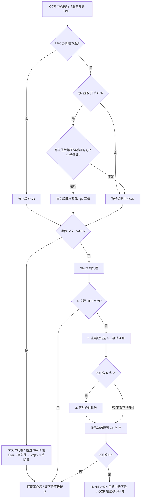

# NeosAI 日本保险 IDP — 产品需求文档

本稿表记：<mark class="change-modified">黄色＝修改</mark>、<ins class="change-added">蓝色＝新增</ins>、<del class="change-deleted">红色＝删除</del>。

## 第 1 章｜术语与词汇表

### 1.1 术语表（本期新增）


| 中文      | 日语/界面          | 定义                                                                                                                                               |
| ------- | -------------- | ------------------------------------------------------------------------------------------------------------------------------------------------ |
| 画像不正検知  | 画像不正検知         | 前处理节点内模块：一级开关；二级为 PS検出 / AI生成検出 / 帳票特徴検出 / 筆跡検出，各自独立开关 + 对象账票（分开选，默认均 ON）。运行时四个二级检测并行执行。模型输出通过/不通过，不通过时须返回不正类型字段给后端 |
| 不正类型    | 不正タイプ          | 画像不正検知判「不通过」时返回的枚举（与命中的二级检测对应，如 PS / AI生成 / 帳票特徴 / 筆跡）；供后端与前处理人工确认页展示 |
| QR 字段读取 | QR読取           | 运行时能力：针对 Step2 字段读取 tab（界面：テキスト読取）的 QR 读取<del class="change-deleted">，按 admin 配置的字段映射逐字段写值</del><mark class="change-modified">（LIAJ 診断書模板为 QR 連結読取，按字段顺序整体写值）</mark>；OCR 节点执行时工具扫描/解码并写值；テーブル情報読取 不参与 QR                                                              |
<del class="change-deleted">| QR 源    | QRソース          | 账票级逻辑槽位（QR1、QR2…）；配置端在固定账票下方扫描区域内从左到右检出；检出几个生成几个；目录仅展示扫描结果，不可手动删改                                                                                |</del>
<del class="change-deleted">| 取值方法    | 取値方法           | 字段级 QR 分隔开关：关闭时全文取值（QR扫描到的内容全部填入该字段），开启时按分隔符与字段排序取值                                                                                              |</del>
| <ins class="change-added">QR 連結読取</ins> | <ins class="change-added">QR読取（連結）</ins> | <ins class="change-added">LIAJ 診断書模板专用的读取方式：把多个数据 QR 的解码结果按槽位顺序接成一长串，用 `$` 和 `^` 两个同级分隔符切开，再照字段表的顺序一个字段填一个值。切出来的值有几个，就叫「写入值数」；写入值数必须刚好等于该模板的 QR 仕样值数（A01 为 407），对不上就整份诊断书改走 OCR</ins> |
| <ins class="change-added">QR 槽位</ins> | <ins class="change-added">QR1、QR2…（槽位）</ins> | <ins class="change-added">固定账票下方扫描区从左到右检出的 QR 位置（QR1、QR2…）。LIAJ A01 有 6 个、K01 有 9 个。槽位数量只用来展示检出情况，不决定走 QR 还是 OCR</ins> |
<del class="change-deleted">| 分隔符     | 区切り文字          | 分隔模式下用于切分 QR 解码串的分隔符；连续分隔符之间视为空字段；段内空串或空值占位亦视为空                                                                                                  |</del>
<del class="change-deleted">| 字段排序    | 順序             | 分隔模式下，从 QR 解码串中取第几个片段（1 起）；同一 QR 源内 N=该源分隔映射字段总数，順序须为 1～N 连号且不重复                                                                                 |</del>
| 正常范围    | 正常範囲           | Step3 正常条件：按 **処理ルール**（后处理规则）决定可否配置；**マスタ照合**、**テキスト置換** 不可配；其余规则可选；比较对象为 処理ルール 后处理产物                                                         |
| 字段 HITL  | HITL             | Step2 <del class="change-deleted">OCR設定</del><mark class="change-modified">字段读取 tab</mark> 字段/表格列开关：指定该字段是否为人工确认对象。ON（默认）= 参与人工确认；OFF = 不参与（不进确认画面）。 |
| 脱敏标记    | マスク            | Step2 字段级打码标记（与 HITL 并列的独立开关，默认 OFF；仅 テキスト読取 字段表，テーブル情報読取 的列定义不提供该开关）。ON 的字段在下游自动排除：Step3 処理ルール 不出现该字段（含 AI匹配草案与正常条件校验，残留错误自动清除）；Step5 効果テスト 文本卡片不显示。与前处理节点敏感情报检出（账票级脱敏工程）的衔接待后续明确 |
| 敏感情报检出  | 敏感情報検出         | 前处理节点子模块：模块开关 + 对象账票（账票级）。对象账票可选范围暂为业务场景 Step1 关联账票；字段级打码见账票类型 Step2 マスク开关，与节点脱敏工程的衔接待后续明确 |
| 分類信頼度閾値 | 分類信頼度閾値        | Step1 必填项：案件集约识别分类阶段的账票分类置信度下限（百分比）                                                                                                              |
| 账票类型设置  | 帳票タイプ設定        | 配置端账票主数据模块；Step2 含 <del class="change-deleted">OCR/QR 双模式、</del>字段 HITL 与 マスク；Step3 含処理ルール与正常范围（マスク字段自动排除）；Step4 为前处理图像级设置（无字段级マスク）；Step5 効果テスト 按マスク结果隐藏卡片 |
| 提示词     | プロンプト          | Step2 字段/列的读取提示词：约束 OCR 模型从账票何处抽取、输出格式与抽出单位（含单位换算）；界面列名 プロンプト = 提示词                                                                              |
| 字段类别    | タイプ            | Step2 字段/列的数据类别（`string` / `number` / `enum` 等）；决定 OCR 读取与后处理的数据形态；**不承载计量单位**（量纲见 プロンプト（提示词））；**不单独决定** Step3 正常条件可否配置                                            |
| 抽出单位    | （プロンプト（提示词）约定） | Step2 プロンプト（提示词）中由 admin **自行约定**的 OCR **输出计量单位**（如 cm、円、日）；**不由 タイプ（字段类别）自动推导**；正解サンプル 与 Step3 正常条件阈值须与约定量纲对齐                                                       |


### 1.2 易混术语


| 中文                          | 区分要点                                                                                                                                                                                   |
| --------------------------- | -------------------------------------------------------------------------------------------------------------------------------------------------------------------------------------- |
<del class="change-deleted">| OCR 读取设定 vs QR 读取设定         | 字段主数据在 OCR 读取设定维护，QR 读取设定只配 QR 源与取值；テーブル情報読取 固定 OCR                                                                                                                                    |</del>
<del class="change-deleted">| 账票读取模式 vs 字段 OCR 兜底 | QR設定 下逐字段路由：① 未选 QRソース → 该字段 OCR；② 已选且 QR 扫描有效（含空值）→ 映射写值，不兜底；③ 已选但 QR 扫描无效（未扫出）→ 该字段 OCR 兜底；OCR設定 则全字段 OCR；LIAJ 診断書模板为 QR 連結読取：整份判定，写入值数不足则整份 OCR                                                                                           |</del>
| <mark class="change-modified">QR 連結読取 vs Step3 QRコード</mark> | <del class="change-deleted">Step2 QR 仅扫描样张底部区域多码目录</del><mark class="change-modified">Step2 字段读取 tab 的 QR 連結読取（LIAJ 診断書模板）扫描样张底部区域多码，按字段顺序整体写值</mark>；Step3 処理ルール「QRコード」保留，用于非诊断书等顶部单码场景（Step2 扫不到顶部码） |
| 敏感情报检出 vs 画像不正検知            | 脱敏为前处理工程（账票级开关 + 对象账票；字段级打码见账票类型 Step2 マスク）；画像不正为一级模块开关 + 二级检测（PS / AI生成 / 帳票特徴 / 筆跡，各自开关与对象账票分开选，运行时四项并行），不通过时返回不正类型 → 前处理人工确认待办 |
| マスク vs 敏感情报检出               | マスク（字段级）在账票类型 Step2 配置，决定下游 Step3/Step5 的字段排除与卡片隐藏；敏感情报检出（节点）定账票级是否执行。本期对象账票 = Step1 关联账票；两者衔接待后续明确 |
| 字段 HITL vs 人工确认规则            | 人工确认规则定「何种条件触发要確認」；字段 HITL 定「该字段是否为人工确认对象」：ON（默认）参与，OFF 不参与 |
| 正常范围 vs Master 照合           | 正常条件是否展示由 Step3 **処理ルール** 决定（**マスタ照合**、**テキスト置換** 不可配）；与 Step2 タイプ（字段类别）解耦；マスタ照合 仍走 OCR 确认规则 3～5                                                                                                             |
| 正常范围 vs AI 检证               | 正常范围在账票 Step3 配置、OCR 节点执行时校验；AI 检证在独立节点跨字段                                                                                                                                             |
| 配置 test vs 前处理确认预览          | Step5 効果テスト 按マスク结果排除文本卡片；遮挡预览与打码在前处理确认页（字段级范围待后续明确） |
| 配置 test vs OCR 抽出确认         | Step5 展示取值来源（QR/OCR) ；OCR 抽出确认页不展示来源标签                                                                                                                                                 |
| タイプ（字段类别） vs プロンプト（提示词） | **タイプ（字段类别）** 与 **プロンプト（提示词）** **独立配置**：タイプ 声明字段类别与 OCR 数据形态；**プロンプト 由 admin 按字段/列自行编写**（或 AI自動生成 后编辑），**不按 タイプ 分模板、不做类型校验**；量纲（cm / 円 等）写在 プロンプト；正解サンプル须与 プロンプト 对齐；**正常条件可否配置由 処理ルール 决定** |
| 规则 6 vs 规则 7 vs QR 写值     | **规则 6**（正常値範囲を超えています）：**全路径**（含 QR 写值）越界 alone 即命中；**规则 7**（低信頼度かつ…）：仅 **OCR / QR→OCR 兜底**，须低置信 **且** 越界；默认勾选 **规则 6 + 7** |


## 第 2 章｜用户交互流程

本章按能力组织用户故事：正常值校验、字段 HITL、マスク（敏感情报检出）、画像不正検知、通知（邮件）、QR 读取。

### 2.1 故事：正常值校验

角色：admin（配置正常条件与人工确认规则）；操作员（办结 OCR 抽出确认时仍受正常值约束）

目标：在账票 Step3 按 処理ルール 配置正常范围；运行时仅当字段 HITL=ON 且已勾选依赖正常条件的人工确认规则（规则 6 / 7）时，才对后处理产物做正常条件比较。未勾选这些规则则不做正常条件比较（避免无效计算）。办结时必填与正常值未通过则阻断。

```
配置：Step3 正常条件（按 処理ルール 可否配置）+ 読取モデル設定 人工確認ルール（默认规则 6 + 7，可改组合）→ Step5 test 验收
运行：后处理 → HITL → 已勾选人工确认规则 →（规则含 6/7 才）正常条件比较 → 规则命中 → HITL=ON 且命中的字段进 OCR 抽出确认待办
```

1. admin 在账票类型 Step3 按 処理ルール 为字段/列选配正常条件（範囲内、<、≤、>、≥、列挙）；マスタ照合、テキスト置換 不可配；阈值与 Step2 プロンプト（提示词）量纲对齐。
2. admin 在読取モデル設定 配置人工确认规则组合；默认勾选规则 6 + 7，可改。规则 6：正常条件越界 alone（OCR、QR 写值、QR→OCR 兜底均适用）。规则 7：仅 OCR / 兜底，须低置信且越界。若另启规则 1，则 OCR 低置信 alone 亦可命中。
3. 运行时顺序：先 HITL；OFF 则本字段不进确认路径。ON 则查看已勾选人工确认规则；仅当勾选了规则 6/7 才做正常条件比较，未勾选则跳过；再按已勾选规则做 OR 判定。
4. 规则命中后：将该字段（已是 HITL=ON）纳入 OCR 抽出确认待办。操作员办结时仍校验必填与正常值；未通过则阻断。执行页不展示范围结论、配置区间或命中哪条规则。

---

### 2.2 故事：字段 HITL

角色：admin（配置字段/列 HITL）；操作员（仅处理进入确认画面的字段）

目标：在账票 Step2 <del class="change-deleted">OCR設定</del><mark class="change-modified">字段读取 tab</mark> 指定字段是否为人工确认对象。ON（默认）= 可参与人工确认；OFF = 不参与（不进确认画面）。人工确认规则命中后，仅 HITL=ON 的字段进入 OCR 抽出确认。

```
配置：Step2 字段/列 HITL（默认 ON）→ Step5 test 验收（HITL=ON 且规则命中时标红）
运行：HITL → 已勾选人工确认规则 →（按需）正常条件 → 规则命中的 HITL=ON 字段 → OCR 抽出确认待办
```

1. admin 在账票类型 Step2 <del class="change-deleted">OCR設定（テキスト読取 / テーブル情報読取）</del><mark class="change-modified">字段读取 tab（テキスト読取）与表格读取 tab（テーブル情報読取）</mark>为字段或列配置 HITL；默认 ON。
2. 运行时顺序：先看 HITL（OFF 不进确认路径）；再看已勾选人工确认规则；若规则中含 6/7 才比较正常条件，未勾选则不看正常条件；最后 OR 判定规则是否命中。
3. 规则命中后：把 HITL=ON 且命中规则校验的字段放进 OCR 抽出确认待办（账票级至少有一个此类字段时生成待办）。
4. 操作员在执行页修正要確認字段；HITL=OFF 字段不作为要確認展示。HITL=OFF 字段办结时的必填/正常值校验仍适用，只是不进确认画面。

---

### 2.3 故事：マスク（敏感情报检出）

角色：admin（账票类型 Step2 配置字段マスク；节点侧启用敏感情报检出）；操作员（查看脱敏结果；无专用待办）

目标：字段级マスク在账票类型 Step2 配置（与 HITL 并列的独立开关），下游 Step3 自动排除。敏感情报检出仍在前处理节点以开关 + 对象账票决定账票级是否执行；对象账票可选范围为业务场景 Step1 关联账票。


配置流程：

<del class="change-deleted">旧：账票类型 Step2 OCR設定：字段 マスク 开关（テキスト読取 字段表，与 HITL 并列的独立开关，默认 OFF）</del>

```
账票类型 Step2 字段读取 tab：字段 マスク 开关（テキスト読取 字段表，与 HITL 并列的独立开关，默认 OFF）
业务场景 Step2 前処理設定：敏感情报检出 ON + 对象账票（账票级）
```

1. admin 在账票类型 Step2 <del class="change-deleted">OCR設定</del><mark class="change-modified">字段读取 tab</mark> 为字段配置 マスク开关（与 HITL 并列的独立开关，默认 OFF）。
2. admin 在业务场景 Step2 前処理設定 开启「敏感情报检出」，从 Step1 关联账票中选择对象账票。
3. 账票类型 Step2 マスク开关的下游效果：Step3 処理ルール 不出现该字段（含 AI匹配草案与正常条件校验）。前处理确认页的打码按 Step2 脱敏设定给相应字段打码。

运行流程：

```
前处理：画像不正検知 → 回転 → 補正 → 整列 → 敏感情报检出
```

1. 工作流进入前处理节点；当敏感情报检出 ON 且当前实例账票在对象账票列表中，执行账票级脱敏工程（字段级打码范围见账票类型 Step2 マスク开关；与节点脱敏工程的衔接待后续明确）。
2. 脱敏成功 → 后续 OCR 抽出节点读取处理后实例；案件详情与导出按脱敏结果展示。
3. 节点 OFF、或未选该账票 → 跳过脱敏，OCR 读原实例。

---

### 2.4 故事：画像不正検知

角色：admin（启用模块与二级检测）；操作员（人工确认待办）

目标：在前处理节点启用画像不正検知；一级开关控制模块，二级分别开关 PS検出 / AI生成検出 / 帳票特徴検出 / 筆跡検出，且各检测项独立选择对象账票。运行时四个二级检测并行执行。模型判「不通过」时返回不正类型并进人工确认（非 OCR 抽出确认）。

配置流程：

```
业务场景 Step2 → 前処理設定 → 画像不正検知 ON
  → 二级：PS / AI生成 / 帳票特徴 / 筆跡（各：开关 + 对象账票，分开选；默认均 ON）
```

1. admin 在账票类型 Step2 <del class="change-deleted">OCR設定</del><mark class="change-modified">字段读取 tab</mark> 为字段配置 マスク开关（与 HITL 并列的独立开关，默认 OFF）。
2. admin 在业务场景 Step2 前処理設定 开启「画像不正検知」。
2. 在模块 ON 时为每个二级检测分别配置开关与对象账票（未指定则视为全部关联账票）；关闭某项则运行时不执行该检测。

运行流程：

```
前处理 · 画像不正検知
  二级并行：PS / AI生成 / 帳票特徴 / 筆跡（仅开关 ON 的项 × 各自对象账票）
  → 任一不通过 + 不正类型 → preprocessResult=reviewRequired → 我的任务 · 人工确认
```

1. 前处理五大模块串行时，画像不正検知最先运行（在几何处理与脱敏之前）。
2. 模块 ON 时，已启用的四个二级检测并行执行，各只作用于自身对象账票；关闭的项不跑。
3. 任一已启用检测判「不通过」→ 须返回不正类型字段给后端；生成人工确认待办；操作员在人工确认页可见类型并选择完了/补件/案件中止。多项同时不通过时，不正类型须覆盖全部命中项。
4. 全部通过 → 不正类型为空；继续后续子模块（回転 → 補正 → 整列 → 敏感情报检出）。

---

### 2.5 故事：通知（站内信 + 邮件）

角色：admin（配置规则）；操作员、操作管理者（收件人）

目标：在业务场景 Step3 扩展邮件渠道；前处理/OCR 等节点事件命中规则时并行投递站内信与邮件；通知仅告知，不替代待办。

配置流程：

```
业务场景 Step3 → 通知ルール追加 → 对象节点 + 触发事件 + 渠道（站内信/邮件）+ 邮箱地址 + 件名/正文
```

1. admin 选择对象节点（如前处理、OCR 抽出）与触发事件（如 preprocessStatus=failed、preprocessResult=reviewRequired、ocrResult=reviewRequired）。
2. 通知渠道多选站内信、邮件，至少选一；勾选邮件时填写邮箱地址（カンマ区切り，`,` または `，`；格式校验）。
3. 编辑件名/正文，可插入通知变量池 token；保存规则。
4. 典型配置：前处理要确认 = → 邮件通知案件担当者；OCR failed → 站内信 + 邮件通知操作管理者。

运行流程：

```
节点输出事件 → 匹配 Step3 开启规则 → 并行发送站内信 / 邮件 → 用户查阅（工作流继续；待办独立生成）
```

1. 运行时引擎按节点类型与变量取值匹配 Step3 规则；命中多条则全部发送。
2. 案件担当者（或其他角色）从顶栏站内信查阅；勾选邮件的规则同步投递至配置邮箱。
3. 变量缺值按空渲染，不阻断流程；邮件投递失败记日志。
4. 角色权限：在触发消息通知/邮件分发时，指派角色后，如该角色的用户中存在案件担当者，则只发给每个案件的案件担当者（指定用户）；如不存在，则发给该角色下所有用户集合

---

### 2.6 故事：QR 读取

角色：admin（<del class="change-deleted">QR 映射与读取模式</del><mark class="change-modified">QR 連結読取 开关与扫描</mark>）；操作员（OCR 抽出确认，无 QR 专用待办）

目标：<del class="change-deleted">在账票 Step2 字段读取 tab 配置 QR 源与字段映射；</del><ins class="change-added">在账票 Step2 字段读取 tab 打开 QR 読取 开关（LIAJ 診断書模板）并等扫描跑完；</ins>运行时看<del class="change-deleted">三种情况</del><mark class="change-modified">写入值数够不够</mark>，决定整份走 QR 还是 OCR；与 OCR 路径汇合后，仅对 HITL=ON 的字段按七项确认规则判定。

配置流程：

<del class="change-deleted">旧配置流程：Step1 上传 template → Step2 字段读取 · QR扫描 → QR 源目录 → QR 字段映射 → Step5 test 验收</del>

```
Step1 上传 template → Step2 字段读取 · QR 読取 开关 ON → QR スキャン → 写入值数等于字段总数 → Step5 test 验收
```

1. <del class="change-deleted">admin 在 Step1 上传 template 样张；Step2 字段读取（テキスト読取）切换 QR設定 后，系统扫描样张生成 QRソース目录（QR1、QR2…）；也可点击 QR扫描 手动重扫刷新目录（防止第一次扫描漏检或重新上传样例后漏检的情况）。</del>
2. <del class="change-deleted">QR扫描仅生成或刷新 QR 源目录，不自动写入字段映射。admin 在映射表逐字段可选配置 QRソース、取値方法、区切り文字、順序；未选 QRソース 的字段运行时走 OCR（OCR 模式维护項目名/タイプ/HITL/必须/字段排序/删减操作；上述主数据在 QR 模式只读）。テーブル情報読取 不参与 QR。</del>
3. <ins class="change-added">admin 在 Step1 上传 template 样张；Step2 字段读取（テキスト読取）内打开 QR 読取 开关（默认 OFF，需 admin 手动开启），系统扫描样张下方扫描区的全部 QR 槽位（A01 为 6 个）并逐槽解码。扫描要花时间，槽位从左到右逐个出结果，全部出完前不显示路径徽标；也可点击 QR スキャン 手动重扫（防止第一次扫描漏检或重新上传样例后漏检的情况）。</ins>
4. <ins class="change-added">挑出数据码：数据码的串里用 `$` 分隔各个字段值；ID 类码（上传 ID、受理类 ID 等）整串没有 `$`，跟字段无关。判定很简单，看解码结果里有没有 `$`，没有就丢掉这个槽位。把留下的数据码按槽位顺序接成一长串，用 `$` 和 `^` 两个同级分隔符切开，再照 Step2 字段表的顺序一个字段填一个值。全程不用逐字段配映射。</ins>
5. <ins class="change-added">走哪条路径：写入值数等于该模板的字段总数（A01 是 407）就整份按 QR 写值；不够就整份改走 OCR，不会只写一部分字段。</ins>
6. Step5 test：每字段卡片右上角展示读取来源标签（QR読取 或 OCR読取，仅两种）；HITL=ON 且规则命中时输入框标红；HITL=OFF 字段不标要確認。
7. 业务场景 OCR 抽出节点仍为开关 + 对象账票；引擎执行时读取上述账票配置，画布无 QR 专用节点。

运行流程（运行时流程图在账票类型设置分节展示，与用户故事不重复贴图）：

1. <del class="change-deleted">OCR設定，或 QR設定 下某字段未选 QRソース：该字段 OCR。</del>
2. <del class="change-deleted">QR設定 下字段已选 QRソース 且对应 QR 扫描有效（含解码后为空值）：按映射写值；空值仍视为有效 QR 写值，不触发 OCR 兜底。</del>
3. <del class="change-deleted">QR設定 下字段已选 QRソース 但对应 QR 扫描无效（未扫出）：该字段 OCR 兜底。</del>
4. <ins class="change-added">非 LIAJ 診断書模板：无 QR 路径，全部字段 OCR。</ins>
5. <ins class="change-added">LIAJ 診断書模板（連結読取）：开关 OFF → 整份 OCR；开关 ON 且写入值数等于模板字段总数 → 全部字段走 QR 写值；写入值数不够 → 整份改走 OCR。这条路径不看单个字段，槽位检出数只作展示。</ins>
6. 写值与后处理汇合后：仅 HITL=ON 字段评估人工确认规则；HITL=OFF 字段不参与人工确认。

---

## 第 6 章｜功能详细说明

### 6.01 业务场景设置

业务场景为四步向导（Step1 集约规则、Step2 工作流、Step3 通知、发布门禁）。本节说明 Step1 默认关联、Step2 工作流画布与 Step3 通知的增量。

#### 界面语言（本期增量）

顶栏可在日文与简体中文间切换。中文模式下，导航、步骤条、按钮、面板标题、节点名、前处理设定项（含伪造检测四项与说明）、空状态与工具提示等 UI chrome 优先显示简体中文；短词不做整句内子串替换，避免半日半中混杂。账票字段名与样例业务数据保留日文，不强翻。

#### Step1 集约规则（本期增量）

新建/迁移业务场景时，系统按主帳票与语义等价字段自动生成完整默认关联关系（含兜底边），使全部关联账票从主帳票可达；并默认填好主帳票与業務キー。满足校验即可直接进入 Step2，无需先手动补齐关联。

#### Step2 工作流画布（本期增量）

前处理节点内五个子模块固定顺序（不正检测 → 几何处理 → 脱敏）：

```
画像不正検知 → 画像回転 → 画像補正 → 画像整列 → 敏感情报检出
```


| 步骤  | 模块           | 理由                                       |
| --- | ------------ | ---------------------------------------- |
| 1   | 画像不正検知       | 优先在原实例上判定篡改/伪造风险；一级开关；二级 PS / AI生成 / 帳票特徴 / 筆跡各自开关 + 对象账票（分开选）；运行时四项并行；不通过时返回不正类型 |
| 2～4 | 回転 → 補正 → 整列 | 几何预处理                                    |
| 5   | 敏感情报检出       | 几何完成后对对象账票执行脱敏工程；字段级打码范围见账票类型 Step2 マスク；OCR 读处理后实例；无业务待办 |


文件状态四段枚举不变；子模块进度汇总至 preprocessStatus / preprocessResult，不在案件一覧展示子模块名。

1. 前处理面板：画像不正检测（一级开关 + 二级四项「开关 + 对象账票」分开选）、回転/補正/整列与敏感情报检出（各：开关 + 对象账票）；执行顺序为不正检测 → 回転/補正/整列 → 脱敏。
2. 敏感情报检出：模块 ON 且实例账票在对象列表时执行账票级脱敏。对象账票可选范围 = 业务场景 Step1 关联账票。字段级打码范围见账票类型 Step2 マスク开关；与节点脱敏工程的衔接待后续明确。
3. 画像不正检测：模块 ON 时仅执行二级开关为 ON 的检测项；四项运行时并行，各检测项仅对自身对象账票生效；标题旁 i 注释说明各检测具体内容；输出通过/不通过；判「不通过」时须返回不正类型字段给后端（多项命中时覆盖全部命中项），并设 preprocessResult=reviewRequired → 人工确认。
4. OCR 抽出节点配置面板为开关 + 对象账票，本期无新增配置项；QR 读取、正常值校验、后处理规则、字段 HITL 均在账票类型 Step2/Step3 配置，由运行时引擎在该节点执行时读取。


| 信号                              | 新增或变化      |
| ------------------------------- | ---------- |
| preprocessResult=reviewRequired | 画像不正判「不通过」 |
| 不正类型（返回后端）                      | 不通过时必填；与命中的二级检测对应（PS / AI生成 / 帳票特徴 / 筆跡）；通过时为空 |


#### Step3 通知设置（本期增量）

通知规则支持对象节点、触发事件、站内信投递；本节增量见下方「通知ルール追加」面板（截图）。

1. 通知渠道新增邮件：可多选站内信 + 邮件；勾选邮件须填邮箱地址；共用件名/正文与变量渲染。


| 字段/参数 | 界面文案（日语） | 控件  | 必填    | 说明                                          |
| ----- | -------- | --- | ----- | ------------------------------------------- |
| 通知渠道  | 通知チャネル   | 多选  | 是     | 选项：システム通知、メール，至少选一                          |
| 站内信   | システム通知   | 复选  | —     | 通知チャネル多选之一；勾选后须选通知対象                        |
| 邮件    | メール      | 复选  | —     | 通知チャネル多选之一                                  |
| 邮箱地址  | メール宛先    | 文本  | 勾选邮件时 | 多地址以 `,` 或 `，` 分隔；各地址段前后空格保存时去除空格；邮箱本体须半角格式 |


#### 异常与边界


| 场景                | 条件                            | 用户提示 / 处理                                              |
| ----------------- | ----------------------------- | ------------------------------------------------------ |
| Step2 · 敏感情报检出失败  | 敏感情报检出模块执行失败                  | preprocessStatus=failed；走案件异常；不新增脱敏专用待办                |
| Step2 · 画像不正不通过   | 画像不正検知判「不通过」                  | preprocessResult=reviewRequired；返回不正类型（PS / AI生成 / 帳票特徴 / 筆跡）给后端；进前处理人工确认 |
| Step3 · 邮件地址分隔与空白 | メール宛先 输入全角逗号 `，` 或地址段前后含空格    | **允许**：`,` / `，` 均可作多地址分隔符；各段 trim 后校验；不因分隔符全半角或首尾空格报错 |
| Step3 · 勾选站内信未选对象 | 渠道含システム通知但通知対象为空              | 保存报错（`通知対象を選択してください`）                                  |
| Step3 · 勾选邮件未填邮箱  | 渠道含メール但メール宛先为空                | 保存报错（`メール宛先を入力してください`）                                 |
| Step3 · 邮件地址格式错误  | trim 后仍含无效邮箱（如全角 `@`、缺 `@` 等） | 保存报错（`メールアドレスの形式が正しくありません: …`）；列出无效地址                  |
| Step3 · 件名/正文未填   | 件名或正文为空                       | 保存报错（`件名を入力してください` / `内容を入力してください`）                    |
| Step3 · 邮件投递失败    | 运行时邮件服务失败                     | 记日志；工作流继续（不阻断）                                         |


### 6.03 账票类型设置

#### 功能点

Step1：新增分類信頼度閾値（0～100，必填）；template 样张供 QR 扫描。

Step2：<del class="change-deleted">QR 仅字段读取tab适配；字段读取内切换 OCR設定 / QR設定；</del><ins class="change-added">LIAJ 診断書模板在字段读取 tab 以 QR 読取 开关走 QR 連結読取，不设读取模式切换、不配字段映射，按字段顺序整体写值；</ins>OCR 维护字段/列主数据 + HITL + 拖拽顺序/删减等；【AI自動生成】 仅 OCR 字段/列，不生成 QR 相关配置。マスク列与 HITL 并列配置（仅 テキスト読取 字段表）；マスク=ON 的字段在 Step3/Step5 自动排除，Step5 卡片隐藏。

Step3：字段读取 / 表格读取 新增正常条件列（範囲内、<、≤、>、≥、列挙）；读取模型弹窗七项确认规则见 6.04。

Step5：test 展示字段值、读取来源（QR読取 / OCR読取）、HITL=ON 且规则命中时输入框标红；マスク=ON 的字段卡片隐藏。本期 QR <del class="change-deleted">扫描与映射</del><mark class="change-modified">連結読取</mark>以 Z 客户诊断书 template 为主。

#### 运行时（OCR 抽出节点执行时）

与第 2 章 QR 读取、正常值校验、字段 HITL 用户故事为同一规格；此处保留运行时路由详图。<del class="change-deleted">配置侧 QR 源扫描与字段映射步骤见下方「字段读取 · QR 配置流程」，两图场景不同、不重复。</del>

OCR 抽出节点为开关 + 对象账票；引擎对该节点 ON 的账票，读取账票类型已保存的 Step2/Step3 配置执行抽取，不在画布上重复配置。<del class="change-deleted">QR 路由仅消费字段读取 tab 的有效映射。</del><ins class="change-added">QR 路由仅由字段读取 tab 的 QR 読取 开关与写入值数门禁决定。</ins>

<del class="change-deleted">逐字段运行时路由（QR設定 下按字段；OCR設定 则全字段 OCR）：</del>
<ins class="change-added">QR 連結読取 运行时路由（仅 LIAJ 診断書模板；其他模板无 QR 路径）：</ins>

1. <del class="change-deleted">未选 QRソース → 该字段 OCR。</del>
2. <del class="change-deleted">已选且对应 QR 扫描有效（含解码后为空值）→ 按映射 QR 写值；空值仍为有效写值，不触发 OCR 兜底。</del>
3. <del class="change-deleted">已选但对应 QR 扫描无效（未扫出）→ 该字段 OCR 兜底。</del>
4. <ins class="change-added">QR 読取 开关 OFF → 本账票全部字段 OCR。</ins>
5. <ins class="change-added">开关 ON 且写入值数等于模板字段总数 → 全部字段按字段顺序 QR 写值；写入值数不够 → 整份诊断书改走 OCR。</ins>
6. マスク=ON 的字段：读值后跳过 Step3 処理ルール（AI匹配草案与正常条件校验不适用），不进确认画面；Step5 効果テスト 文本卡片隐藏。
7. 写值与后处理汇合后（仅 マスク=OFF 字段），确认路径顺序：HITL → 已勾选人工确认规则 →（仅当勾选规则 6/7 时）正常条件比较 → 规则 OR 判定；命中则将该 HITL=ON 字段纳入 OCR 抽出确认待办。HITL=OFF 或未勾选依赖正常条件的规则时，不做正常条件比较。




| 步骤    | 读取配置                   | 行为                                                                                      |
| ----- | ---------------------- | --------------------------------------------------------------------------------------- |
| 路由    | 账票 Step2 字段读取 tab · QR 読取 开关 | <del class="change-deleted">OCR設定 → 全字段 OCR；QR設定 → 逐字段：未选 QRソース 走 OCR，已选且扫描有效（含空值）写值，仅扫描无效（未扫出）才 OCR 兜底。</del><ins class="change-added">LIAJ 診断書模板：开关 ON 且写入值数等于模板字段总数 → 全部字段按字段顺序 QR 写值；开关 OFF 或写入值数不够 → 整份 OCR。其他模板没有 QR 路径，全字段 OCR。</ins>テーブル情報読取 始终 OCR |
| 后处理   | 账票 Step3 処理ルール         | 固定规则标准化（含 QRコード，见下方）；用于顶部单码等 Step2 底部扫描覆盖不到的场景 |
| マスク排除 | 账票 Step2 マスク列（テキスト読取 字段表） | マスク=ON 的字段不进 Step3 规则/正常条件与确认画面；Step5 文本卡片隐藏（与 HITL 相互独立） |
| 1 字段 HITL | 账票 Step2 HITL 列 | 先看：OFF = 本字段不进确认路径；ON = 进入下一步 |
| 2 人工确认规则 | 读取模型弹窗七项               | 查看已勾选规则；多选 OR；默认规则 6 + 7 |
| 3 正常条件 | 账票 Step3 正常条件          | 仅当已勾选规则含 6/7 时才比较；未勾选则跳过 |
| 4 进待办 | HITL + 规则命中             | 规则命中后，将 HITL=ON 且命中校验的字段放入 OCR 抽出确认待办 |


#### <del class="change-deleted">字段读取 · QR 配置流程</del>

<del class="change-deleted">仅 Step2 字段读取 tab（界面：テキスト読取）· QR設定。与上方运行时路由图分工：本图描述 admin 配置步骤，不描述 OCR 节点执行顺序。</del>

<del class="change-deleted">（原流程图：Step1 template → QR扫描 → QR 源目录 QR1 QR2… → 字段读取 · QR 字段映射 → Step5 test，随本节一并删除）</del>

<del class="change-deleted">扫描在 Step1 样张固定账票下方区域从左到右执行，产出 QRソース目录（QR1、QR2… 及检测区域）。Step2 QR 不扫描顶部二维码。字段 QR 映射不在扫描环节写入，须 admin 在下方映射表逐字段手动配置；QRソース 可不选，未选字段运行时走 OCR。</del><ins class="change-added">配置侧不再有 QR 源目录与映射表：LIAJ 診断書模板只由 QR 読取 开关与写入值数决定，见下方「LIAJ 診断書 QR 連結読取」。</ins>

#### Step1 分类设定


| 字段/参数       | 界面文案（日语） | 控件   | 必填  | 校验            | 下游消费                    |
| ----------- | -------- | ---- | --- | ------------- | ----------------------- |
| 分类置信度阈值     | 分類信頼度閾値  | 数字输入 | 是   | 0～100 整数，后缀 % | 案件集约 · 画像分类；低于阈值 → 集约确认 |
| template 样张 | —        | 文件上传 | 否   | 换样张后重新 <del class="change-deleted">QR扫描</del><mark class="change-modified">QR スキャン</mark>   | Step2 QR 扫描             |


界面文案：分類信頼度閾値 旁 i 提示「案件集約時の画像分類信頼度」；必填标记「必須」。

#### <del class="change-deleted">Step2 读取模式</del><ins class="change-added">Step2 字段读取 tab</ins>

<del class="change-deleted">Step2 分字段读取（テキスト読取）与表格读取（テーブル情報読取）两个 tab。OCR/QR 模式切换、QR 源与字段映射仅在字段读取 tab；切至表格读取 tab 时强制 OCR設定。</del><ins class="change-added">Step2 分字段读取（テキスト読取）与表格读取（テーブル情報読取）两个 tab，不设 OCR / QR 读取模式切换。LIAJ 診断書模板在字段读取 tab 内以 QR 読取 开关控制 QR 連結読取，不配字段映射；表格读取 tab 无 QR 相关项。</ins>


| 字段/参数  | 界面文案（日语）          | 控件   | 必填         | 说明                                           | 下游消费  |
| ------ | ----------------- | ---- | ---------- | -------------------------------------------- | ----- |
| 读取 tab | テキスト読取 / テーブル情報読取 | tab  | —          | 字段读取 / 表格读取                                  | —     |
<del class="change-deleted">| 读取设定   | OCR設定 / QR設定      | 轻量切换 | 字段读取 tab 内 | 二选一；QR設定 下逐字段路由（未选 QRソース → OCR）；LIAJ 診断書模板以 QR 読取 开关控制，整份判定；表格读取 tab 不展示 | 运行时路由 |</del>

#### Step2 按钮（读取 · OCR）

<del class="change-deleted">AI自動生成 不生成 QR 源目录、字段 QR 映射、取値方法、区切り文字、順序；QR 源目录由扫描 / **QR扫描** 生成，字段映射及相关列须用户手动配置。</del><ins class="change-added">AI自動生成 不生成 QR 相关配置；QR 槽位由 QR スキャン 扫描生成，只读展示，不可手动编辑。</ins>


| 按钮     | 界面文案（日语） | 显示条件                   | 点击后                                                                                                                 |
| ------ | -------- | ---------------------- | ------------------------------------------------------------------------------------------------------------------- |
| AI自动生成 | AI自動生成   | <del class="change-deleted">字段读取 · OCR設定，或表格读取 tab</del><mark class="change-modified">字段读取 / 表格读取 tab</mark> | 辅助生成各字段/列 プロンプト（提示词）与 正解サンプル 草稿；**生成后由 admin 自行编辑**，**不按 タイプ 强制模板**；不涉及 QR |
<del class="change-deleted">| AI自动生成 | —        | 字段读取 · QR設定            | 不显示 |</del>

#### Step2 プロンプト（提示词）

**タイプ（字段类别） 与 プロンプト（提示词） 的关系**

- **タイプ（字段类别）**（Step2 項目タイプ）：声明字段**类别**——`string` / `number` / `enum` 等；用于 OCR 读取与后处理时的**数据形态**等。**不承载计量单位**，**不单独决定** Step3 正常条件可否配置（由 **処理ルール** 决定）。
- **プロンプト（提示词）**：admin **按字段/列自行编写**（或使用 **AI自動生成** 后编辑），约束读取模型——**从账票何处抽取、以何种格式输出、是否需要约定抽出单位及换算**等；**不由 タイプ（字段类别）推导、不按类型分模板、不做类型校验**。
- **正解サンプル**：与 プロンプト（提示词） **完全对齐**的期望输出，供 Step5 test / 调优；**不是账面上的原文**，而是按 プロンプト（提示词）（含单位换算后）应得到的值。

**配置位置**（Step2 <del class="change-deleted">OCR設定</del><mark class="change-modified">字段读取 tab</mark>）


| 适用范围 | 界面位置           | 界面文案（日语）       | 说明                                         |
| ---- | -------------- | -------------- | ------------------------------------------ |
| 文本字段 | テキスト読取 · 字段表   | プロンプト          | 自由文本；admin 自行编写读取约束；界面列名 プロンプト = 提示词 |
| 文本字段 | 同上             | 正解サンプル         | 与 プロンプト（提示词） 对齐的样例值，供 test / 调优       |
| 表格列  | テーブル情報読取 · 列定义 | プロンプト / 正解サンプル | 同上；列级 プロンプト = 提示词                          |


**プロンプト（提示词） 建议写清的内容**（**非强制模板**，admin 可按字段语义取舍）

1. **抽取位置**：账票上读哪个栏位/语义（如「身長欄」「請求金額欄」）。
2. **输出格式**：半角/全角、是否允许小数、日期格式、是否带单位后缀等。
3. **抽出单位**（若需要）：输出值采用的计量单位（如 cm、円、日）；**写在 プロンプト（提示词），不写在 タイプ（字段类别）**。
4. **单位换算**（若账面与约定输出单位不一致）：须在 プロンプト（提示词） 明示。例：账面 `1.6米`，约定输出 cm → 模型输出 `160`（不带后缀时写「単位は含めない」）。

**示例**（以下为 `number` 类字段参考；**プロンプト 内容均由 admin 自行定义**，非系统按 タイプ 生成）


| 账面可见（样张） | タイプ（字段类别） | プロンプト（提示词）·摘要                                                | 正解サンプル   | 処理ルール   | 正常条件阈值（同抽出单位、纯数字） |
| -------- | --------- | ------------------------------------------------------------ | -------- | ------- | ----------------- |
| `1.6米`   | number    | 身長欄。半角数字のみ。単位は cm。帳票が m/米 表記の場合は cm に換算して出力。単位 suffix は含めない。 | `160`    | 数字のみ    | `50`～`250`        |
| `12日`    | number    | 通院日数欄。半角数字のみ。単位は含めない。                                        | `12`     | 数字のみ    | `1`～`15`          |
| `12万円`   | number    | 請求金額欄。半角数字のみ。単位は円。帳票の「万円」表記は円に換算。                            | `120000` | 金額（JPY） | `0`～`99999999`    |


**路径说明**

- **OCR / QR→OCR 兜底**：读取时消费 Step2 プロンプト（提示词）（含 admin 约定的格式、抽出单位与换算）；写值后进入 Step3 固定规则链。
- **QR 写值**：不经过 OCR プロンプト（提示词）；载荷格式由 QR 规范决定，同样进入 Step3 固定规则链。

**与 Step3 的分工**


| 阶段               | 职责                                     | 是否调大模型      |
| ---------------- | -------------------------------------- | ----------- |
| Step2 プロンプト（提示词） | 约定 OCR **抽取输出**的格式、**抽出单位**及账面→约定单位的换算（**admin 自行编写**） | 读取阶段由读取模型执行 |
| Step3 処理ルール      | 按 admin 所选固定规则做格式标准化（不再推断/换算量纲）        | **否**       |
| Step3 正常条件       | 数值范围或列挙比较；阈值为**与 プロンプト（提示词） 约定量纲对齐的纯数字**  | **否**       |


**配置对齐链**（admin 自行保证一致）

```text
プロンプト（提示词）写明抽取位置、格式、抽出单位（+ 换算，若需要） → 正解サンプル 对齐
  → Step3 処理ルール 标准化 → 正常条件阈值（与 プロンプト 量纲一致）
```

运行时不调大模型做单位推断或换算；**量纲约定只在 Step2 プロンプト（提示词）（及对齐的 正解サンプル / Step3 阈值）一处声明**。

#### Step2 HITL 列

Step2 AI 读取分 テキスト読取 / テーブル情報読取 两个 tab；HITL 与 マスク 列均在 <del class="change-deleted">OCR設定</del><mark class="change-modified">字段读取 tab</mark> 配置（マスク 列仅テキスト読取 字段表）。テーブル情報読取 固定 OCR（<del class="change-deleted">无 QR 模式切换</del><mark class="change-modified">无 QR 相关项</mark>），按各表格卡片维护列定义（各列含 必須/HITL 开关，无 マスク）；列级不参与 マスク 排除。


| 适用范围 | 界面位置             | 界面文案（日语） | 控件  | 必填  | 说明 | 下游消费 |
| ---- | ---------------- | -------- | --- | --- | --- | --- |
| 文本字段 | テキスト読取 · 字段表     | HITL     | 开关  | 否   | 指定该字段是否为人工确认对象；ON（默认）参与，OFF 不参与 | OCR 抽出确认：仅 HITL=ON 且规则命中的字段标红可编辑；HITL=OFF 不进确认画面 |
| 表格列  | テーブル情報読取 · 各表列定义 | HITL     | 开关  | 否   | 同上 | 同上 |


界面文案：

- HITL 列 i 提示：「当該フィールドを人工確認の対象にするかを指定します。」

运行时与人工确认规则的关系：

1. 先看字段/列 HITL：OFF → 不进确认路径；办结时的必填/正常值校验仍适用。
2. HITL=ON 时，再看读取模型弹窗已勾选的人工确认规则。
3. 若已勾选规则含 6 和/或 7，才做正常条件比较；未勾选则不看正常条件。
4. 按已勾选规则做 OR 判定；命中 → 该字段标为要確認。
5. 规则命中后：把 HITL=ON 且命中规则校验的字段放入 OCR 抽出确认待办（至少有一个此类字段时生成账票级待办）。

#### Step2 脱敏列

マスク 列与 HITL 列并列（テキスト読取 字段表右侧，见下方截图红框；テーブル情報読取 的列定义不提供マスク列）；两者相互独立、可任意组合，マスク 默认 OFF。


| 适用范围 | 界面位置             | 界面文案（日语） | 控件  | 必填  | 说明 | 下游消费 |
| ---- | ---------------- | -------- | --- | --- | --- | --- |
| 文本字段 | テキスト読取 · 字段表     | マスク     | 开关  | 否   | 字段级脱敏/打码标记；ON 的字段在下游自动排除 | Step3 処理ルール 不出现该字段（含 AI匹配草案与正常条件校验，残留错误自动清除）；Step5 効果テスト 文本卡片隐藏 |


与敏感情报检出（前处理节点）的关系：マスク 是字段级配置（账票类型 Step2），敏感情报检出是账票级脱敏工程（业务场景 Step2 前処理設定，开关 + 对象账票）；本期对象账票 = Step1 关联账票，两者衔接待后续明确。

#### <del class="change-deleted">Step2 字段读取 · QR 映射</del>

<del class="change-deleted">适用范围：仅字段读取 tab（テキスト読取）· QR設定；表格读取 tab 无 QR 配置项。</del>

<del class="change-deleted">**QRソース目录 vs 字段映射**</del>


<del class="change-deleted">| 环节                     | 谁执行                 | 产出                      | 是否自动写字段映射 |</del>
| ---------------------- | ------------------- | ----------------------- | --------- |
<del class="change-deleted">| 进入 QR設定 自动扫描 / 点击 QR扫描 | 系统扫描 Step1 template | QRソース目录 QR1、QR2…        | **否**     |</del>
<del class="change-deleted">| 映射表各行配置                | admin 手动            | 字段 ↔ QR 源、取値方法、区切り文字、順序 | —         |</del>


<del class="change-deleted">**映射表字段**</del>


<del class="change-deleted">| 字段/参数  | 界面文案（日语）    | 控件        | 必填          | 说明                                     |</del>
| ------ | ----------- | --------- | ----------- | -------------------------------------- |
<del class="change-deleted">| QR 源目录 | QRソース（来源条）  | 列表 + QR扫描 | 否           | 扫描生成；**QR扫描 仅刷新此目录**，不代填映射表            |</del>
<del class="change-deleted">| QR 源   | QRソース（映射表列） | 下拉（可清空）   | 否           | 从目录选 QR1、QR2…；未选占位「未選択（OCR）」→ 该字段走 OCR |</del>
<del class="change-deleted">| 取值方法   | 取値方法        | 开关        | 已选 QR 源后    | 见下方「取値方法 / 区切り文字 / 順序」                 |</del>
<del class="change-deleted">| 分隔符    | 区切り文字       | 文本        | 取値方法 ON 时必填 | 见下方                                    |</del>
<del class="change-deleted">| 字段排序   | 順序          | 数字        | 取値方法 ON 时必填 | 见下方                                    |</del>


<del class="change-deleted">**取値方法 / 区切り文字 / 順序（分隔取值规则）**</del>

<del class="change-deleted">三者仅在该字段已选 **QRソース** 且需从 QR 解码串取值时配置；**取値方法 OFF 时隐藏区切り文字、順序列**。</del>


<del class="change-deleted">| 配置项          | 界面状态   | 行为                                                                                            |</del>
| ------------ | ------ | --------------------------------------------------------------------------------------------- |
<del class="change-deleted">| **取値方法 OFF** | 开关关闭   | 将该 QR 源的**完整解码串**原样写入本字段（全文取值）                                                                |</del>
<del class="change-deleted">| **取値方法 ON**  | 开关开启   | 先按 **区切り文字** 切分解码串，再按 **順序** 取其中**一段**写入本字段（分隔取值）                                             |</del>
<del class="change-deleted">| **区切り文字**    | ON 时显示 | 切分用分隔符（如 `$`）。**连续分隔符**之间视为空段（例：`a$$b` → `a`、空、`b`）。段内为**空串**或**空值占位**（原型占位符 `-` 等）亦视为空       |</del>
<del class="change-deleted">| **順序**       | ON 时显示 | 分隔后取第几段，**从 1 起**（第 1 段 = 1）。**同一 QRソース** 下所有开启分隔的字段：**順序不可重复**；须为 1～N 不重号，N = 该源下开启分隔映射的字段总数 |</del>


<del class="change-deleted">**示例（取値方法 ON，区切り文字** `$`**）**</del>

<del class="change-deleted">解码串 `安達$珠美$1960`：順序 1 → `安達`，順序 2 → `珠美`，順序 3 → `1960`。若順序 2 已被同 QR 源另一字段占用，则不可重复选择。</del>

<del class="change-deleted">运行时</del>

- <del class="change-deleted">全文（OFF）：QR 扫描有效 → 整串写值（含空串）。</del>
- <del class="change-deleted">分隔（ON）：QR 扫描有效 → 切分后取对应段写值；段缺失或为空仍写入空值，视为有效 QR 写值，不触发 OCR 兜底。</del>
- <del class="change-deleted">仅当对应 QR 扫描无效（未扫出）时，该字段走 OCR 兜底（若已配置 QR 映射）。</del>

#### LIAJ 診断書 QR 連結読取

<ins class="change-added">适用范围：LIAJ 診断書模板（A01 / A04 / K01 等固定格式）。不逐字段配置映射，按字段顺序整体写值。仅 Step2 字段读取 tab（界面：テキスト読取）。门槛：写入值数必须等于该模板类型的 QR 仕样值数（A01 为 407）；对不上就整份诊断书改走 OCR。</ins>

#### LIAJ 連結読取 · 功能点

<ins class="change-added">1. QR 読取 开关：字段读取 tab 内的账票级开关，默认 OFF；ON 时本账票走 QR 連結読取，OFF 时全部字段走 OCR。打开前应先核对项目数：必须等于该模板类型的 QR 仕样值数（A01 为 407），不一致就提示并保持 OFF（见「异常与边界」）。</ins>

<ins class="change-added">2. QR 扫描：扫描样张下方扫描区的全部 QR 槽位（A01 有 6 个、K01 有 9 个），每个槽位单独解码。进入 Step2 且开关 ON 时自动扫一次，也可以点 QR スキャン 重扫。扫描出的值数必须等于该模板的 QR 仕样值数（A01 为 407），对不上就整份改走 OCR。</ins>

<ins class="change-added">3. 扫描要花时间：槽位不是一次全出来，而是从左到右逐个出结果。还没出结果的槽位显示为虚线灰底，条内显示「スキャン中…」；6 个槽位全部出完之前不显示路径徽标，也不判定走哪条路径（读一半就报「不足」会误报）。扫描出的值数必须等于该模板的 QR 仕样值数（A01 为 407），对不上就整份改走 OCR。</ins>

<ins class="change-added">4. 挑出数据码：数据码的串里用 `$` 分隔各个字段值；ID 类码（上传 ID、受理类 ID 等）整串没有 `$`，跟字段无关。判定很简单，看解码结果里有没有 `$`，没有就丢掉这个槽位，不参与后面的拼接。</ins>

<ins class="change-added">5. 拼接与切开：把留下的数据码按槽位顺序接成一长串，再用 `$` 和 `^` 两个同级分隔符切开。字段值内部不会出现这两个符号，所以切出来的段数就是字段值个数，下面记作「写入值数」。写入值数必须等于该模板类型的 QR 仕样值数（A01 为 407），对不上就整份诊断书改走 OCR。</ins>

<ins class="change-added">6. 写值：照 Step2 字段表的顺序，一个字段填一个值。空字段靠连续分隔符表示（`a$$b` 切成 `a`、空、`b`），切出来是一个空值，照样占一个位置，所以写入值数不会因为空字段而对不上。要跟「缺值」分开：某个槽位整串读不出内容，该槽位整个被丢掉，写入值数会变少。</ins>

<ins class="change-added">7. 走哪条路径只看一件事：写入值数是否等于该模板的 QR 仕样值数（A01 是 407）。相等就整份按 QR 写值；不相等就整份改走 OCR，不会只写一部分字段。项目数在打开开关时已经校验过，所以到这一步还对不上，基本只剩扫描缺槽位这一种原因。</ins>

<ins class="change-added">8. 槽位检出数（如 6/6）只是展示，不决定路径。缺了哪个槽位从界面上看不出来，所以完整性只看写入值数是否等于 QR 仕样值数。</ins>

<ins class="change-added">9. 后续衔接：QR 写值和 OCR 写值一样进 Step3 処理ルール，再按字段 HITL 与已勾选的人工确认规则判定。</ins>

#### LIAJ 連結読取 · 页面与入口

<ins class="change-added">入口：账票类型设置 Step2 字段读取 tab（界面：テキスト読取），AI 输入栏下方、字段表上方；表格读取 tab 不展示。</ins>

<ins class="change-added">条内元素从左到右：标题 QR 読取、i 提示、开关、槽位条、路径徽标、QR スキャン 按钮。开关 OFF 时槽位条隐藏，只显示「無効 — OCR のみで読取」；扫描期间槽位条显示 6 个未定槽位、路径徽标位置显示「スキャン中…」；扫描结束后才出路径徽标；写入值数不够时条下方出现提示行。</ins>

<ins class="change-added">默认是开关 OFF。刚进字段读取 tab 只能看到标题、i 提示、开关和「無効 — OCR のみで読取」，槽位条与路径徽标都不显示；admin 打开开关时先核对项目数（应与 QR 仕样值数一致，不一致则弹回 OFF），通过后立即开始扫描，槽位从左到右逐个出结果，全部出完才显示路径徽标与 QR スキャン 结果。</ins>

#### LIAJ 連結読取 · 按钮与启用条件

| <ins class="change-added">按钮</ins> | <ins class="change-added">界面文案（日语）</ins> | <ins class="change-added">启用条件</ins> | <ins class="change-added">点击后</ins> |
| ---- | ---- | ---- | ---- |
| <ins class="change-added">QR 読取</ins> | <ins class="change-added">QR 読取</ins> | <ins class="change-added">—</ins> | <ins class="change-added">打开或关闭本账票的 QR 連結読取；打开后立即扫描一次；关闭后全部字段走 OCR，槽位条隐藏，正在跑的扫描也一并中止</ins> |
| <ins class="change-added">QR 扫描</ins> | <ins class="change-added">QR スキャン</ins> | <ins class="change-added">QR 読取 开关 ON；扫描中禁用并显示加载中</ins> | <ins class="change-added">重新扫描样张下方扫描区，刷新槽位检出结果与写入值数</ins> |

#### LIAJ 連結読取 · 字段与参数规格

| <ins class="change-added">字段/参数</ins> | <ins class="change-added">界面文案（日语）</ins> | <ins class="change-added">控件</ins> | <ins class="change-added">必填</ins> | <ins class="change-added">说明</ins> | <ins class="change-added">下游消费</ins> |
| ---- | ---- | ---- | ---- | ---- | ---- |
| <ins class="change-added">QR 読取</ins> | <ins class="change-added">QR 読取</ins> | <ins class="change-added">开关</ins> | <ins class="change-added">—</ins> | <ins class="change-added">默认 OFF；账票级；ON 时槽位条显示，OFF 时槽位条隐藏</ins> | <ins class="change-added">运行时字段路由</ins> |
| <ins class="change-added">QR 槽位</ins> | <ins class="change-added">QR1、QR2…</ins> | <ins class="change-added">只读</ins> | <ins class="change-added">—</ins> | <ins class="change-added">扫描生成；未出结果的槽位为虚线灰底，未检出的槽位标红；只作展示，不决定走哪条路径</ins> | <ins class="change-added">—</ins> |
| <ins class="change-added">路径徽标</ins> | <ins class="change-added">QR 読取優先パス適用中</ins> | <ins class="change-added">只读</ins> | <ins class="change-added">—</ins> | <ins class="change-added">写入值数对得上时显示（绿色）；对不上时不显示徽标，改用条下方的提示行说明原因</ins> | <ins class="change-added">—</ins> |

#### LIAJ 連結読取 · 界面文案（日语）

| <ins class="change-added">类型</ins> | <ins class="change-added">界面文案（日语）</ins> | <ins class="change-added">说明</ins> |
| ---- | ---- | ---- |
| <ins class="change-added">开关</ins> | <ins class="change-added">QR 読取</ins> | <ins class="change-added">账票级 QR 連結読取 开关，默认 OFF</ins> |
| <ins class="change-added">无效态</ins> | <ins class="change-added">無効 — OCR のみで読取</ins> | <ins class="change-added">开关 OFF；槽位条隐藏</ins> |
| <ins class="change-added">扫描中</ins> | <ins class="change-added">スキャン中…</ins> | <ins class="change-added">开关 ON 后的扫描期间；路径徽标位置显示，此时不出路径徽标</ins> |
| <ins class="change-added">路径徽标</ins> | <ins class="change-added">QR 読取優先パス適用中</ins> | <ins class="change-added">写入值数等于 QR 仕样值数；绿色。对不上时不显示徽标，原因由下面的提示行说明</ins> |
| <ins class="change-added">i 提示</ins> | <ins class="change-added">LIAJ診断書テンプレート専用。複数の QR の値を項目にマッピングします。QR が 1 つでも解析に失敗すると、診断書全体を OCR 読み取りに切り替えます。</ins> | <ins class="change-added">开关旁 i 图标</ins> |
| <ins class="change-added">提示行</ins> | <ins class="change-added">QR の読み取りが不完全です。画像を再アップロードして再スキャンしてください。</ins> | <ins class="change-added">写入值数不足 且 有未检出槽位时（扫描侧原因）；不展示技术计数</ins> |
| <ins class="change-added">提示行</ins> | <ins class="change-added">QR から読み取った値の数が項目数と一致しません。項目の設定を確認してください。</ins> | <ins class="change-added">槽位全部检出但写入值数仍与 QR 仕样值数不符时（字段数侧原因，重扫无济于事）；不展示技术计数</ins> |
| <ins class="change-added">开关阻断提示</ins> | <ins class="change-added">項目数（N）が QR の値数（M）と一致しません。項目を揃えてから QR 読取 を有効にしてください</ins> | <ins class="change-added">打开 QR 読取 开关时，模板字段数与该模板类型的 QR 仕样值数不一致；开关保持 OFF，不扫描</ins> |

#### LIAJ 連結読取 · 异常与边界

| <ins class="change-added">场景</ins> | <ins class="change-added">条件</ins> | <ins class="change-added">用户提示 / 处理</ins> |
| ---- | ---- | ---- |
| <ins class="change-added">写入值数不足</ins> | <ins class="change-added">切出来的写入值数不等于该模板的 QR 仕样值数（A01 为 407）</ins> | <ins class="change-added">不显示路径徽标；提示分两种：有未检出槽位 → 「QR の読み取りが不完全です。画像を再アップロードして再スキャンしてください。」；槽位全部检出但值数仍不符 → 「QR から読み取った値の数が項目数と一致しません。項目の設定を確認してください。」；两种情况都整份诊断书改走 OCR</ins> |
| <ins class="change-added">槽位未检出</ins> | <ins class="change-added">某个槽位解码失败、整串读不出内容，或解码结果里没有 `$`</ins> | <ins class="change-added">该槽位标红；该槽位的值不参与拼接，写入值数因此变少，整份诊断书改走 OCR</ins> |
| <ins class="change-added">开关关闭</ins> | <ins class="change-added">QR 読取 开关 OFF</ins> | <ins class="change-added">槽位条隐藏，显示「無効 — OCR のみで読取」；全部字段走 OCR</ins> |
| <ins class="change-added">项目数与 QR 值数不一致</ins> | <ins class="change-added">打开 QR 読取 开关时，模板字段数 ≠ 该模板类型的 QR 仕样值数（A01 为 407）</ins> | <ins class="change-added">提示「項目数（N）が QR の値数（M）と一致しません。項目を揃えてから QR 読取 を有効にしてください」；开关弹回 OFF，不扫描。在设置侧先拦住，运行时写入值数对不上的原因基本只剩扫描侧</ins> |
| <ins class="change-added">重扫恢复</ins> | <ins class="change-added">值数不足后点击 QR スキャン</ins> | <ins class="change-added">重新扫描；写入值数对得上则显示徽标，恢复 QR 优先路径</ins> |

#### Step3 処理ルール（后处理职责）

与正常条件同表（テキスト読取 / テーブル情報読取 双 tab）。QR/OCR 写值均先经固定 処理ルール；后处理成功后，是否做正常条件比较见下方「运行时判定」（须 HITL=ON 且已勾选规则 6/7）。

```
Step2 プロンプト（提示词） → 写值 → 固定処理ルール →（确认路径按需）正常条件比较（均不调大模型）
```

- 処理ルール 执行失败 → `ocrStatus=failed`，案件异常，不进 OCR 确认。
- AIマッチング 仅推荐规则，不生成正常条件。
- 処理ルール 保留「QRコード」（及「バーコード」）：用于非诊断书等顶部单码账票。<del class="change-deleted">Step2 QR読取只扫描底部区域，扫不到顶部码；此类字段在 Step2 走 OCR 或未配底部 QR 映射时，可由 Step3 选 QRコード 规则做码值标准化/取值后处理。与 Step2 底部多码映射互补，不互相替代。</del><ins class="change-added">Step2 的 QR 連結読取只扫描底部区域，扫不到顶部码；此类顶部单码字段在 Step2 走 OCR，由 Step3 选 QRコード 规则做码值标准化/取值后处理；LIAJ 診断書模板的底部多码由 QR 連結読取 处理，不经 QRコード 规则。</ins>

#### Step3 正常值范围

**本期范围**：正常条件支持 範囲内、<、≤、>、≥ 与 列挙；比较对象为 Step3 処理ルール 后处理产物。数值类阈值填**与 Step2 プロンプト（提示词） 抽出单位同量纲的纯数字**（字段上不写 cm/円 等后缀）。

**适用 処理ルール**（均为可选，未配则跳过比较）：


| 処理ルール | 正常条件 | 可用模式 |
| --------- | -------- | -------- |
| **マスタ照合** | **不展示、不配、不参与** | — |
| **テキスト置換** | **不展示、不配、不参与** | — |
| 其余所有 処理ルール | 可配 | 範囲内 / < / ≤ / > / ≥ / 列挙（六种模式均可选，不按 Step2 タイプ 或 処理ルール 类别限制） |


バーコード / QRコード 等不确定格式字段：処理ルール 选 バーコード 或 QRコード 时，可用 列挙 列出允许取值，亦可选数值比较模式（若后处理产物可解析为数字）。QRコード 专用于顶部单码等 Step2 底部扫描未覆盖的场景。

正常条件列：在 処理ルール 非 マスタ照合 / テキスト置換 的行展示；模式下拉 + 阈值输入；i 提示「処理ルール後の値の正常範囲を判定。」数值阈值对齐见 Step2 プロンプト（提示词） 节。

**运行时判定**（后处理成功后；须同时满足：字段 HITL=ON、已勾选规则 6 和/或 7、処理ルール 允许配置正常条件、已配正常条件、后处理产物非空；否则跳过正常条件比较）

1. 正常条件比较不做「全字段无条件执行」：HITL=OFF，或未勾选规则 6/7，均跳过比较（避免无效计算）。适用路径仍为 OCR、QR 写值、QR→OCR 兜底。
2. 规则 6（正常値範囲を超えています，→ OCR 抽出确认，须已勾选）：全路径（含 QR 写值、OCR、兜底）Step3 正常条件越界 alone 即命中（字段须已启用正常条件）。
3. 规则 7（低信頼度かつ正常値範囲を超えています，须已勾选）：仅 OCR / QR→OCR 兜底；OCR 读取置信低于阈值 且 正常条件越界，同时成立才命中。
4. 规则 1（读取置信低于阈值，须已勾选）：仅 OCR / QR→OCR 兜底 路径；低置信 alone 即命中，与正常值是否越界无关（可与规则 6、7 叠加勾选）；仅勾选规则 1 时不做正常条件比较。
5. QR 写值路径：规则 1、2、7 不适用（无 OCR 读取置信 / 未走 OCR 多模型）；规则 3～6 在已勾选时适用。

**比对失败 / 无法比较的情况**（后处理已成功且已配正常条件时）：


| 情况 | 处理 |
| ---- | ---- |
| 数值比较模式（範囲内 / < / ≤ / > / ≥）：后处理产物**无法解析为数字** | 视为**比较失败**（无法完成阈值比较） |
| 列挙 模式：产物经 trim + 全半角归一后**不在允许列表** | 视为**比较失败**（越界） |
| 后处理产物**为空** | **跳过**正常条件比较 |
| 比较失败 alone | **不单独**生成 OCR 抽出确认待办；须结合 6.04 已勾选规则（默认规则 6 + 7：越界即进确认；规则 6 覆盖 QR 写值越界） |

5. 任一**已启用**规则命中 → 生成 OCR 抽出确认待办（执行页仅字段标红，**不展示**命中原因文案）。


| 结果                | 取值路径     | 典型示例                                   |
| ----------------- | -------- | -------------------------------------- |
| 规则 6 命中（默认配置）     | QR 写值    | QR 读得通院日数 `20`，超出 `1`～`15`（不要求 OCR 置信） |
| 规则 6 命中（默认配置）     | OCR / 兜底 | 通院日数置信正常但值 `20` 超出 `1`～`15` → **进**待办      |
| 规则 1 命中（须勾选规则 1）     | OCR / 兜底 | 某字段 OCR 置信 62%，正常条件通过 → **进**待办        |
| 规则 7 命中（须勾选规则 7） | OCR / 兜底 | 通院日数 OCR 置信 62%，后处理值 `20` 超出 `1`～`15`  |
| 仅越界（仅勾选规则 7、未勾 6） | OCR / 兜底 | 通院日数置信正常但值 `20` 超出配置区间 → **不进**待办      |


| 模式                  | 判定                              |
| ------------------- | ------------------------------- |
| 範囲内 / < / ≤ / > / ≥ | 后处理数值与阈值比较                      |
| 列挙                  | 按统一分隔符切分允许值列表；trim + 全半角归一后完全匹配 |


阈值：数值为纯数字（不含円、日等量纲单位）；列挙为上述分隔符切分的值列表（全半角逗号）。

#### Step5 效果测试

配置端 mock；范围结论**仅 Step5** 展示，运行时确认页与案件详情不展示。


| 输出项    | テキスト読取 | テーブル情報読取 | 说明                                                    |
| ------ | ------ | -------- | ----------------------------------------------------- |
| 范围结论   | 适用     | 适用       | **仅 Step5**：範囲OK / 超出正常值范围 + 配置区间（如 `1`～`15`）；越界时字段标红 |
| 读取来源标签 | 适用     | —        | 仅 Step5：字段卡片右上角；QR読取 / OCR読取；纯 OCR 路径展示 OCR読取         |
| 要確認标记  | 适用     | 适用       | HITL=ON 且规则命中时输入框标红；HITL=OFF 不标要確認 |
| マスク反映   | 适用     | —        | Step2 マスク=ON 的字段不显示卡片（テーブル情報読取 无列级マスク） |


#### <del class="change-deleted">Step2 · QR 界面文案（日语）</del>

<del class="change-deleted">Step2 字段读取 tab 与 QR 源条、映射表、提示与弹窗沿用原型日文文案（表格读取 tab 无 QR 相关项）。</del>


<del class="change-deleted">| 类型          | 界面文案（日语）                                                                                | 说明                                                       |</del>
| ----------- | --------------------------------------------------------------------------------------- | -------------------------------------------------------- |
<del class="change-deleted">| Tab         | テキスト読取                                                                                  | Step2 字段读取 tab                                           |</del>
<del class="change-deleted">| Tab         | テーブル情報読取                                                                                | Step2 表格读取 tab（无 QR）                                     |</del>
<del class="change-deleted">| 模式切换        | OCR設定 / QR設定                                                                            | <mark class="change-modified">仅字段读取 tab 内轻量切换</mark><ins class="change-added">；LIAJ 診断書模板不切换模式，用 QR 読取 开关</ins>                                          |</del>
<del class="change-deleted">| 区域标题        | QRソース                                                                                   | QR 源条标题                                                  |</del>
<del class="change-deleted">| 空态          | Step1 でテンプレートをアップロードしてください                                                              | 无 Step1 template                                         |</del>
<del class="change-deleted">| 空态          | 読取中…                                                                                    | QR 扫描进行中                                                 |</del>
<del class="change-deleted">| 空态          | QR を検出できませんでした。「QRスキャン」で再試行できます                                                         | 扫描无检出                                                    |</del>
<del class="change-deleted">| 表头          | 番号 / 項目名 / 必須 / タイプ / QRソース / 取値方法 / 区切り文字 / 順序                                         | 字段映射表列；界面列名 タイプ = 字段类别                                   |</del>
<del class="change-deleted">| 下拉占位        | 未選択（OCR）                                                                                | QR 源下拉；未选则该字段 OCR                                        |</del>
<del class="change-deleted">| 取値方法开关      | 全文 / 分割                                                                                | 取値方法列开关；OFF=全文、ON=分割（中文 UI 显示「分隔」）                           |</del>
<del class="change-deleted">| 取値方法说明      | OFF：QR 解码全文をそのままフィールドに書き込みます。ON：区切り文字と順序を入力し、指定した 1 段だけを取得します。                          | 取値方法列 i 提示；OFF=全文 / ON=分隔取 1 段                           |</del>
<del class="change-deleted">| 分隔符说明       | 区切り文字で split します。連続する区切り（例：$$）の間は空フィールドです。段内が空文字または空値占位の場合も空として扱います。                    | 仅取値方法 ON 时生效；连续分隔符→空段                                    |</del>
<del class="change-deleted">| 字段排序说明      | 分割時に QR 解码串から取る位置（1 起）。同一 QR ソース内で重複不可。                                                 | 仅取値方法 ON 时生效；1 起、同源不重复                                   |</del>
<del class="change-deleted">| 順序校验报错      | 順序を入力してください / 最大値を超えています / 順序が連番ではありません / 順序が重複しています                                    | 取値方法 ON 时 順序 列；空值、超上限、非连号、重复                             |</del>
<del class="change-deleted">| 分隔符校验报错     | 区切り文字を入力してください                                                                          | 取値方法 ON 时 区切り文字 列为空                                      |</del>
<del class="change-deleted">| タイプ（字段类别）说明 | OCR設定で定義した項目タイプを表示します。QR読取では編集できません。                                                    | タイプ（字段类别）列 i 提示                                          |</del>
<del class="change-deleted">| QR源说明       | QR設定に入ると Step1 テンプレートの底部領域を自動スキャンし、左から右へ QR1、QR2… と検出数に応じて割り当てます。上部 QR は対象外。テンプレート変更後は「QRスキャン」で再実行できます。 | 仅生成底部 QRソース目录；顶部码请用 Step3 処理ルール QRコード；字段映射须手动 |</del>
<del class="change-deleted">| QR扫描重扫确认    | 既にフィールド映射が設定されています。QRスキャンを再実行すると、フィールド映射がクリアされ、QRソース目録が上書きされます。続行しますか？                  | 映射表已有字段选 QRソース 时再次点击 QRスキャン；确认后清空字段映射并重扫目录；按钮「続行」「キャンセル」 |</del>


#### <del class="change-deleted">按钮（Step2 · QR）</del>


<del class="change-deleted">| 按钮   | 界面文案（日语） | 启用条件             | 点击后                                                                                                                              |</del>
| ---- | -------- | ---------------- | -------------------------------------------------------------------------------------------------------------------------------- |
<del class="change-deleted">| QR扫描 | QRスキャン   | Step1 有 template | **仅**重扫并更新 QRソース目录（QR1、QR2…）；**不**自动填写字段映射表的 QRソース / 取値方法 / 区切り文字 / 順序。**已有字段 QR 映射**时点击弹窗确认后**先清空映射**再重扫；无映射时直接扫描；按钮「続行」「キャンセル」 |</del>


#### 异常与边界


| 场景                  | 条件                                                | 用户提示 / 处理                                                                                                             |
| ------------------- | ------------------------------------------------- | --------------------------------------------------------------------------------------------------------------------- |
| Step1 · 运行时分类置信度低   | classificationConfidence 低于 Step1 阈值              | 进入集约确认                                                                                                                |
| Step2 · QR 扫描无检出    | template 底部区域未检测到 QR                         | <del class="change-deleted">空态：「QR を検出できませんでした。「QRスキャン」で再試行できます」，提示再次扫描</del><mark class="change-modified">槽位全部未检出 → 写入值数 0，按「写入值数不足」处理：路径徽标转红，整份诊断书改走 OCR</mark> |
<del class="change-deleted">| Step2 · QR扫描重扫      | 映射表已有字段配置 QRソース 时再次点击 QR扫描                        | 弹窗：「既にフィールド映射が設定されています。QRスキャンを再実行すると、フィールド映射がクリアされ、QRソース目録が上書きされます。続行しますか？」；确认后清空字段映射并重扫目录；按钮「続行」「キャンセル」；无映射时直接扫描 |</del>
| Step2 · QR 写值空       | <del class="change-deleted">QR 扫描有效但解码/分段结果为空</del><ins class="change-added">数据码里用连续分隔符（`$$`）表示该字段为空，不是「槽位读不出」</ins> | 写入空值；不触发 OCR 兜底；后续按空值与必填/正常条件规则处理 |
<del class="change-deleted">| 运行时 · QR 扫描无效兜底 | 字段已选 QRソース 但对应 QR 未扫出 | <mark class="change-modified">该字段 OCR 兜底</mark> |</del>
<del class="change-deleted">| Step2 · 順序/分隔符校验失败  | 取値方法 ON 时順序为空、重复或非同源连号；分隔符为空                      | 输入框标红，hover时tooltip报错（「順序を入力してください」「区切り文字を入力してください」「最大値を超えています」「順序が連番ではありません」「順序が重複しています」）；阻断保存                       |</del>
| Step3 · 正常条件不完整     | 処理ルール 允许配置且已选比较模式但阈值缺失，或 min>max | 输入框标红，报错                                                                                                              |
| 运行时 · 后处理执行失败       | Step3 処理ルール 执行失败                                  | `ocrStatus=failed`；案件异常；不进 OCR 确认                                                                                     |
| 运行时 · 正常条件未通过 | 后处理越界（规则 6）；OCR·兜底低置信（规则 1）或低置信且越界（规则 7）；QR 写值越界（规则 6）；且该字段 HITL=ON | `reviewRequired` → OCR 确认；HITL=OFF 字段不因此进确认 |
| <ins class="change-added">LIAJ · 写入值数不足</ins> | <ins class="change-added">切出来的写入值数不等于该模板的 QR 仕样值数（A01 为 407）</ins> | <ins class="change-added">不显示路径徽标；提示分两种：有未检出槽位 → 「QR の読み取りが不完全です。画像を再アップロードして再スキャンしてください。」；槽位全部检出但值数仍不符 → 「QR から読み取った値の数が項目数と一致しません。項目の設定を確認してください。」；两种情况都整份诊断书改走 OCR</ins> |
| <ins class="change-added">LIAJ · 槽位未检出</ins> | <ins class="change-added">某个槽位解码失败、整串读不出内容，或解码结果里没有 `$`（ID 类码，不是数据码）</ins> | <ins class="change-added">该槽位标红；该槽位的值不参与拼接，写入值数因此变少，整份诊断书改走 OCR</ins> |
| <ins class="change-added">LIAJ · QR 読取 开关关闭</ins> | <ins class="change-added">开关 OFF</ins> | <ins class="change-added">槽位条隐藏，显示「無効 — OCR のみで読取」；全部字段走 OCR</ins> |
| <ins class="change-added">LIAJ · 项目数与 QR 值数不一致</ins> | <ins class="change-added">打开开关时，模板字段数 ≠ 该模板类型的 QR 仕样值数（A01 为 407）</ins> | <ins class="change-added">提示「項目数（N）が QR の値数（M）と一致しません。項目を揃えてから QR 読取 を有効にしてください」；开关弹回 OFF，不扫描。在设置侧先拦住，运行时写入值数对不上的原因基本只剩扫描侧</ins> |


### 6.04 我的任务

#### 功能点（本期增量）

1. 读取模型弹窗确认规则扩展为七项（前五项为读取置信/Master 等既有规则，第六项为「正常値範囲を超えています」，第七项为「低信頼度かつ正常値範囲を超えています」）；复选框多选 OR；默认勾选规则 6 + 7；admin 可改为其他组合。仅对账票类型 Step2 HITL=ON 的字段评估已勾选规则；任一此类字段规则命中 → OCR 抽出确认待办。
2. 画像不正 preprocessResult=reviewRequired → 前处理人工确认待办（非 OCR 抽出确认页）；待办/后端须携带不正类型（PS / AI生成 / 帳票特徴 / 筆跡）。
3. 前处理确认页脱敏预览与字段展示（与账票类型 Step2 マスク配置的衔接待后续明确）。
4. OCR 抽出确认执行页：HITL=ON 且要確認的字段高亮 + 可编辑；HITL=OFF 字段不作为要確認展示；不展示要確認原因、范围结论、配置区间、读取来源（读取来源仅账票类别设定 Step5 / 案件日志）。
5. QR 不单独产生待办类型；QR 与 OCR 路径汇合后按下方适用矩阵判定（QR 写值不适用规则 1、2、7；规则 6 为越界 alone），再经字段 HITL 过滤。

办结仍校验必填与正常值；未通过则阻断。

#### 人工确认规则（七项）

配置入口：业务规则配置 → モデル設定 → 读取模型设置弹窗（人工确认触发规则，多选 OR，默认勾选规则 6 + 7）。


| 序号  | 规则                 | 判定对象                                                            | 典型场景                                             |
| --- | ------------------ | --------------------------------------------------------------- | ------------------------------------------------ |
| 1   | 信頼度が閾値未満           | OCR 模型读取置信度（仅 OCR / QR→OCR 兜底路径）                                | 诊断书手写区域 OCR 仅 62%，低于读取模型阈值                       |
| 2   | 多モデル結果不一致          | 主模型与校验模型输出                                                      | 主模型读「齊藤」、校验模型读「斎藤」                               |
| 3   | Master照合類似度が低い     | Step3 Master 照合后相似度                                             | 伤病情报与 ICD-10 词典最佳匹配低于阈值                          |
| 4   | Master照合結果が空       | Step3 Master 照合无命中                                              | 医疗机构名在 Master 中查无结果                              |
| 5   | Master照合信頼度が低い     | Master 照合返回置信度                                                  | 照合有候选但置信度不足                                      |
| 6   | 正常値範囲を超えています       | Step3 正常条件越界（全路径：QR 写值、OCR、兜底）                              | QR：通院日数 QR 读值 `20` 超出 `1`～`15`；OCR：置信正常但越界       |
| 7   | 低信頼度かつ正常値範囲を超えています | Step3 正常条件越界；仅 OCR / QR→OCR 兜底；须 OCR 读取置信低于阈值 且 越界 | OCR：通院日数置信 62% 且后处理值 `20` 超出 `1`～`15`              |


七项为 OR 关系。字段 HITL 过滤（账票类型 Step2）：

1. HITL=ON（默认）：该字段为人工确认对象；已勾选规则命中时进入要確認。
2. HITL=OFF：该字段不参与人工确认（不进确认画面）。
3. 账票级待办：至少存在一个「HITL=ON 且已勾选规则命中」的字段时，合并为一条 OCR 抽出确认待办。

#### 多选配置（默认与常见组合）

| 勾选组合 | OCR / 兜底行为 | QR 写值行为 |
| -------- | -------------- | ----------- |
| **默认：6 + 7** | 越界 alone（规则 6）或 低置信且越界（规则 7）；仅低置信不进 | 越界 alone → 进确认（规则 6） |
| 1 + 6 | 低置信 **或** 越界 → 进确认 | 越界 alone → 进确认（规则 6） |
| 仅 6 | 越界 alone → 进确认 | 越界 alone → 进确认 |
| 仅 7 | 低置信 **且** 越界 → 进确认 | **不进** |

说明：规则 6 与规则 7 可同时勾选；OCR·兜底路径上越界且低置信时二者可能同时成立，OR 合并仍只产生一条待办。

#### <del class="change-deleted">OCR設定 与 QR設定 下的规则适用</del><mark class="change-modified">取值路径与规则适用</mark>

<del class="change-deleted">读取模式</del><mark class="change-modified">取值路径</mark> 与各人工确认规则的适用关系（规则定义见上方「人工确认规则（七项）」）：


| 取值路径  | 具体场景                                          | 规则 1（读取置信）      | 规则 2（多モデル）      | 规则 3～5（Master） | 规则 6（越界 alone） | 规则 7（低置信+越界） | 进 OCR 抽出确认 |
| ----- | --------------------------------------------- | --------------- | --------------- | -------------- | ------------- | -------------- | ---------- |
| <del class="change-deleted">OCR設定</del><mark class="change-modified">OCR 写值</mark> | <del class="change-deleted">Step2 选 OCR設定；或 QR設定 但无有效 QR 映射或QR检出失败出发OCR兜底</del><mark class="change-modified">非 LIAJ 模板（无 QR 路径）；或 LIAJ 診断書模板 QR 読取 开关 OFF / 写入值数不足 → 整份 OCR</mark> | 适用（OCR 置信）      | 适用              | 适用             | 适用            | 适用（低置信+越界）   | HITL=ON 且七项任一命中 |
<del class="change-deleted">| QR設定  | QR 写值  | 对应 QR 扫描成功，映射写值完成                             | 不适用（无 OCR 读取置信） | 不适用（未走 OCR 多模型） | 适用             | 适用            | 不适用            | HITL=ON 且规则 3～6 命中 |</del>
| <ins class="change-added">QR 連結読取（LIAJ 診断書）</ins> | <ins class="change-added">QR 写值</ins> | <ins class="change-added">写入值数等于模板字段总数，全部字段按字段顺序写值</ins> | <ins class="change-added">不适用（无 OCR 读取置信）</ins> | <ins class="change-added">不适用（未走 OCR 多模型）</ins> | <ins class="change-added">适用</ins> | <ins class="change-added">适用</ins> | <ins class="change-added">不适用</ins> | <ins class="change-added">HITL=ON 且规则 3～6 命中</ins> |
| <ins class="change-added">QR 連結読取（LIAJ 診断書）</ins> | <ins class="change-added">OCR 兜底</ins> | <ins class="change-added">写入值数不等于模板字段总数 → 整份诊断书转 OCR</ins> | <ins class="change-added">适用</ins> | <ins class="change-added">适用</ins> | <ins class="change-added">适用</ins> | <ins class="change-added">适用</ins> | <ins class="change-added">适用（低置信+越界）</ins> | <ins class="change-added">HITL=ON 且七项任一命中</ins> |


说明：

- 上表「进 OCR 抽出确认」均须该字段 HITL=ON；HITL=OFF 不进确认画面。
- QR 成功写值路径不产生 OCR 模型读取置信度，规则 1、2、7 不适用；规则 6 在 QR 写值上为正常条件越界 alone 即命中。规则 2 亦仅 OCR / QR→OCR 兜底路径适用。
- Master 照合字段走 OCR 确认规则 3～5。
- <del class="change-deleted">QR 兜底字段与纯 OCR 路径相同，规则 1、2、6、7 按 OCR 口径；仅「扫描无效（未扫出）」才兜底，扫描有效但空值不兜底；全部 QR 未扫出即为所有已映射字段兜底，不单独设路由分支</del><mark class="change-modified">QR 連結読取 的 OCR 兜底（开关 OFF 或写入值数不够）和纯 OCR 路径一样，规则 1、2、6、7 按 OCR 口径；整份判定，不设字段级分支</mark>

---

