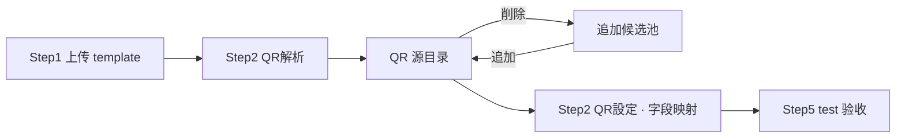
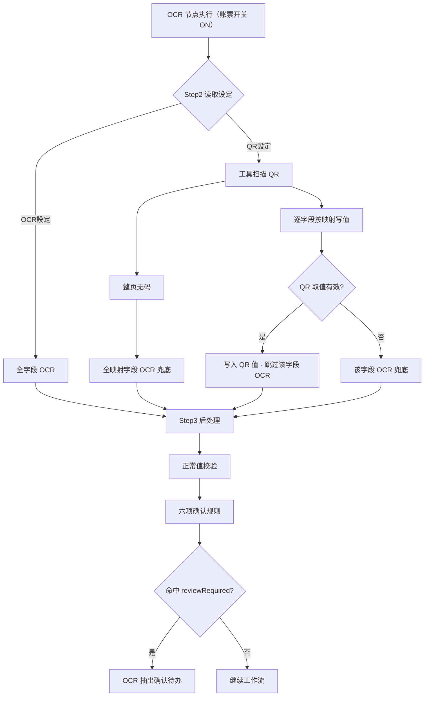
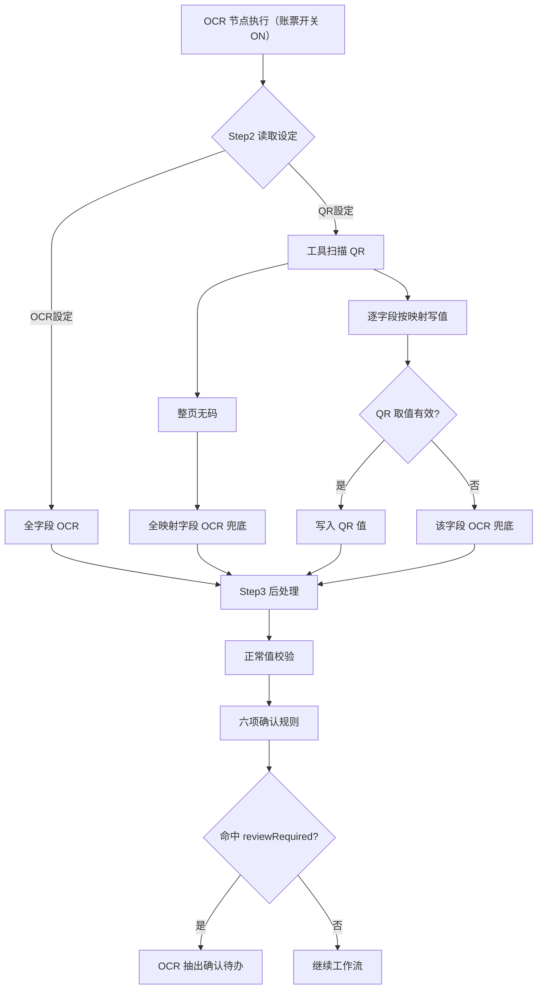
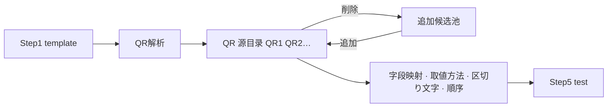

# NeosAI 日本保险 IDP — 产品需求文档（PRD · Phase2）

## 第 1 章｜文档基础与范围

### 1.1 文档定位

本 PRD 为第二期增量，面向 Z 客户保险金请求场景。未重写部分见第一期 PRD。


| 文档              | 链接                                                                    | 覆盖范围                     |
| --------------- | --------------------------------------------------------------------- | ------------------------ |
| 第一期总 PRD        | [neosai-idp-prd.vercel.app](https://neosai-idp-prd.vercel.app/)       | 平台背景、操作端、账票类型、实体状态、角色权限等 |
| 第一期业务场景与工作流 PRD | [idp-workflow-nwxh.vercel.app](https://idp-workflow-nwxh.vercel.app/) | 业务场景四步向导、工作流画布与节点        |


第 6 章写本期增量：业务场景设置、账票类型、我的任务。HTML 评审稿：`npm run build:prd:full` → `prd-public/index.html`。

### 1.2 第二期交付范围

本期在 Z 客户保险金请求场景下，补齐前处理节点内的画像不正検知、敏感情报检出，以及账票类型侧的 QR 字段读取与正常值校验。QR 字段映射、读取模式、正常值范围均在账票类型设置（Step2/Step3）维护；OCR 抽出节点配置面板沿用 P1（开关 + 对象账票），运行时引擎读取账票配置执行抽取。

#### 工作流


| 能力        | 说明                                                    |
| --------- | ----------------------------------------------------- |
| 前处理节点（增量） | 在 P1 前处理节点内新增画像不正検知、敏感情报检出；各模块可独立 ON/OFF，并按对象账票指定执行范围 |
| 业务场景通知扩展  | Step3 通知规则在前处理、OCR 等对象节点下配置处理状态/处理结果触发；站内信与邮件双渠道投递    |


推荐主链：开始 → 前处理 → 条件判断 → 人工确认 → OCR 抽出 → 条件判断 → 人工确认 → 数据映射 → AI 检证 → 条件判断 → 人工确认 → 自定义函数 → 终了。

#### 业务场景设置（增量）


| 步骤        | 本期追加                   |
| --------- | ---------------------- |
| Step2 工作流 | 前处理两子模块（画像不正検知、敏感情报检出） |
| Step3 通知  | 邮件渠道 + 多个邮件地址          |
| Step4 输出  | 勾选 UI 不变；运行时已脱敏则导出脱敏后值 |


#### 账票类型设置（增量）


| 步骤          | 本期追加                                                                                        |
| ----------- | ------------------------------------------------------------------------------------------- |
| Step1 AI 分类 | 分類信頼度閾値（必填）                                                                                 |
| Step2 AI 读取 | 字段读取 tab 下新增 OCR/QR 模式切换；OCR：字段定义 + prompt + 正解 + マスク（新增列）；QR：QR 源扫描与字段映射（取值方法、分割符、字段排序） |
| Step3 处理规则  | 正常值范围（正常条件列）；读取模型弹窗新增第六项「正常值范围超出」                                                           |
| Step5 效果测试  | QR/OCR 读取、后处理、正常值范围、マスク対象综合 test                                                            |


Step1 其余字段、Step4 图像处理及 Step2 读取模型弹窗主体沿用第一期。

#### 引擎与运行时


| 能力          | 说明                                                                           |
| ----------- | ---------------------------------------------------------------------------- |
| 通用 QR 解析    | 配置端在 Step1 样张扫描 QR 源；运行时 OCR 节点执行时读取账票 Step2 配置，调用工具扫描/解码                    |
| 正常值范围校验     | 账票 Step3 配置；OCR 节点执行时后处理完成后逐字段校验；超出正常值触发 OCR 抽出确认待办                          |
| QR 与 OCR 协同 | 账票 Step2 读取设定判定路由：OCR設定 全字段 OCR；QR設定 字段级 QR 优先、失败 OCR 兜底（细则见 6.03 · 运行时）     |
| 画像不正検知      | PS 加工、AI 生成、模板特征等检测；模型二值输出（是/否）；判「是」→ preprocessResult=reviewRequired → 人工确认 |
| 敏感情报检出      | 对 Step2 マスク=ON 字段实例脱敏；脱敏在 OCR 前（P-304）                                       |
| 邮件分发        | Step3 规则命中且勾选邮件时投递；与站内信并行                                                    |


#### 范围边界


| 类别  | 第二期                                                    |
| --- | ------------------------------------------------------ |
| 配置端 | 前处理两子模块；账票 Step1～3、Step5 增量；业务场景 Step3 邮件、Step4 导出取值规则 |
| 操作端 | 不新增菜单；我的任务 OCR 确认规则扩展；前处理确认页脱敏预览                       |
| 引擎  | 画像不正検知、敏感情报检出、QR 工具、正常值校验、邮件分发                         |
|     |                                                        |


画布建模定稿见 1.3；工作流与通知增量见 6.01。

### 1.3 工作流架构（前处理模块化）

画像不正検知、敏感情报检出作为前处理节点内子模块交付，不新增独立画布节点。运行时均在 OCR 抽出之前；模块顺序固定为：

```
画像不正検知 → 敏感情报检出 → 画像回転 → 画像補正 → 画像整列
```

（P-304：脱敏先于几何处理；回転先于補正。）

```
开始 → 前处理 → 条件判断 → … → OCR 抽出 → …
         ↑
    单一节点，内含 5 个子模块（各：模块开关 + 对象账票）
```


| 项         | 定稿规则                                                                       |
| --------- | -------------------------------------------------------------------------- |
| 节点库       | 不出现独立画像不正検知、敏感情报检出类型                                                       |
| 配置 UI     | 前处理节点配置面板「前処理設定」；五模块均为开关 + 对象账票多选；敏感情报检出对象账票仅限 Step1 关联且 Step2 有マスク=ON 的账票 |
| 节点输出      | preprocessStatus、preprocessResult（各子模块结果集約至节点级）                            |
| OCR 抽出节点  | 配置面板沿用 P1（开关 + 对象账票）；QR/正常值/后处理规则来自账票类型 Step2/Step3，运行时消费                  |
| ファイルステータス | 沿用 P1 四段（前処理 / 前処理確認 / OCR抽出 / OCR抽出確認）；子模块不单独占段                           |


### 1.4 本期里程碑

交付范围见 1.2；假设与待客户确认见 1.7。


| 域   | 模块               | 里程碑                                                |
| --- | ---------------- | -------------------------------------------------- |
| 配置端 | 业务场景 · Step2 前处理 | 前处理节点含画像不正検知、敏感情报检出模块；OCR 抽出节点无配置变更                |
| 配置端 | 业务场景 · Step3 通知  | 前处理/OCR 等对象节点触发；站内信 + 邮件双渠道；邮件宛先必填                 |
| 配置端 | 业务场景 · Step4 输出  | 输出字段勾选 UI 不变；运行时已脱敏则导出脱敏后值；QR/OCR 写入值经后处理后正常导出     |
| 配置端 | 账票类型 · Step1     | 分類信頼度閾値必填；template 样张供 QR 扫描                       |
| 配置端 | 账票类型 · Step2     | OCR/QR 读取模式切换；OCR 模式维护字段主数据 + マスク；QR 模式配 QR 源与字段映射 |
| 配置端 | 账票类型 · Step3     | 正常值范围（正常条件列）；读取模型弹窗六项确认规则                          |
| 配置端 | 账票类型 · Step5     | 综合 test：QR/OCR 结果、正常值结论、マスク対象、读取来源标签               |
| 运行时 | 前处理链             | 不正検知 → 脱敏 → 回転 → 補正 → 整列；脱敏在 OCR 前                 |
| 运行时 | OCR 抽出           | 节点开关同 P1；引擎读账票 Step2/Step3 执行 QR/OCR 路由、后处理与正常值校验  |
| 运行时 | 我的任务             | 六项确认规则 → OCR 抽出确认；画像不正 → 人工确认；前处理确认页脱敏预览           |
| 验收  | 原型               | 上述配置与运行时路径可在 workflow-ph2 原型演示                     |


### 1.5 假设与依赖

平台假设见 1.1；待客户确认项见 1.7。

### 1.6 跨模块影响

通知与待办独立：通知仅提醒，待办须办结。


| 模块         | 画像不正 / 正常值 / QR                                            | 敏感情报检出                  | 通知（Step3）      |
| ---------- | ---------------------------------------------------------- | ----------------------- | -------------- |
| 我的任务       | 六项确认规则任一命中 → OCR 抽出确认；QR 与 OCR 路径汇合后统一判定；前处理确认页增加遮挡预览与字段打码 | 不新增脱敏专用待办               | 通知不生成待办；可与待办并行 |
| 案件详情       | 展示 QR/OCR 写入并经后处理的字段值                                      | 已脱敏时展示脱敏后字段/文件          | 案件状态随节点失败信号汇聚  |
| 导出         | 导出 OCR 字段含 QR 写入值                                          | 已脱敏则导出脱敏后值              | —              |
| 业务场景 Step2 | 前处理面板新增两子模块                                                | 敏感情报检出对象账票受 Step2 マスク约束 | Step3 新增邮件渠道   |
| 业务场景 Step4 | 导出字段含 QR 写入并经后处理的值                                         | 已脱敏则导出脱敏后值              | —              |
| 账票类型       | Step1 阈值；Step2 OCR/QR/マスク；Step3 正常范围                       | Step2 マスク定义脱敏对象         | —              |


### 1.7 假设与待客户确认

本期正文按下列假设编写，研发与原型可据此推进。正文中以 `〔假设 P-xxx〕` 标注尚未经客户确认的规则；客户确认后更新对应章节并修订本表。


| 编号    | 能力模块       | 当前假设                                                                 | 状态    |
| ----- | ---------- | -------------------------------------------------------------------- | ----- |
| P-301 | 敏感情报检出     | 脱敏范围按 Step2 マスク=ON 及前处理模块对象账票；验收样张与效果图由客户提供                          | 待客户确认 |
| P-302 | 敏感情报检出     | 脱敏方式为黑块填充                                                            | 待客户确认 |
| P-303 | 敏感情报检出     | 脱敏后保留并可导出原图，同时保留脱敏后文件                                                | 待客户确认 |
| P-304 | 敏感情报检出     | OCR 前实例脱敏；OCR 抽出读取脱敏后实例                                              | 待客户确认 |
| P-305 | 敏感情报检出     | 敏感情报检出由本地部署大模型完成                                                     | 待客户确认 |
| P-401 | 正常值校验      | Step3「正常条件」支持：範囲内、<、≤、>、≥、列挙（枚举）                                     | 待客户确认 |
| P-402 | 正常值校验      | 字段超出正常值进 OCR 抽出确认；不设独立待办类型                                           | 待客户确认 |
| P-201 | QR Code 读取 | 账票 Step2 OCR設定 / QR設定；运行时 OCR 节点执行时 QR 优先 + 单字段 OCR 兜底（见 6.03 · 运行时） | 待客户确认 |
| P-203 | QR Code 读取 | 本期 QR 解析与映射以 Z 客户诊断书 template 为主                                     | 待客户确认 |
| P-204 | QR Code 读取 | QR 与 OCR 路径汇合后统一后处理与人工确认规则判定；不设 QR 专属人工确认规则                          | 待客户确认 |
| P-501 | 画像不正検知     | 前处理模块按业务场景 Step1 关联账票逐行开关；具体 ON 列表由客户指定                              | 待客户确认 |
| P-502 | 画像不正検知     | 模板特征检测依赖 Step1 template 与客户提供的正常样张库                                  | 待客户确认 |
| P-503 | 画像不正検知     | PS 加工、AI 生成、模板特征三类均纳入检测；UAT 试样集与客户共同定义                               | 待客户确认 |


---


## 第 2 章｜术语与词汇表


### 2.1 术语表（本期新增）


| 中文       | 日语/界面   | 定义                                                                      |
| -------- | ------- | ----------------------------------------------------------------------- |
| 画像不正検知   | 画像不正検知  | 前处理节点内模块：整合 PS 加工、AI 生成图像、模板特征不一致等检测；模型输出二值（是/否）；模块开关 + 对象账票；无风险分数与阈值配置 |
| QR 字段读取  | QR読取    | 运行时能力：OCR 节点执行时读取账票 Step2 配置，工具扫描/解码并按字段映射写值；非独立工作流节点、非 OCR 节点新增配置项     |
| QR 源     | QRソース   | 账票级逻辑槽位（QR1、QR2…）；配置端在固定账票下方扫描区域内从左到右检出；检出几个生成几个；可删除移入追加候选池或从候选池追加回目录   |
| 追加候选池    | 追加候補    | 扫描检出但用户从 QR 源目录删除的项；经源条「追加」加回目录；未在目录内时不参与字段映射与运行时写值                     |
| 取值方法     | 取値方法    | 字段级 QR 分割开关：关闭时全文取值，开启时按分割符与字段排序取值                                      |
| 分割符      | 区切り文字   | 分割模式下用于 split QR 解码串的 delimiter；连续分隔符之间视为空字段；段内空串或空值占位亦视为空              |
| 字段排序     | 順序      | 分割模式下，从 QR 解码串中取第几个片段（1 起）；同一 QR 源内 N=该源分割映射字段总数，順序须为 1～N 连号且不重复        |
| 正常范围     | 正常範囲    | Step3 与后处理同表配置的可选校验规则；支持最小值、最大值等                                        |
| AI マッチング | AIマッチング | Step3 工具栏：为 Step2 已有字段自动生成并反映处理规则；不生成【正常条件】                             |
| 敏感情报检出   | 敏感情報検出  | 前处理节点内模块：对 Step2 脱敏=ON 的字段检测 PII 并输出脱敏结果；模块开关 + 对象账票                    |
| 分類信頼度閾値  | 分類信頼度閾値 | Step1 必填项：案件集约识别分类阶段的账票分类置信度下限（百分比）                                     |
| 账票类型设置   | 帳票タイプ設定 | 配置端账票主数据模块；Step2 含 OCR/QR 双模式与脱敏；Step3 含処理ルール（P1）与正常范围（P2 增量）           |


### 2.2 易混术语（精选）


| 中文                  | 区分要点                                         |
| ------------------- | -------------------------------------------- |
| OCR 模式 vs QR 模式     | 共用字段清单；字段主数据在 OCR 模式维护，QR 模式只配 QR 源与取值       |
| 账票读取模式 vs 字段 OCR 兜底 | OCR設定 整票 OCR；QR設定 整票 QR 优先，单字段失败时 OCR 兜底     |
| 前处理模块 vs 独立节点       | 画像不正检测、敏感信息检出在画布前处理节点内配置                     |
| 正常范围 vs AI 检证       | 正常范围在账票 Step3 配置、OCR 节点执行时校验；AI 检证在独立节点跨字段   |
| 配置 test vs 前处理确认预览  | Step5 标记脱敏对象；遮挡预览与打码在前处理确认页                  |
| OCR 抽出确认 vs 人工确认    | OCR 字段复核 vs 画像不正复核，分属不同待办                    |
| Step4 导出 vs マスク     | Step4 只勾选输出字段；マスク 在账票 Step2 定义；运行时已脱敏则导出脱敏后值 |


## 第 3 章｜数据结构与状态（第二期增量）


### 3.1 账票类型实体增量


| 属性       | 说明                                                                                            |
| -------- | --------------------------------------------------------------------------------------------- |
| 分類信頼度閾値  | Step1 必填；0～100 整数百分比；识别分类阶段消费                                                                 |
| QR 源目录   | qrSources[]：id（QR1、QR2…）、检测框、解码文本；Step1 样张经工具在下方区域从左到右扫描写入；可删至追加候选池或从候选池加回                    |
| 追加候选池    | qrIgnored[]：扫描检出但不在目录内的 QR；重扫时保留用户排除状态                                                        |
| 账票读取模式   | Step2 读取设定：OCR設定（整票纯 OCR）或 QR設定（整票 QR 优先 + 字段失败 OCR 兜底）；表格字段固定 OCR                            |
| 字段 QR 映射 | QR設定 下各文本字段：qrSourceId、extractMethod、delimiter（分割符）、segmentIndex（字段排序）；type/必須/マスク等继承 OCR 模式，不在 QR 模式编辑 |
| 字段正常值范围  | Step3 与后处理同表：启用、最小、最大                                                                         |
| 脱敏标记     | Step2 OCR 模式 · 字段行マスク开关                                                                       |


同一诊断书账票类型可覆盖有 QR 与无 QR 物理件；运行时按 Step2 读取设定选择整票 OCR 或 QR 优先 + 字段 OCR 兜底。

### 3.2 前处理子模块顺序与文件状态

在 [第一期 · 前处理节点](https://idp-workflow-nwxh.vercel.app/)（画像回転 / 画像補正 / 画像整列）之前，新增并固定插入：

```
画像不正検知 → 敏感情报检出 → （P1 三项子模块）
```


| 步骤  | 模块           | 理由                            |
| --- | ------------ | ----------------------------- |
| 1   | 画像不正検知       | 优先在原实例上判定篡改/伪造风险              |
| 2   | 敏感情报检出       | P-304：OCR 读脱敏后实例；几何变换前先遮罩个人信息 |
| 3～5 | 回転 → 補正 → 整列 | 沿用 P1                         |


文件状态 四段枚举不变；五个子模块进度汇总至 preprocessStatus / preprocessResult，不在案件一覧展示子模块名。


| 处理节点    | 界面组合示例                               | 触发条件（P2）                       |
| ------- | ------------------------------------ | ------------------------------ |
| 前処理     | 前処理等待 / 前処理中 / 前処理成功 / 前処理失敗         | 含节点内全部已启用子模块（不正検知、脱敏、回転→補正→整列） |
| 前処理確認   | 前処理確認待ち                              | 前处理 HITL 待办未办结（沿用 P1）          |
| OCR抽出   | OCR抽出待ち / OCR抽出中 / OCR抽出成功 / OCR抽出失敗 | 读取前处理输出实例（含脱敏后）                |
| OCR抽出確認 | OCR抽出確認待ち                            | OCR 抽出确认待办未办结                  |


### 3.3 联级关系

画像不正检测、敏感信息检出的失败与待办信号参与案件状态汇总；八种案件状态枚举不变。

---


## 第 4 章｜用户交互流程

本章按第二期五项增量能力组织用户故事：正常值校验、マスク（敏感情报检出）、画像不正検知、通知（邮件）、QR 读取。操作端入口分工、待办类型、案件状态均沿用 [第一期总 PRD](https://neosai-idp-prd.vercel.app/)。

原则：待办在「我的任务」办结；整体进度在「案件列表」检索；字段修正发生在待办执行页。


| 入口                 | 谁常用       | 用户要做什么                             |
| ------------------ | --------- | ---------------------------------- |
| 账票类型设置             | admin     | Step2 マスク/QR；Step3 正常值；Step5 test  |
| 业务场景设置             | admin     | Step2 前処理設定（不正検知、脱敏）；Step3 通知（含邮件） |
| 新增上传 / 案件列表 / 我的任务 | 操作员       | 上传集约、跟踪进度、办结待办                     |
| 站内信                | 操作员、操作管理者 | 查阅通知（可与邮件并行；不生成待办）                 |


---


### 4.2 故事：正常值校验

角色：admin（配置正常条件）；操作员（办结 OCR 抽出确认）

目标：在账票类型 Step3 为数值/枚举字段配置正常范围；运行时 OCR 节点执行后处理时校验，超出则进 OCR 抽出确认，经办修正后继续流程。

配置流程：

```
账票类型 Step3 → 字段行启用正常条件 → 读取模型弹窗勾选「正常値範囲を超えています」→ Step5 test 查看范围结论
```

1. admin 在 Step3 処理ルール表为字段选择正常条件（範囲内、<、≤、>、≥、列挙）并填写阈值或枚举值。
2. 在读取模型设置弹窗确认六项确认规则中包含第六项「正常値範囲を超えています」。
3. Step5 效果 test：字段卡片展示範囲OK / 範囲越界标签；越界样张用于验收配置。
4. 发布业务场景后，运行时引擎在 OCR 节点执行时读取 Step3 配置校验（OCR 节点配置面板无新增项）。

运行流程：

```
OCR 抽出（后处理完成）→ 正常值校验 → 超出 → ocrResult=reviewRequired → 我的任务 · OCR 抽出确认
```

1. 案件集约完成后工作流推进至 OCR 抽出；引擎读取账票 Step3 对已写入字段逐条校验。
2. 某字段超出正常值（如通院日数 20，配置 1～15）→ 该账票合并一条 OCR 抽出确认待办；理由含「正常値範囲を超えています」。
3. 操作员在 my 任务打开待办，对照实例修正字段值；要確認字段高亮 + 可编辑，不展示越界区间说明。
4. 修正后仍超出或必填仍空 → 阻断办结；通过后工作流继续。

---


### 4.3 故事：マスク（敏感情报检出）

角色：admin（定义脱敏对象与启用模块）；操作员（查看脱敏结果；无专用待办）

目标：在账票 Step2 标记需脱敏字段，在业务场景前处理启用敏感情报检出；运行时在 OCR 前对实例脱敏，导出与详情展示脱敏后值。

配置流程：

```
账票 Step2 OCR 模式 · 字段マスク=ON → 业务场景 Step2 前処理設定 · 敏感情报检出 ON + 对象账票
```

1. admin 在账票类型 Step2 OCR 模式，对需脱敏字段开启マスク列（如患者氏名、住所）。
2. 在业务场景 Step2 前処理設定 开启「敏感情报检出」，选择对象账票（可选范围 = Step1 关联且存在マスク=ON 字段的账票）。
3. Step5 test 标记マスク対象；不展示脱敏后像素预览（遮挡预览在前处理确认页，见运行流程）。
4. 业务场景 Step4 输出字段勾选 UI 不变；运行时若已脱敏则导出脱敏后值。

运行流程：

```
前处理：画像不正検知 → 敏感情报检出（PII 检测 + 黑块填充）→ 回転 → 補正 → 整列 → OCR 抽出读脱敏后实例
```

1. 工作流进入前处理节点；敏感情报检出对マスク=ON 字段所在实例执行脱敏〔P-301～305、P-304〕。
2. 脱敏成功 → 后续 OCR 抽出读取脱敏后实例；案件详情与导出字段值为脱敏后值。
3. 前处理确认页（已脱敏场景）：原图 / 遮挡后 Tab 切换预览，默认遮挡后；マスク=ON 字段值统一打码展示。
4. 脱敏 Agent 失败 → preprocessStatus=failed，走案件异常；不新增脱敏专用待办；可并行收到 Step3 通知。

---


### 4.4 故事：画像不正検知

角色：admin（启用模块）；操作员（人工确认待办）

目标：在前处理节点启用画像不正検知，对指定账票检测 PS 加工/AI 生成/模板特征异常；判「是」时进人工确认（非 OCR 抽出确认）。

配置流程：

```
业务场景 Step2 → 前処理設定 → 画像不正検知 ON + 对象账票 → Step3 可选配置 preprocessResult=reviewRequired 通知
```

1. admin 在业务场景 Step2 前処理設定 开启「画像不正検知」，按 Step1 关联账票逐行指定对象（未指定则视为全部关联账票）〔P-501〕。
2. 依赖账票 Step1 template 与客户正常样张库做模板特征比对〔P-502、P-503〕。
3. 可选：Step3 为前处理对象配置 preprocessResult=reviewRequired 或 preprocessStatus=failed 的通知规则。
4. 画布节点库不出现独立「画像不正検知」节点类型。

运行流程：

```
前处理 · 画像不正検知 → 模型输出「是」→ preprocessResult=reviewRequired → 我的任务 · 人工确认
```

1. 前处理串行执行时，画像不正検知在脱敏与几何处理之前运行。
2. 模型二值输出「是」→ 生成人工确认待办；操作员在人工确认页选择完了/补件/案件中止。
3. 输出「否」→ 继续后续子模块与 OCR 抽出。
4. 检测服务异常 → preprocessStatus=failed；可走案件异常与 Step3 告警，不进 OCR 抽出确认。

---


### 4.5 故事：通知（站内信 + 邮件）

角色：admin（配置规则）；操作员、操作管理者（收件人）

目标：在业务场景 Step3 扩展邮件渠道；前处理/OCR 等节点事件命中规则时并行投递站内信与邮件；通知仅告知，不替代待办。

配置流程：

```
业务场景 Step3 → 通知ルール追加 → 对象节点 + 触发事件 + 渠道（站内信/邮件）+ 宛先 + 件名/正文
```

1. admin 选择对象节点（如前处理、OCR 抽出）与触发事件（如 preprocessStatus=failed、preprocessResult=reviewRequired、ocrResult=reviewRequired）。
2. 通知渠道多选站内信、邮件，至少选一；勾选邮件时填写邮件宛先（多地址分隔，格式校验）。
3. 编辑件名/正文，可插入通知变量池 token；保存规则。
4. 典型配置：前处理 failed → 邮件告警运维；OCR failed → 站内信 + 邮件通知操作管理者。

运行流程：

```
节点输出事件 → 匹配 Step3 开启规则 → 并行发送站内信 / 邮件 → 用户查阅（工作流继续；待办独立生成）
```

1. 运行时引擎按节点类型与变量取值匹配 Step3 规则；命中多条则全部发送。
2. 操作员从顶栏站内信查阅；勾选邮件的规则同步投递至配置邮箱。
3. 变量缺值按空渲染，不阻断流程；邮件投递失败记日志。
4. 同一事件可同时触发通知与待办（如 OCR 失败：邮件告警 + OCR 抽出确认待办）。

---


### 4.6 故事：QR 读取

角色：admin（QR 映射与读取模式）；操作员（OCR 抽出确认，无 QR 专用待办）

目标：在账票 Step2 配置 QR 源与字段映射；运行时 OCR 节点执行时 QR 优先、单字段失败 OCR 兜底；与 OCR 路径汇合后统一六项确认规则。

配置流程：



1. admin 在 Step1 上传 template 样张；Step2 テキスト読取 内点击 QR解析，在账票下方区域从左到右扫描生成 QR 源目录。
2. 切换读取设定为 QR設定；为各字段绑定 QR 源、取值方法、分割符、字段排序（界面列名：QRソース、取値方法、区切り文字、順序）；OCR 模式维护的項目名/タイプ/マスク 在 QR 模式只读。
3. Step5 test：QR 路径字段卡片右上角展示读取来源标签（QR読取 / QR→OCR兜底）；纯 OCR 字段不展示。
4. 业务场景 OCR 抽出节点仍为开关 + 对象账票；引擎执行时读取上述账票配置，画布无 QR 专用节点。

运行流程：



1. QR設定：工具扫描实例 QR，按映射写值；单字段 QR 失败则该字段 OCR 兜底；整页无码则全映射字段 OCR 兜底。
2. OCR設定 或无有效 QR 映射：全字段 OCR（同 P1）。
3. QR 成功字段不走 OCR 置信度判定；Master 照合与正常值校验仍适用（见 6.04 适用矩阵）。
4. 兜底后仍无法自动确认 → OCR 抽出确认待办；不单独设 QR 待办类型；确认页不展示读取来源。

---


## 第 6 章｜功能详细说明


### 6.01 业务场景设置

四步向导框架、Step1 集约规则、发布门禁等沿用 [第一期 · 6.01](https://idp-workflow-nwxh.vercel.app/)。工作流画布与 Step3 通知的主体规格亦在该文档 6.01.7～6.01.8，本节只写 P2 增量。

#### Step2 工作流画布（本期增量）

节点库、画布编排、变量引用、设置检查及 OCR/条件/人工确认等节点面板规格见 [第一期 · 6.02](https://idp-workflow-nwxh.vercel.app/)。

1. 前处理面板新增画像不正检测、敏感信息检出（各：开关 + 对象账票）；插入在 P1 三项子模块（回転/補正/整列）之前。
2. 敏感信息检出可选账票：Step1 关联且 Step2 有マスク=ON。
3. 画像不正检测：输出是/否，判「是」→ preprocessResult=reviewRequired → 人工确认〔P-501～503〕。
4. 敏感信息检出：对マスク=ON 字段实例脱敏〔P-301～305、P-304〕。
5. 节点库移除独立「画像不正検知」「敏感情报检出」节点类型。
6. OCR 抽出节点：配置面板沿用 P1，按 Step1 关联账票逐行开关；不设 QR、正常值等新配置项。QR 读取、正常值校验、后处理规则均在账票类型 Step2/Step3 配置，由运行时引擎在该节点执行时读取（见 6.03 · 运行时）。


| 信号                              | 新增或变化    |
| ------------------------------- | -------- |
| preprocessResult=reviewRequired | 画像不正判「是」 |


| 场景       | 处理                      |
| -------- | ----------------------- |
| 画像不正检测失败 | preprocessStatus=failed |


#### Step3 通知设置（本期增量）

通知规则框架、对象节点、触发事件、站内信投递沿用第一期 6.01.8。

1. 通知渠道新增邮件：可多选站内信 + 邮件；勾选邮件须填宛先；共用件名/正文与变量渲染。
2. 前处理对象节点可配置 preprocessStatus / preprocessResult 触发（含画像不正、脱敏 Agent 失败等）。


| 字段/参数 | 控件  | 必填    | 说明          |
| ----- | --- | ----- | ----------- |
| 通知渠道  | 多选  | 是     | 站内信、邮件，至少选一 |
| 邮件宛先  | 文本  | 勾选邮件时 | 邮箱地址，格式校验   |


| 场景       | 处理        |
| -------- | --------- |
| 勾选邮件未填宛先 | 保存报错      |
| 邮件投递失败   | 记日志，工作流继续 |


#### Step4 输出字段与发布（本期增量）

输出字段勾选、排序、发布门禁 UI 与流程沿用 P1；Step4 仍只配置「导出哪些 OCR 字段」，不提供マスク列或导出格式选项。


| 维度     | P1                        | P2 变化                       |
| ------ | ------------------------- | --------------------------- |
| 配置端    | 从 Step2 已开启 OCR 的账票类型勾选字段 | 不变                          |
| 运行时导出值 | OCR 抽出并经后处理的字段值           | 若本案已执行敏感情报检出，导出值为脱敏后值       |
| QR 路径  | —                         | QR 写入并经 Step3 后处理的值正常进入导出候选 |
| 导出确认待办 | 经办确认并提交导出                 | 展示与提交均为运行时最终值（含脱敏后值）        |


说明：マスク 对象在账票类型 Step2 定义；Step4 不参与脱敏配置，只消费工作流链路产出的字段终值。原图/脱敏后文件是否一并交付由导出引擎策略决定〔P-303〕；字段级导出始终跟随脱敏结果。


| 场景          | 处理                      |
| ----------- | ----------------------- |
| 关联账票达 30 上限 | 阻断追加（Step1，沿用 P1）       |
| 未执行脱敏       | 导出 OCR/QR 后处理值（同 P1）    |
| 已执行脱敏       | 导出字段值为脱敏后值；案件详情同步展示脱敏后值 |


### 6.03 账票类型设置


#### 功能点

Step1：新增分類信頼度閾値（0～100，必填）；template 样张供 QR 扫描。

Step2：读取设定切换 OCR設定 / QR設定；OCR 模式维护字段主数据 + マスク；QR 模式配 QR 源、取值方法、分割符、字段排序；QR解析 扫描 Step1 样张生成 QR1、QR2…

Step3：新增正常条件列（範囲内、<、≤、>、≥、列挙）〔P-401、402〕；读取模型弹窗六项确认规则（见 6.04）。

Step5：test 展示 QR/OCR 结果、正常值结论、マスク対象标记；QR 路径字段卡片显示读取来源标签。

#### 运行时（OCR 抽出节点执行时）

OCR 抽出节点开关与 P1 相同；引擎对该节点 ON 的账票，读取账票类型已保存的 Step2/Step3 配置执行抽取，不在画布上重复配置。



| 步骤 | 读取配置 | 行为 |
| --- | --- | --- |
| 路由 | 账票 Step2 读取设定 | OCR設定：全字段 OCR；QR設定：工具扫描 QR → 逐字段写值，单字段失败 OCR 兜底，整页无码则全映射字段 OCR 兜底 |
| 后处理 | 账票 Step3 処理ルール | 日期规范化、Master 照合等（P1） |
| 正常值校验 | 账票 Step3 正常条件 | 超出正常值 → ocrResult=reviewRequired → OCR 抽出确认 |
| 确认规则 | 读取模型弹窗六项 | OR 合并判定；适用矩阵见 6.04 |

#### QR 配置流程



扫描在 Step1 样张固定账票下方区域从左到右执行；误检可删至追加候选池，需要时经「追加」加回目录并重编号。


| 场景       | 处理                                  |
| -------- | ----------------------------------- |
| 超出正常值    | ocrResult=reviewRequired → OCR 抽出确认 |
| 字段 QR 失败 | 该字段 OCR 兜底；命中规则则 reviewRequired     |


#### Step1 分类设定


| 字段/参数       | 控件   | 必填  | 校验          | 下游消费        |
| ----------- | ---- | --- | ----------- | ----------- |
| 分類信頼度閾値     | 数字输入 | 是   | 0～100 整数    | 识别分类        |
| template 样张 | 文件上传 | 否   | 换样张后重新 QR解析 | Step2 QR 扫描 |


#### Step2 读取模式


| 字段/参数 | 界面文案（日语） | 控件   | 必填  | 说明               | 下游消费      |
| ----- | --------- | ---- | --- | ---------------- | --------- |
| 读取设定  | OCR設定 / QR設定 | 轻量切换 | 是   | 二选一              | 运行时路由     |
| マスク   | マスク       | 开关   | 否   | OCR 模式字段行        | 前处理敏感信息检出 |


#### Step2 QR 映射


| 字段/参数  | 界面文案（日语） | 控件       | 必填      | 说明                              |
| ------ | --------- | -------- | ------- | ------------------------------- |
| QR 源目录 | QRソース     | 来源条 + 削除 | 否       | Step1 样张扫描，从左到右编号 QR1、QR2…      |
| QR 源   | QRソース     | 下拉       | QR設定下必填 | 绑定目录内 QR 源；占位「選択してください」         |
| 取值方法   | 取値方法     | 开关       | QR 源非空  | OFF 全文 / ON 按分割符+字段排序取值         |
| 分割符    | 区切り文字    | 输入       | 分割开启    | split 用 delimiter               |
| 字段排序   | 順序       | 数字       | 分割开启    | 1～N 连号，N=该源映射字段数；同一 QR 源内不可重复 |


#### Step3 正常值范围


| 字段/参数 | 控件    | 枚举             | 下游消费      |
| ----- | ----- | -------------- | --------- |
| 正常条件  | 下拉+输入 | 範囲内、<、≤、>、≥、列挙 | OCR 后处理判定 |


超出时 OCR 抽出确认理由：「正常値範囲を超えています」。

#### Step5 效果测试

test 输出：test摘要、读取来源标签（QR 路径）、范围结论、マスク対象标记。

#### Step2 · QR 界面文案（日语）

Step2 读取 tab 与模式切换、QR 源条、映射表、提示与弹窗沿用原型日文文案。


| 类型     | 界面文案（日语）                                                                                         | 说明              |
| ------ | ------------------------------------------------------------------------------------------------ | --------------- |
| Tab    | テキスト読取                                                                                           | Step2 文本读取 tab  |
| Tab    | テーブル情報読取                                                                                         | Step2 表格读取 tab  |
| 模式切换   | OCR設定 / QR設定                                                                                     | テキスト読取 内轻量切换   |
| 区域标题   | QRソース                                                                                            | QR 源条标题          |
| 空态     | Step1 でテンプレートをアップロードしてください                                                                         | 无 Step1 template |
| 空态     | 読取中…                                                                                             | QR 扫描进行中        |
| 空态     | QR を検出できませんでした。「QR解析」で再試行できます                                                                    | 扫描无检出           |
| 表头     | 番号 / 項目名 / 必須 / タイプ / QRソース / 取値方法 / 区切り文字 / 順序                                              | 字段映射表列          |
| 下拉占位   | 選択してください                                                                                         | QR 源下拉          |
| 取値方法说明 | OFF：QR 解码全文をそのままフィールドに書き込みます。ON：区切り文字と順序を入力し、指定した 1 段だけを取得します。                                    | 取値方法列 i 提示      |
| 分割符说明  | 区切り文字で split します。連続する区切り（例：$$）の間は空フィールドです。段内が空文字または空値占位の場合も空として扱います。                              | 区切り文字列 i 提示    |
| 字段排序说明 | 分割時に QR 解码串から取る位置（1 起）。同一 QR ソース内で重複不可。                                                           | 順序列 i 提示       |
| タイプ说明  | OCR設定で定義した項目タイプを表示します。QR読取では編集できません。                                                              | タイプ列 i 提示      |
| QR源说明  | QR設定に入ると Step1 テンプレートを自動スキャンし、左から右へ QR1、QR2… と検出数に応じて割り当てます。不要な QR は削除、漏れた QR は追加できます。テンプレート変更後は「QR解析」で再実行できます。 | QRソース区 i 提示    |


#### 按钮（Step2 · QR）


| 按钮   | 界面文案（日语） | 启用条件             | 点击后                                                                 |
| ---- | -------- | ---------------- | ------------------------------------------------------------------- |
| QR解析 | QR解析     | Step1 有 template | 重扫 QR 目录；已有映射时弹窗「QR解析を再実行すると、現在の QRソースとフィールドマッピングが上書きされます。続行しますか？」；按钮「続行」「キャンセル」 |
| 追加   | 追加       | 候选池非空            | 加回下一项 QR 源；无候选时提示「追加できる QR ソースがありません」                              |
| 删除   | 削除       | 目录 ≥1 项          | 移入追加候选池并重编号；成功提示「{QRn} を QRソースから除外しました」                            |


#### 异常与边界


| 场景                       | 处理                         |
| ------------------------ | -------------------------- |
| 分類信頼度閾値空                 | 阻断保存 Step1                 |
| Step1 无 template 进 QR 模式 | 展示「Step1 でテンプレートをアップロードしてください」 |
| 正常条件不完整 / min>max        | 阻断保存 Step3                 |
| QR 失败                    | 该字段 OCR 兜底；命中规则 → OCR 抽出确认 |


### 6.04 我的任务

待办列表、指派、办结沿用 [第一期总 PRD · 我的任务](https://neosai-idp-prd.vercel.app/)。

#### 功能点（本期增量）

1. 读取模型弹窗确认规则扩展为六项（前五项 P1，第六项 P2「正常值范围超出」）；六项任一命中 → OCR 抽出确认待办。
2. 画像不正 preprocessResult=reviewRequired → 人工确认待办（非 OCR 抽出确认页）。
3. 前处理确认页（已脱敏）：原图/遮挡后预览 + 敏感字段打码〔P-302、303〕。
4. 读取来源标签仅 Step5 test、案件日志展示；OCR 抽出确认执行页不展示读取来源。
5. QR 不单独产生待办类型；QR 与 OCR 路径汇合后统一按六项规则判定。


#### OCR 抽出确认规则（六项）

配置入口：业务规则配置 → モデル設定 → 读取模型设置弹窗（人工确认触发规则，多选 OR）。


| 序号  | 规则             | 判定对象                | 典型场景                         |
| --- | -------------- | ------------------- | ---------------------------- |
| 1   | 信頼度が閾値未満       | OCR 抽出字段置信度         | 诊断书手写区域 OCR 仅 62%，低于模型阈值     |
| 2   | 多モデル結果不一致      | 主模型与校验模型输出          | 主模型读「齊藤」、校验模型读「斎藤」           |
| 3   | Master照合類似度が低い | Step3 Master 照合后相似度 | 伤病情报与 ICD-10 词典最佳匹配低于阈值      |
| 4   | Master照合結果が空   | Step3 Master 照合无命中  | 医疗机构名在 Master 中查无结果          |
| 5   | Master照合信頼度が低い | Master 照合返回置信度      | 照合有候选但置信度不足                  |
| 6   | 正常値範囲を超えています   | Step3 正常条件（P2）      | 通院日数 OCR/QR 值为 20，配置范围为 1～15 |


六项为 OR 关系：账票级任一字段命中 → 该账票合并为一条 OCR 抽出确认待办。

#### OCR設定 与 QR設定 下的规则适用


| 读取模式  | 字段取值路径                | 具体场景                            | 规则 1～2（OCR 置信） | 规则 3～5（Master） | 规则 6（正常值） | 进 OCR 抽出确认 |
| ----- | --------------------- | ------------------------------- | -------------- | -------------- | --------- | ---------- |
| OCR設定 | 全字段 OCR               | Step2 选 OCR設定；或 QR設定 但无有效 QR 映射 | 适用             | 适用             | 适用        | 六项任一命中     |
| QR設定  | QR 成功写值               | 底部 6 码全扫到，split 正常，字段值写入        | 不适用（未走 OCR）    | 适用（后处理仍执行）     | 适用        | 规则 3～6 命中  |
| QR設定  | 单字段 QR 失败 → OCR 兜底    | 某 QR 源解码空、split 后为空、映射源未检出      | 仅兜底字段适用        | 兜底字段适用         | 兜底字段适用    | 兜底字段六项 OR  |
| QR設定  | 整页无 QR → 全映射字段 OCR 兜底 | 物理件无码、扫描 0 条、样张与实票不符            | 全映射字段适用        | 全映射字段适用        | 全映射字段适用   | 同 OCR設定    |
| QR設定  | QR 写值 + 后处理异常         | QR 读出「2025/13/01」日期规范化失败        | 不适用            | 视后处理/Master 结果 | 视范围校验     | 对应规则命中     |


说明：

- QR 成功字段不产生 OCR 置信度，故规则 1、2 不触发；Master 照合与正常值校验在 Step3 后处理阶段仍对该字段执行。
- QR 失败触发单字段 OCR 兜底后，该字段与纯 OCR 路径相同，六项均适用。
- 画像不正検知 reviewRequired 不进本表，走人工确认待办（与 OCR 抽出确认分属不同待办类型）。


#### 前处理确认执行页（P2）


| 元素    | 规格                               |
| ----- | -------------------------------- |
| 展示条件  | 敏感信息检出成功                         |
| 实例预览  | 原图 / 遮挡后 Tab 切换，默认遮挡后〔P-302、303〕 |
| 敏感字段值 | マスク=ON 字段，统一打码展示                 |


#### 异常与边界


| 场景                     | 处理                            |
| ---------------------- | ----------------------------- |
| 必填仍空或仍超出正常值            | 阻断办结                          |
| 脱敏失败                   | preprocessStatus=failed，走案件异常 |
| reviewRequired 无人工确认分支 | 可发布但运行时停止；设置检查警告（沿用 P1）       |


---

