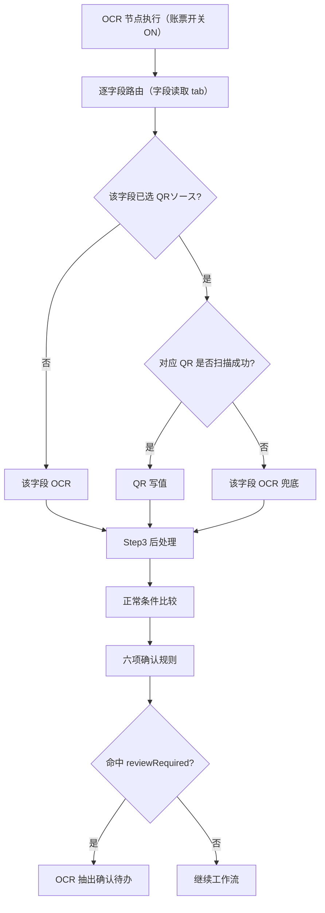

# NeosAI 日本保险 IDP — 产品需求文档

## 第 1 章｜术语与词汇表

### 1.1 术语表（本期新增）


| 中文      | 日语/界面     | 定义                                                                                                                                          |
| ------- | --------- | ------------------------------------------------------------------------------------------------------------------------------------------- |
| 画像不正検知  | 画像不正検知    | 前处理节点内模块：整合 PS 加工、AI 生成图像、模板特征不一致检测；模型输出二分值（通过/不通过）；模块开关 + 对象账票                                                                             |
| QR 字段读取 | QR読取      | 运行时能力：仅针对 Step2 字段读取 tab（界面：テキスト読取）配置的 QR 映射；OCR 节点执行时工具扫描/解码并按映射写值；テーブル情報読取 不参与 QR                                                         |
| QR 源    | QRソース     | 账票级逻辑槽位（QR1、QR2…）；配置端在固定账票下方扫描区域内从左到右检出；检出几个生成几个；目录仅展示扫描结果，不可手动删改                                                                           |
| 取值方法    | 取値方法      | 字段级 QR 分割开关：关闭时全文取值，开启时按分割符与字段排序取值                                                                                                          |
| 分割符     | 区切り文字     | 分割模式下用于 split QR 解码串的 delimiter；连续分隔符之间视为空字段；段内空串或空值占位亦视为空                                                                                  |
| 字段排序    | 順序        | 分割模式下，从 QR 解码串中取第几个片段（1 起）；同一 QR 源内 N=该源分割映射字段总数，順序须为 1～N 连号且不重复                                                                            |
| 正常范围    | 正常範囲      | Step3 正常条件：按 Step2 タイプ 决定；`string` 不可配；`number` 可配数值范围；`enum` 仅列挙；比较对象为 処理ルール 后处理产物                                                         |
| PII     | PII       | 个人可识别信息（Personally Identifiable Information）：可识别具体个人的信息，如姓名、地址、电话、证件号、病历号等；本期不在 Step2 单独配置 PII 规则，而由前处理「敏感情报检出」按 Step2 マスク=ON 字段在实例影像上检测并打码 |
| 脱敏标记    | マスク       | Step2 OCR設定 字段/表格列开关：标记该字段为前处理脱敏对象；マスク=ON 的字段参与 PII 检测与打码；导出与详情展示脱敏后值                                                                       |
| 敏感情报检出  | 敏感情報検出    | 前处理节点内固定子模块：对 Step2 マスク=ON 字段做 PII 检测与图像打码；模块开关 + 对象账票；工程执行（success/failed），非 Agent 业务判定                                                    |
| 分類信頼度閾値 | 分類信頼度閾値   | Step1 必填项：案件集约识别分类阶段的账票分类置信度下限（百分比）                                                                                                         |
| 账票类型设置  | 帳票タイプ設定   | 配置端账票主数据模块；Step2 含 OCR/QR 双模式与脱敏；Step3 含処理ルール与正常范围                                                                                          |
| 抽出单位    | （プロンプト约定） | Step2 プロンプト 中声明的 OCR **输出量纲**（如 cm、円、日）；与 タイプ 解耦；**正解サンプル**与 Step3 正常条件阈值均使用该量纲下的纯数字                                                        |


### 1.2 易混术语


| 中文                  | 区分要点                                                                                                                                                         |
| ------------------- | ------------------------------------------------------------------------------------------------------------------------------------------------------------ |
| OCR 读取设定 vs QR 读取设定 | 字段主数据在 OCR 读取设定维护，QR 读取设定只配 QR 源与取值；テーブル情報読取 固定 OCR                                                                                                          |
| 账票读取模式 vs 字段 OCR 兜底 | QR設定 下逐字段路由：① 未选 QRソース → 该字段 OCR；② 已选且 QR 扫到 → 映射写值；③ 已选但 QR 未扫到 → 该字段 OCR 兜底；OCR設定 则全字段 OCR                                                                 |
| 敏感情报检出 vs 画像不正検知    | 脱敏为前处理工程（敏感信息检测+打码）；画像不正为模型二值判定（通过/不通过）→ 前处理人工确认待办；二者均无阈值配置                                                                                                  |
| マスク vs PII 检测       | マスク 是 Step2 配置侧标记哪些字段/列需脱敏；PII 检测是运行时在前处理实例影像上定位并打码；二者配合，无マスク 则不触发该字段脱敏                                                                                      |
| 正常范围 vs Master 照合   | 正常条件是否展示由 Step2 タイプ 决定（`string` 不可配）；与 処理ルール 解耦；マスタ照合 仍走 OCR 确认规则 3～5                                                                                        |
| 正常范围 vs AI 检证       | 正常范围在账票 Step3 配置、OCR 节点执行时校验；AI 检证在独立节点跨字段                                                                                                                   |
| 配置 test vs 前处理确认预览  | Step5 标记脱敏对象；遮挡预览与打码在前处理确认页                                                                                                                                  |
| 配置 test vs OCR 抽出确认 | Step5 展示取值来源（QR/OCR) ；OCR 抽出确认页不展示来源标签                                                                                                                       |
| タイプ vs プロンプト抽出单位    | **タイプ**（`number` / `enum` / `string`）只声明字段类别与 Step3 正常条件是否可配；**cm / m / 円** 等量纲写在 **プロンプト**，不由 タイプ 表达；正解サンプル须按 プロンプト 量纲填写（如账面 `1.6米`、プロンプト 约定 cm → 正解 `160`） |
| 规则 6 vs QR 写值       | 规则 6 **兼容 QR**：**QR 写值**越界 alone 即命中；**OCR / QR→OCR 兜底**须低置信且越界（无 OCR 置信时不考核「低置信」半条）                                                                         |


## 第 2 章｜用户交互流程

本章按五项能力组织用户故事：正常值校验、マスク（敏感情报检出）、画像不正検知、通知（邮件）、QR 读取。

### 2.1 故事：正常值校验

角色：admin（配置正常条件）；操作员（办结 OCR 抽出确认）

目标：Step3 配置正常范围；运行时后处理完成后校验，未通过则进 OCR 抽出确认。判定口径、比较模式与异常见 6.03 · Step3 正常值范围；执行页展示边界见 6.04。

```
配置：Step3 启用正常条件 + 选择人工确认规则 6 → Step5 test 验收
运行：后处理完成 → 正常条件比较 → reviewRequired → 我的任务 · OCR 抽出确认
```

1. admin 在 Step3 为 `number` / `enum` 类型字段选配正常条件（见 6.03 · 适用 タイプ）；与 Step2 プロンプト、処理ルール 对齐；Step5 展示字段来源标签（QR/OCR）。
2. 运行时逐字段比较后处理产物（**OCR、QR 写值、QR→OCR 兜底均适用**）；命中规则 6 → OCR 抽出确认：**QR 写值**为越界 alone；**OCR / 兜底**为低置信且越界。
3. 操作员在执行页修正要確認字段；**不展示**范围结论、配置区间或读取来源；办结仍校验正常值（未通过则阻断）。

---


### 2.2 故事：マスク（敏感情报检出）

角色：admin（定义脱敏对象与启用模块）；操作员（查看脱敏结果；无专用待办）

目标：在账票 Step2 标记需脱敏字段，在业务场景前处理节点启用敏感情报检出模块；运行时在 OCR 前对实例脱敏，导出与详情展示脱敏后值。

配置流程：

```
账票 Step2 OCR設定 · 文本字段/表格列 マスク=ON → 业务场景 Step2 前処理設定 · 敏感情报检出 ON + 对象账票
```

1. admin 在账票类型 Step2 OCR設定 下，对需脱敏的文本字段或表格列开启マスク列（如患者氏名、住所；テキスト読取 / テーブル情報読取 均有マスク列）。
2. 在业务场景 Step2 前処理設定 开启「敏感情报检出」，选择对象账票（可选范围 = Step1 关联且存在マスク=ON 文本字段或表格列的账票）。
3. Step5 test 标记マスク対象；不展示脱敏后像素预览（遮挡预览在前处理确认页，见运行流程）。

运行流程：

```
前处理：画像不正検知 → 敏感情报检出→ 回転 → 補正 → 整列 → OCR 抽出读脱敏后实例
```

1. 工作流进入前处理节点；敏感情报检出对マスク=ON 字段所在实例执行脱敏。
2. 脱敏成功 → 后续 OCR 抽出读取脱敏后实例；案件详情与导出字段值为脱敏后值。
3. 前处理确认页（已脱敏场景）：原图 / 遮挡后 Tab 切换预览，默认遮挡后；マスク=ON 字段值统一打码展示。
4. 敏感情报检出模块执行失败 → preprocessStatus=failed，走案件异常；不新增脱敏专用待办；可并行收到 Step3 通知。

---


### 2.3 故事：画像不正検知

角色：admin（启用模块）；操作员（人工确认待办）

目标：在前处理节点启用画像不正検知，对指定账票检测 PS 加工/AI 生成/模板特征异常；模型判「不通过」时进人工确认（非 OCR 抽出确认）。

配置流程：

```
业务场景 Step2 → 前処理設定 → 画像不正検知 ON + 对象账票 → Step3 可选配置 preprocessResult=reviewRequired 通知
```

1. admin 在业务场景 Step2 前処理設定 开启「画像不正検知」，按 Step1 关联账票逐行指定对象（未指定则视为全部关联账票）。
2. 依赖账票 Step1 template 与客户正常样张库做模板特征比对。
3. 可选：Step3 为前处理对象配置 preprocessResult=reviewRequired 或 preprocessStatus=failed 的通知规则。

运行流程：

```
前处理 · 画像不正検知 → 模型输出「不通过」→ preprocessResult=reviewRequired → 我的任务 · 人工确认
```

1. 前处理串行执行时，画像不正検知在脱敏与几何处理之前运行。
2. 模型二值输出「不通过」→ 生成人工确认待办；操作员在人工确认页选择完了/补件/案件中止。
3. 输出「通过」→ 继续后续子模块与 OCR 抽出。
4. 检测服务异常 → preprocessStatus=failed；可走案件异常与 Step3 告警，不进 OCR 抽出确认。

---


### 2.4 故事：通知（站内信 + 邮件）

角色：admin（配置规则）；操作员、操作管理者（收件人）

目标：在业务场景 Step3 扩展邮件渠道；前处理/OCR 等节点事件命中规则时并行投递站内信与邮件；通知仅告知，不替代待办。

配置流程：

```
业务场景 Step3 → 通知ルール追加 → 对象节点 + 触发事件 + 渠道（站内信/邮件）+ 邮箱地址 + 件名/正文
```

1. admin 选择对象节点（如前处理、OCR 抽出）与触发事件（如 preprocessStatus=failed、preprocessResult=reviewRequired、ocrResult=reviewRequired）。
2. 通知渠道多选站内信、邮件，至少选一；勾选邮件时填写邮箱地址（カンマ区切り，`,` または `，`；格式校验）。
3. 编辑件名/正文，可插入通知变量池 token；保存规则。
4. 典型配置：前处理要确认 = → 邮件通知案件担当者；OCR failed → 站内信 + 邮件通知操作管理者。

运行流程：

```
节点输出事件 → 匹配 Step3 开启规则 → 并行发送站内信 / 邮件 → 用户查阅（工作流继续；待办独立生成）
```

1. 运行时引擎按节点类型与变量取值匹配 Step3 规则；命中多条则全部发送。
2. 案件担当者从顶栏站内信查阅；勾选邮件的规则同步投递至配置邮箱。
3. 变量缺值按空渲染，不阻断流程；邮件投递失败记日志。
4. 角色权限：在触发消息通知/邮件分发时，指派角色后，如该角色的用户中存在案件担当者，则只发给每个案件的案件担当者（指定用户）；如不存在，则发给该角色下所有用户集合

---


### 2.5 故事：QR 读取

角色：admin（QR 映射与读取模式）；操作员（OCR 抽出确认，无 QR 专用待办）

目标：在账票 Step2 字段读取 tab 配置 QR 源与字段映射；运行时按三种情况路由；与 OCR 路径汇合后统一六项确认规则。

配置流程：

```
Step1 上传 template → Step2 字段读取 · QR扫描 → QR 源目录 → QR 字段映射 → Step5 test 验收
```

1. admin 在 Step1 上传 template 样张；Step2 字段读取（テキスト読取）切换 QR設定 后，系统扫描样张生成 **QRソース目录**（QR1、QR2…）；也可点击 **QR扫描** 手动重扫刷新目录（防止第一次扫描漏检或重新上传样例后漏检的情况）。
2. **QR扫描**仅生成或刷新 QR 源目录，不自动写入字段映射。admin 在映射表逐字段**可选**配置 QRソース、取値方法、区切り文字、順序；**未选 QRソース 的字段运行时走 OCR**（OCR 模式维护的項目名/タイプ/マスク/必须/字段排序/删减操作） 在 QR 模式只读）。テーブル情報読取 不参与 QR。
3. Step5 test：每字段卡片右上角展示读取来源标签（**QR読取** 或 **OCR読取**，仅两种）；命中要確認时仅输入框标红。
4. 业务场景 OCR 抽出节点仍为开关 + 对象账票；引擎执行时读取上述账票配置，画布无 QR 专用节点。

运行流程（配置流程图与运行时流程图均在账票类型设置 · 6.03 分节展示，与用户故事不重复贴图）：

1. **OCR設定**，或 **QR設定 下某字段未选 QRソース**：该字段 OCR。
2. **QR設定 下字段已选 QRソース 且对应 QR 扫描成功**：按映射写值。
3. **QR設定 下字段已选 QRソース 但对应 QR 未扫到**：该字段 OCR 兜底。

---


## 第 6 章｜功能详细说明


### 6.01 业务场景设置

业务场景为四步向导（Step1 集约规则、Step2 工作流、Step3 通知、发布门禁）。本节说明 Step2 工作流画布与 Step3 通知的增量。

#### Step2 工作流画布（本期增量）

前处理节点内五个子模块固定顺序（脱敏先于几何处理）：

```
画像不正検知 → 敏感情报检出 → 画像回転 → 画像補正 → 画像整列
```


| 步骤  | 模块           | 理由                                  |
| --- | ------------ | ----------------------------------- |
| 1   | 画像不正検知       | 优先在原实例上判定篡改/伪造风险                    |
| 2   | 敏感情报检出       | 固定工程：PII 检测 + 图像打码；OCR 读脱敏后实例；无业务待办 |
| 3～5 | 回転 → 補正 → 整列 | 几何预处理                               |


文件状态四段枚举不变；子模块进度汇总至 preprocessStatus / preprocessResult，不在案件一覧展示子模块名。

1. 前处理面板新增画像不正检测、敏感信息检出（各：开关 + 对象账票）；插入在画像回転/補正/整列之前。
2. 敏感信息检出可选账票：Step1 关联且账票类别设定Step2 存在マスク=ON 的文本字段或表格列。
3. 画像不正检测：输出通过/不通过，判「不通过」→ preprocessResult=reviewRequired → 人工确认。
4. OCR 抽出节点配置面板为开关 + 对象账票，本期无新增配置项；QR 读取、正常值校验、后处理规则均在账票类型 Step2/Step3 配置，由运行时引擎在该节点执行时读取。


| 信号                              | 新增或变化      |
| ------------------------------- | ---------- |
| preprocessResult=reviewRequired | 画像不正判「不通过」 |


#### Step3 通知设置（本期增量）

通知规则支持对象节点、触发事件、站内信投递；本节增量见下方「通知ルール追加」面板（截图）。

1. 通知渠道新增邮件：可多选站内信 + 邮件；勾选邮件须填邮箱地址；共用件名/正文与变量渲染。


| 字段/参数 | 界面文案（日语） | 控件  | 必填    | 说明                                           |
| ----- | -------- | --- | ----- | -------------------------------------------- |
| 通知渠道  | 通知チャネル   | 多选  | 是     | 选项：システム通知、メール，至少选一                           |
| 站内信   | システム通知   | 复选  | —     | 通知チャネル多选之一；勾选后须选通知対象                         |
| 邮件    | メール      | 复选  | —     | 通知チャネル多选之一                                   |
| 邮箱地址  | メール宛先    | 文本  | 勾选邮件时 | 多地址以 `,` 或 `，` 分隔；各地址段前后空格保存时 trim；邮箱本体须半角格式 |


#### 异常与边界


| 场景                | 条件                            | 用户提示 / 处理                                              |
| ----------------- | ----------------------------- | ------------------------------------------------------ |
| Step2 · 敏感情报检出失败  | 敏感情报检出模块执行失败                  | preprocessStatus=failed；走案件异常；不新增脱敏专用待办                |
| Step3 · 邮件地址分隔与空白 | メール宛先 输入全角逗号 `，` 或地址段前后含空格    | **允许**：`,` / `，` 均可作多地址分隔符；各段 trim 后校验；不因分隔符全半角或首尾空格报错 |
| Step3 · 勾选站内信未选对象 | 渠道含システム通知但通知対象为空              | 保存报错（`通知対象を選択してください`）                                  |
| Step3 · 勾选邮件未填邮箱  | 渠道含メール但メール宛先为空                | 保存报错（`メール宛先を入力してください`）                                 |
| Step3 · 邮件地址格式错误  | trim 后仍含无效邮箱（如全角 `@`、缺 `@` 等） | 保存报错（`メールアドレスの形式が正しくありません: …`）；列出无效地址                  |
| Step3 · 件名/正文未填   | 件名或正文为空                       | 保存报错（`件名を入力してください` / `内容を入力してください`）                    |
| Step3 · 邮件投递失败    | 运行时邮件服务失败                     | 记日志；工作流继续（不阻断）                                         |


### 6.03 账票类型设置


#### 功能点

Step1：新增分類信頼度閾値（0～100，必填）；template 样张供 QR 扫描。

Step2：QR 仅字段读取tab适配；字段读取内切换 OCR設定 / QR設定；OCR 维护字段/列主数据 + マスク+拖拽顺序/删减等；【AI自動生成】 仅 OCR 字段/列，不生成 QR 相关配置。

Step3：字段读取 / 表格读取 新增正常条件列（範囲内、<、≤、>、≥、列挙）；读取模型弹窗六项确认规则见 6.04。

Step5：test 展示字段值、读取来源（QR読取 / OCR読取）、要確認字段输入框标红。本期 QR 扫描与映射以 Z 客户诊断书 template 为主。

#### 运行时（OCR 抽出节点执行时）

与 2.6 用户故事运行流程为同一规格；此处保留运行时路由详图。配置侧 QR 源扫描与字段映射步骤见下方「字段读取 · QR 配置流程」，两图场景不同、不重复。

OCR 抽出节点为开关 + 对象账票；引擎对该节点 ON 的账票，读取账票类型已保存的 Step2/Step3 配置执行抽取，不在画布上重复配置。QR 路由仅消费字段读取 tab 的有效映射。

**逐字段运行时路由**（QR設定 下按字段；OCR設定 则全字段 OCR）：

1. **未选 QRソース** → 该字段 OCR。
2. **已选且对应 QR 扫描成功** → 按映射 QR 写值。
3. **已选但对应 QR 未扫到** → 该字段 OCR 兜底。




| 步骤    | 读取配置                   | 行为                                                                                      |
| ----- | ---------------------- | --------------------------------------------------------------------------------------- |
| 路由    | 账票 Step2 字段读取 tab 读取设定 | OCR設定 → 全字段 OCR；QR設定 → 逐字段：未选 QRソース 走 OCR，已选且 QR 扫到写值，已选但 QR 未扫到 OCR 兜底。テーブル情報読取 始终 OCR |
| 后处理   | 账票 Step3 処理ルール         | 固定规则标准化（待确认）                                                                            |
| 正常值校验 | 账票 Step3 正常条件          | 后处理成功后比较（**全路径**）；规则 6：QR 写值越界 / OCR·兜底低置信且越界 → OCR 抽出确认（见 6.04）                        |
| 确认规则  | 读取模型弹窗六项               | OR 合并判定；适用矩阵见 6.04                                                                      |


#### 字段读取 · QR 配置流程

仅 Step2 字段读取 tab（界面：テキスト読取）· QR設定。与上方运行时路由图分工：本图描述 admin 配置步骤，不描述 OCR 节点执行顺序。


扫描在 Step1 样张固定账票下方区域从左到右执行，**产出 QRソース目录**（QR1、QR2… 及检测区域）。**字段 QR 映射不在扫描环节写入**，须 admin 在下方映射表逐字段手动配置；**QRソース 可不选，未选字段运行时走 OCR**。

#### Step1 分类设定


| 字段/参数       | 界面文案（日语） | 控件   | 必填  | 校验            | 下游消费                    |
| ----------- | -------- | ---- | --- | ------------- | ----------------------- |
| 分类置信度阈值     | 分類信頼度閾値  | 数字输入 | 是   | 0～100 整数，后缀 % | 案件集约 · 画像分类；低于阈值 → 集约确认 |
| template 样张 | —        | 文件上传 | 否   | 换样张后重新 QR扫描   | Step2 QR 扫描             |


界面文案：分類信頼度閾値 旁 i 提示「案件集約時の画像分類信頼度」；必填标记「必須」。

#### Step2 读取模式

Step2 分字段读取（テキスト読取）与表格读取（テーブル情報読取）两个 tab。OCR/QR 模式切换、QR 源与字段映射仅在字段读取 tab；切至表格读取 tab 时强制 OCR設定。


| 字段/参数  | 界面文案（日语）          | 控件   | 必填         | 说明                                           | 下游消费  |
| ------ | ----------------- | ---- | ---------- | -------------------------------------------- | ----- |
| 读取 tab | テキスト読取 / テーブル情報読取 | tab  | —          | 字段读取 / 表格读取                                  | —     |
| 读取设定   | OCR設定 / QR設定      | 轻量切换 | 字段读取 tab 内 | 二选一；QR設定 下逐字段路由（未选 QRソース → OCR）；表格读取 tab 不展示 | 运行时路由 |


#### Step2 按钮（读取 · OCR）

AI自動生成 不生成 QR 源目录、字段 QR 映射、取値方法、区切り文字、順序；QR 源目录由扫描 / **QR扫描** 生成，字段映射及相关列须用户手动配置。


| 按钮     | 界面文案（日语） | 显示条件                   | 点击后                                                                                                  |
| ------ | -------- | ---------------------- | ---------------------------------------------------------------------------------------------------- |
| AI自动生成 | AI自動生成   | 字段读取 · OCR設定，或表格读取 tab | 生成 OCR プロンプトと正解サンプル（字段/列级）；プロンプト 须含**抽出位置、输出格式、抽出单位**（含账面单位与输出单位不一致时的换算说明）；正解サンプル 与 プロンプト 同量纲；不涉及 QR |
| AI自动生成 | —        | 字段读取 · QR設定            | 不显示                                                                                                  |


#### Step2 プロンプト

**タイプ 与 プロンプト 的分工**

- **タイプ**（Step2 項目タイプ）：声明字段**类别**——`string` / `number` / `enum` 等；决定 Step3 能否配置正常条件，以及后处理/比较时的**数据形态**（是否为数字、可否列挙）。**タイプ 不承载计量单位**。
- **プロンプト**：在 タイプ 已确定类别的前提下，约束读取模型——**从账票何处抽取、以何种格式输出、结果的计量单位（抽出单位）是什么**；若账面上的写法/单位与约定输出单位不一致，须在 プロンプト 写明换算规则（由读取模型在抽取阶段完成，**运行时不另调大模型做单位推断**）。
- **正解サンプル**：与 プロンプト **完全对齐**的期望输出，供 Step5 test / 调优；**不是账面上的原文**，而是按 プロンプト（含单位换算后）应得到的值。

**配置位置**（Step2 OCR設定）


| 适用范围 | 界面位置           | 界面文案（日语）       | 说明                              |
| ---- | -------------- | -------------- | ------------------------------- |
| 文本字段 | テキスト読取 · 字段表   | プロンプト          | 约束读取模型：抽取位置、输出格式、**抽出单位**       |
| 文本字段 | 同上             | 正解サンプル         | 与 プロンプト 同量纲、同格式的样例值，供 test / 调优 |
| 表格列  | テーブル情報読取 · 列定义 | プロンプト / 正解サンプル | 同上                              |


**プロンプト 须写清的内容**

`number` 类字段（タイプ=`number`）：

1. **抽取位置**：账票上读哪个栏位/语义（如「身長欄」「請求金額欄」）。
2. **抽出单位**：输出值采用的计量单位（如 cm、円、日）；**写在 プロンプト，不写在 タイプ**。
3. **单位换算**（若账面与抽出单位不一致）：须在 プロンプト 明示。例：账面 `1.6米` / `1.6m`，プロンプト 约定输出单位为 cm → 模型输出 `160`（不带 `cm` 后缀时写「単位は含めない」）。
4. **输出格式**：半角数字、是否允许小数、输出是否带单位后缀（number 类通常输出**纯数字**，量纲仅由 プロンプト 约定、正解サンプル 与 Step3 阈值体现）。

`enum` / `string` 类字段：プロンプト 约定输出形态（如原文照录、仅输出枚举值之一、日期格式等）；**正解サンプル** 同样须与 プロンプト 一致。

**示例**（`number` 类；正解サンプル 列供 Step5 / 调优对照）


| 账面可见（样张） | タイプ    | プロンプト（摘要）                                                    | 正解サンプル   | 処理ルール   | 正常条件阈值（同抽出单位、纯数字） |
| -------- | ------ | ------------------------------------------------------------ | -------- | ------- | ----------------- |
| `1.6米`   | number | 身長欄。半角数字のみ。単位は cm。帳票が m/米 表記の場合は cm に換算して出力。単位 suffix は含めない。 | `160`    | 数字のみ    | `50`～`250`        |
| `12日`    | number | 通院日数欄。半角数字のみ。単位は含めない。                                        | `12`     | 数字のみ    | `1`～`15`          |
| `12万円`   | number | 請求金額欄。半角数字のみ。単位は円。帳票の「万円」表記は円に換算。                            | `120000` | 金額（JPY） | `0`～`99999999`    |


**路径说明**

- **OCR / QR→OCR 兜底**：读取时消费 Step2 プロンプト（含抽出单位与换算）；写值后进入 Step3 固定规则链。
- **QR 写值**：不经过 OCR プロンプト；载荷格式由 QR 规范决定，同样进入 Step3 固定规则链。

**与 Step3 的分工**


| 阶段          | 职责                                     | 是否调大模型      |
| ----------- | -------------------------------------- | ----------- |
| Step2 プロンプト | 约定 OCR **抽取输出**的格式、**抽出单位**及账面→约定单位的换算 | 读取阶段由读取模型执行 |
| Step3 処理ルール | 按 admin 所选固定规则做格式标准化（不再推断/换算量纲）        | **否**       |
| Step3 正常条件  | 数值范围或列挙比较；阈值为**与 プロンプト 同量纲的纯数字**       | **否**       |


**配置对齐链**（number 类）

```text
タイプ=number → プロンプト 写明抽出单位（+ 换算） → 正解サンプル 同量纲
  → Step3 処理ルール 标准化 → 正常条件阈值（纯数字、同量纲）
```

运行时不调大模型做单位推断或换算；**量纲约定只在 Step2 プロンプト（及对齐的 正解サンプル / Step3 阈值）一处声明**。

#### Step2 脱敏列

Step2 AI 读取分 テキスト読取 / テーブル情報読取 两个 tab；マスク列均在 OCR設定 下配置。テーブル情報読取 固定 OCR（无 QR 模式切换），按各表格卡片维护列定义。


| 适用范围 | 界面位置             | 界面文案（日语） | 控件  | 必填  | 说明                  | 下游消费                         |
| ---- | ---------------- | -------- | --- | --- | ------------------- | ---------------------------- |
| 文本字段 | テキスト読取 · 字段表     | マスク      | 开关  | 否   | 标记该字段为前处理敏感情报检出脱敏对象 | 前处理敏感信息检出、Step5 マスク対象、导出脱敏后值 |
| 表格列  | テーブル情報読取 · 各表列定义 | マスク      | 开关  | 否   | 标记该列为前处理敏感情报检出脱敏对象  | 同上                           |


界面文案：

- マスク列 i 提示：「この項目は前処理の個人情報脱敏（マスキング）対象フィールドの指定に使用されます。」


#### Step2 字段读取 · QR 映射

适用范围：仅字段读取 tab（テキスト読取）· QR設定；表格读取 tab 无 QR 配置项。

**QRソース目录 vs 字段映射**


| 环节                     | 谁执行                 | 产出                      | 是否自动写字段映射 |
| ---------------------- | ------------------- | ----------------------- | --------- |
| 进入 QR設定 自动扫描 / 点击 QR扫描 | 系统扫描 Step1 template | QRソース目录 QR1、QR2…        | **否**     |
| 映射表各行配置                | admin 手动            | 字段 ↔ QR 源、取値方法、区切り文字、順序 | —         |


**映射表字段**


| 字段/参数  | 界面文案（日语）    | 控件        | 必填          | 说明                                     |
| ------ | ----------- | --------- | ----------- | -------------------------------------- |
| QR 源目录 | QRソース（来源条）  | 列表 + QR扫描 | 否           | 扫描生成；**QR扫描 仅刷新此目录**，不代填映射表            |
| QR 源   | QRソース（映射表列） | 下拉（可清空）   | 否           | 从目录选 QR1、QR2…；未选占位「未選択（OCR）」→ 该字段走 OCR |
| 取值方法   | 取値方法        | 开关        | 已选 QR 源后    | 见下方「取値方法 / 区切り文字 / 順序」                 |
| 分割符    | 区切り文字       | 文本        | 取値方法 ON 时必填 | 见下方                                    |
| 字段排序   | 順序          | 数字        | 取値方法 ON 时必填 | 见下方                                    |


**取値方法 / 区切り文字 / 順序（分割取值规则）**

三者仅在该字段已选 **QRソース** 且需从 QR 解码串取值时配置；**取値方法 OFF 时隐藏区切り文字、順序列**。


| 配置项          | 界面状态   | 行为                                                                                            |
| ------------ | ------ | --------------------------------------------------------------------------------------------- |
| **取値方法 OFF** | 开关关闭   | 将该 QR 源的**完整解码串**原样写入本字段（全文取值）                                                                |
| **取値方法 ON**  | 开关开启   | 先按 **区切り文字** split 解码串，再按 **順序** 取其中**一段**写入本字段（分割取值）                                         |
| **区切り文字**    | ON 时显示 | split 分隔符（如 `$`）。**连续分隔符**之间视为空段（例：`a$$b` → `a`、空、`b`）。段内为**空串**或**空值占位**（原型占位符 `-` 等）亦视为空    |
| **順序**       | ON 时显示 | 分割后取第几段，**从 1 起**（第 1 段 = 1）。**同一 QRソース** 下所有开启分割的字段：**順序不可重复**；须为 1～N 不重号，N = 该源下开启分割映射的字段总数 |


**示例（取値方法 ON，区切り文字** `$`**）**

解码串 `安達$珠美$1960`：順序 1 → `安達`，順序 2 → `珠美`，順序 3 → `1960`。若順序 2 已被同 QR 源另一字段占用，则不可重复选择。

**运行时**

- 全文（OFF）：QR 扫到 → 整串写值。
- 分割（ON）：QR 扫到 → split 后取对应段写值；段缺失/为空视为该字段 QR 未取到值，该字段走 **OCR 兜底**（若已配置 QR 映射）。


#### Step3 処理ルール（后处理职责）

与正常条件同表（テキスト読取 / テーブル情報読取 双 tab）。QR/OCR 写值均先经固定 **処理ルール**；**后处理成功后**，若 Step2 タイプ 为 `number` 或 `enum` 且已配正常条件，则进入正常条件比较。

```
Step2 プロンプト → 写值 → 固定処理ルール →（タイプ 适用时）正常条件比较（均不调大模型）
```

- **処理ルール 执行失败** → `ocrStatus=failed`，案件异常，不进 OCR 确认。
- AIマッチング 仅推荐规则，不生成正常条件。


#### Step3 正常值范围

**本期范围**：正常条件支持 範囲内、<、≤、>、≥ 与 列挙；比较对象为 Step3 処理ルール 后处理产物。数值类阈值填**与 Step2 プロンプト 抽出单位同量纲的纯数字**（字段上不写 cm/円 等后缀）。

**适用 Step2 タイプ**（均为可选，未配则跳过比较）：


| タイプ      | 正常条件                                               |
| -------- | -------------------------------------------------- |
| `string` | 不展示、不配、不参与                                         |
| `number` | 範囲内 / < / ≤ / > / ≥                                |
| `enum`   | 仅 列挙；允许值 **カンマ区切り**（`,` または `，`），trim + 全半角归一后完全匹配 |


**バーコード等不确定格式字段**：Step2 タイプ 设为 `enum`，用列挙列出允许取值；若后处理产物可解析为数字且タイプ 为 `number`，範囲内 / 比较模式亦适用。

正常条件列：仅在 `number` / `enum` タイプ 的行展示；模式下拉 + 阈值输入；i 提示「処理ルール後の値を判定。number はプロンプト同単位の数字、enum は列挙値と照合。」配置对齐见 **Step2 プロンプト** 节。

**运行时判定**（后处理成功后；タイプ 不适用、未配置正常条件或字段为空则跳过）

1. 正常条件比较**所有路径均执行**（OCR、QR 写值、QR→OCR 兜底）。
2. **规则 6**（→ OCR 抽出确认）按取值路径分流：
  - **QR 写值**：Step3 正常条件越界 alone 即命中（无 OCR 读取置信度，不要求「低置信」）。
  - **OCR / QR→OCR 兜底**：OCR 读取置信低于阈值 **且** 正常条件越界，同时成立才命中。
3. **QR 写值路径**：规则 1、2 不适用（无 OCR 读取置信 / 未走 OCR 多模型）；规则 3～6 适用。
4. `number` タイプ：产物无法解析为数字 → 无法比较。
5. `enum` タイプ：列挙 按 trim + 全半角归一后完全匹配。
6. 命中规则 6 时生成 OCR 抽出确认待办（执行页仅字段标红，**不展示**命中原因文案）。


| 结果           | 取值路径     | 典型示例                                   |
| ------------ | -------- | -------------------------------------- |
| 规则 6 命中      | OCR / 兜底 | 通院日数 OCR 置信 62%，后处理值 `20` 超出 `1`～`15`  |
| 规则 6 命中      | QR 写值    | QR 读得通院日数 `20`，超出 `1`～`15`（不要求 OCR 置信） |
| 仅越界（不触发规则 6） | OCR / 兜底 | 通院日数置信正常但值 `20` 超出配置区间                 |
| 仅低置信（规则 1）   | OCR / 兜底 | 某字段 OCR 置信 62%，正常条件通过                  |


| 模式                  | 判定                              |
| ------------------- | ------------------------------- |
| 範囲内 / < / ≤ / > / ≥ | 后处理数值与阈值比较                      |
| 列挙                  | 按统一分隔符切分允许值列表；trim + 全半角归一后完全匹配 |


阈值：数值为纯数字（不含円、日等量纲单位）；列挙为上述分隔符切分的值列表（全半角逗号/分号/空格/换行等均可）。

#### Step5 效果测试

配置端 mock；范围结论**仅 Step5** 展示，运行时确认页与案件详情不展示。


| 输出项    | テキスト読取 | テーブル情報読取 | 说明                                                    |
| ------ | ------ | -------- | ----------------------------------------------------- |
| 字段值    | 适用     | 适用（表格行）  | 只读展示 mock 读取结果                                        |
| 范围结论   | 适用     | 适用       | **仅 Step5**：範囲OK / 超出正常值范围 + 配置区间（如 `1`～`15`）；越界时字段标红 |
| 读取来源标签 | 适用     | —        | 仅 Step5：字段卡片右上角；QR読取 / OCR読取；纯 OCR 路径展示 OCR読取         |
| 要確認标记  | 适用     | 适用       | 命中要確認时输入框标红                                           |


#### Step2 · QR 界面文案（日语）

Step2 字段读取 tab 与 QR 源条、映射表、提示与弹窗沿用原型日文文案（表格读取 tab 无 QR 相关项）。


| 类型     | 界面文案（日语）                                                                                | 说明                             |
| ------ | --------------------------------------------------------------------------------------- | ------------------------------ |
| Tab    | テキスト読取                                                                                  | Step2 字段读取 tab                 |
| Tab    | テーブル情報読取                                                                                | Step2 表格读取 tab（无 QR）           |
| 模式切换   | OCR設定 / QR設定                                                                            | 仅字段读取 tab 内轻量切换                |
| 区域标题   | QRソース                                                                                   | QR 源条标题                        |
| 空态     | Step1 でテンプレートをアップロードしてください                                                              | 无 Step1 template               |
| 空态     | 読取中…                                                                                    | QR 扫描进行中                       |
| 空态     | QR を検出できませんでした。「QRスキャン」で再試行できます                                                         | 扫描无检出                          |
| 表头     | 番号 / 項目名 / 必須 / タイプ / QRソース / 取値方法 / 区切り文字 / 順序                                         | 字段映射表列                         |
| 下拉占位   | 未選択（OCR）                                                                                | QR 源下拉；未选则该字段 OCR              |
| 取値方法说明 | OFF：QR 解码全文をそのままフィールドに書き込みます。ON：区切り文字と順序を入力し、指定した 1 段だけを取得します。                          | 取値方法列 i 提示；OFF=全文 / ON=分割取 1 段 |
| 分割符说明  | 区切り文字で split します。連続する区切り（例：$$）の間は空フィールドです。段内が空文字または空値占位の場合も空として扱います。                    | 仅取値方法 ON 时生效；连续分隔符→空段          |
| 字段排序说明 | 分割時に QR 解码串から取る位置（1 起）。同一 QR ソース内で重複不可。                                                 | 仅取値方法 ON 时生效；1 起、同源不重复         |
| タイプ说明  | OCR設定で定義した項目タイプを表示します。QR読取では編集できません。                                                    | タイプ列 i 提示                      |
| QR源说明  | QR設定に入ると Step1 テンプレートを自動スキャンし、左から右へ QR1、QR2… と検出数に応じて割り当てます。テンプレート変更後は「QRスキャン」で再実行できます。 | 仅生成 QRソース目录；字段映射须手动            |


#### 按钮（Step2 · QR）


| 按钮   | 界面文案（日语） | 启用条件             | 点击后                                                                                                  |
| ---- | -------- | ---------------- | ---------------------------------------------------------------------------------------------------- |
| QR扫描 | QRスキャン   | Step1 有 template | **仅**重扫并更新 QRソース目录（QR1、QR2…）；**不**自动填写字段映射表的 QRソース / 取値方法 / 区切り文字 / 順序。已有目录时点击可提示确认后重扫；按钮「続行」「キャンセル」 |


#### 异常与边界


| 场景                  | 条件                                           | 用户提示 / 处理                                                          |
| ------------------- | -------------------------------------------- | ------------------------------------------------------------------ |
| Step1 · 运行时分类置信度低   | classificationConfidence 低于 Step1 阈值         | 进入集约确认                                                             |
| Step2 · QR 扫描无检出    | template 上未检测到 QR                            | 空态：「QR を検出できませんでした。「QRスキャン」で再試行できます」，提示再次扫描                        |
| Step2 · QR扫描重扫      | 已有 QRソース目录时再次点击 QR扫描                         | 弹窗确认；按钮「続行」「キャンセル」                                                 |
| Step2 · 順序/分隔符校验失败  | 取値方法 ON 时順序为空、重复或非同源连号；分隔符为空                 | 输入框标红，hover时tooltip报错（「最大値を超えています」「順序が連番ではありません」「順序が重複しています」）；阻断保存 |
| Step3 · 正常条件不完整     | `number` / `enum` タイプ 且已选比较模式但阈值缺失，或 min>max | 输入框标红，报错                                                           |
| 运行时 · 后处理执行失败       | Step3 処理ルール 执行失败                             | `ocrStatus=failed`；案件异常；不进 OCR 确认                                  |
| 运行时 · 正常条件未通过（规则 6） | 后处理越界；OCR·兜底且 OCR 置信低于阈值，或 QR 写值越界           | `reviewRequired` → OCR 确认（规则 6）                                    |


### 6.04 我的任务


#### 功能点（本期增量）

1. 读取模型弹窗确认规则扩展为六项（前五项为读取置信/Master 等既有规则，第六项为「低置信且超出正常值范围」）；**多选 OR**，默认勾选规则 6；六项任一命中 → OCR 抽出确认待办。
2. 画像不正 preprocessResult=reviewRequired → 人工确认待办（非 OCR 抽出确认页）。
3. 前处理确认页脱敏预览与字段展示（待确认）。
4. OCR 抽出确认执行页：要確認字段高亮 + 可编辑；**不展示**要確認原因、范围结论、配置区间、读取来源（范围结论仅 Step5 / 案件日志）。
5. QR 不单独产生待办类型；QR 与 OCR 路径汇合后按 **6.04 适用矩阵** 判定（QR 写值不适用规则 1、2；规则 6 为越界 alone）。

办结仍校验必填与正常值；未通过则阻断。

#### OCR 抽出确认规则（六项）

配置入口：业务规则配置 → モデル設定 → 读取模型设置弹窗（人工确认触发规则，**多选 OR，默认勾选规则 6**）。


| 序号  | 规则                 | 判定对象                                                            | 典型场景                                             |
| --- | ------------------ | --------------------------------------------------------------- | ------------------------------------------------ |
| 1   | 信頼度が閾値未満           | OCR 模型读取置信度（仅 OCR / QR→OCR 兜底路径）                                | 诊断书手写区域 OCR 仅 62%，低于读取模型阈值                       |
| 2   | 多モデル結果不一致          | 主模型与校验模型输出                                                      | 主模型读「齊藤」、校验模型读「斎藤」                               |
| 3   | Master照合類似度が低い     | Step3 Master 照合后相似度                                             | 伤病情报与 ICD-10 词典最佳匹配低于阈值                          |
| 4   | Master照合結果が空       | Step3 Master 照合无命中                                              | 医疗机构名在 Master 中查无结果                              |
| 5   | Master照合信頼度が低い     | Master 照合返回置信度                                                  | 照合有候选但置信度不足                                      |
| 6   | 低信頼度かつ正常値範囲を超えています | Step3 正常条件越界；**QR 写值**越界可单独命中；**OCR 读取**须 OCR 读取置信低于阈值 **且** 越界 | QR：通院日数 QR 读值 `20` 超出 `1`～`15`；OCR：同字段置信 62% 且越界 |


六项为 OR 关系：账票级任一字段命中 → 该账票合并为一条 OCR 抽出确认待办。

#### OCR設定 与 QR設定 下的规则适用


| 读取模式  | 字段取值路径 | 具体场景                                          | 规则 1（读取置信）      | 规则 2（多モデル）      | 规则 3～5（Master） | 规则 6（正常值）  | 进 OCR 抽出确认 |
| ----- | ------ | --------------------------------------------- | --------------- | --------------- | -------------- | ---------- | ---------- |
| OCR設定 | OCR写值  | Step2 选 OCR設定；或 QR設定 但无有效 QR 映射或QR检出失败出发OCR兜底 | 适用（OCR 置信）      | 适用              | 适用             | 适用（低置信+越界） | 六项任一命中     |
| QR設定  | QR 写值  | 对应 QR 扫描成功，映射写值完成                             | 不适用（无 OCR 读取置信） | 不适用（未走 OCR 多模型） | 适用             | 适用         | 规则 3～6 命中  |


说明：

- QR 成功写值路径**不产生 OCR 模型读取置信度**，规则 1、2 **不适用**；规则 **6 在 QR 写值上为正常条件越界 alone 即命中**（与 OCR·兜底的「低置信且越界」分流）。规则 2 亦仅 OCR / QR→OCR 兜底路径适用。
- Master 照合字段走 OCR 确认规则 3～5。
- QR 兜底字段与纯 OCR 路径相同，规则 1、2、6 按 OCR·兜底口径（规则 6 须低置信且越界）；全部 QR 未扫到即为所有已映射字段兜底，不单独设路由分支。

---

