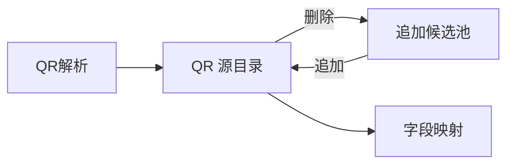
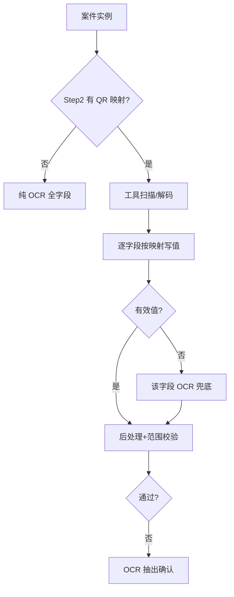

# NeosAI 日本保险 IDP — 产品需求文档（PRD · Phase2）

## 第 1 章｜文档基础与范围

### 1.1 文档定位

本 PRD 描述第二期增量需求，面向 Z 客户保险金请求场景的落地交付。未在本版重写的功能，按模块追溯下列第一期 PRD，不在此重复全文。


| 文档              | 链接                                                                    | 覆盖范围                                                  |
| --------------- | --------------------------------------------------------------------- | ----------------------------------------------------- |
| 第一期总 PRD        | [neosai-idp-prd.vercel.app](https://neosai-idp-prd.vercel.app/)       | 平台背景、三层架构、操作端（新增上传、案件列表、我的任务、站内信）、账票类型设置、实体与状态机、角色权限等 |
| 第一期业务场景与工作流 PRD | [idp-workflow-nwxh.vercel.app](https://idp-workflow-nwxh.vercel.app/) | 6.01 业务场景设置（四步向导 Step1～4）、6.02 工作流画布与可编排节点            |


对应关系：第 5～6 章模块 **6.01、6.02** 及 Step3 通知规则主体 → 业务场景与工作流 PRD；**6.03 账票类型**、**6.04 我的任务**、**6.06 文件上传** 及站内信等 → 总 PRD。

### 1.2 第二期交付范围

本期在 Z 客户保险金请求场景下，补齐前处理节点内的画像不正検知、敏感情报检出与字段正常值校验能力链。账票类型设置沿用第一期五步向导；QR 字段映射仍在 Step2（OCR/QR 读取设定模式切换），于 OCR 抽出节点内执行；Step3 沿用第一期処理ルール，本期仅增量追加正常值范围。

#### 工作流


| 能力        | 说明                                                                         |
| --------- | -------------------------------------------------------------------------- |
| 前处理节点（增量） | 在 P1 前处理节点内新增画像不正検知、敏感情报检出两个模块；各模块可独立 ON/OFF，并按对象账票（业务场景 Step1 关联账票）指定执行范围 |
| 业务场景通知扩展  | Step3 通知规则在前处理对象节点下配置处理状态/处理结果触发；站内信与邮件双渠道投递（规则勾选邮件时向配置邮箱发送）               |


推荐主链（业务场景默认工作流）：开始 → 前处理 → 条件判断 → 人工确认 → OCR 抽出 → 条件判断 → 人工确认 → 数据映射 → AI 检证 → 条件判断 → 人工确认 → 自定义函数 → 终了。

#### 账票类型设置（增量）


| 步骤          | 本期追加                                                                                            |
| ----------- | ----------------------------------------------------------------------------------------------- |
| Step1 AI 分类 | 新增分類信頼度閾値（必填）；上传 template 样张（QR 解析复用，Step2 不再上传）                                                |
| Step2 AI 读取 | OCR/QR 模式切换；OCR：字段定义（項目名/タイプ/必須/マスク/操作）+ prompt + 正解；QR：QR 源扫描与字段 QR 映射（取値方法等）；字段主数据仅在 OCR 模式维护 |
| Step3 处理规则  | 正常值范围                                                                                           |
| Step5 效果测试  | QR/OCR 读取、后处理、正常值范围综合test                                                                         |


Step1 其余字段、Step4 图像处理及 Step2 读取模型弹窗等沿用第一期，不在本期重写。

#### 引擎与运行时


| 能力          | 说明                                                                                                  |
| ----------- | --------------------------------------------------------------------------------------------------- |
| 通用 QR 解析    | 调用工具 QR 扫描/解码：配置端在 Step1 样张固定账票下方区域内从左到右扫描，检出几个生成几个 QR 源；运行时 OCR 抽出节点对案件实例按同规则扫描解码                  |
| 正常值范围校验     | OCR 抽出节点内，后处理完成后逐字段校验；超出正常值范围触发 OCR 抽出确认待办                                                          |
| QR 与 OCR 协同 | 路由由引擎读 Step2 配置判定（非大模型）：无 QR 映射 → 纯 OCR；有映射 → 工具扫描 QR，字段级 QR 优先、失败 OCR 兜底（细则见 6.02 · OCR 抽出 · 引擎执行） |
| 画像不正検知      | 整合 PS 加工、AI 生成、模板特征等检测；模型输出二值判定（是/否）；判定为「是」时处理结果为要确认                                                |
| 邮件分发        | Step3 规则命中且勾选邮件渠道时，向规则配置的邮箱地址投递件名/正文（变量 token 运行时渲染）；与站内信并行、互不替代                                    |


#### 范围边界


| 类别  | 第二期                                                                                                                            |
| --- | ------------------------------------------------------------------------------------------------------------------------------ |
| 配置端 | 前处理节点新增画像不正検知、敏感情报检出模块（对象账票可配）；账票类型 Step1（分類信頼度閾値必填）、Step2（OCR/QR/マスク）、Step3（正常值范围）；业务场景 Step3 通知规则扩展（前处理子状态触发、站内信/邮件双渠道、邮件宛先） |
| 操作端 | 不新增独立菜单；既有上传、我的任务、站内信等随工作流结果变化（见 1.6）                                                                                          |
| 引擎  | 画像不正検知、字段正常值范围校验、敏感情报检出 Agent、邮件分发；QR 扫描与解码由工具在 OCR 抽出节点内执行                                                                    |
| 不含  | 数据映射、AI 检证完整页面（仍为占位）；API 对外实现；待办类型与待办框架本身（沿用第一期）                                                                               |


配置与节点职责对照见工作流画布联动逻辑表（6.02）。画布建模定稿见 1.3。

### 1.3 工作流架构（前处理模块化）

画像不正検知、敏感情报检出作为前处理节点内子模块交付，不新增独立画布节点。运行时均在 OCR 抽出之前；模块顺序固定为画像不正検知 → 敏感情报检出 → 画像回転 → 画像補正 → 画像整列（P-304：脱敏先于几何处理；回転先于補正）。

画布形态：

```
开始 → 前处理 → 条件判断 → … → OCR 抽出 → …
         ↑
    单一节点，内含 5 个子模块（各：模块开关 + 对象账票）
    画像不正検知 → 敏感情报检出 → 画像回転 → 画像補正 → 画像整列
```


| 项         | 定稿规则                                                                                                |
| --------- | --------------------------------------------------------------------------------------------------- |
| 节点库       | 不出现独立画像不正検知、敏感情报检出类型；旧类型仅用于已发布场景迁移                                                                  |
| 配置 UI     | 前处理节点检视「前処理設定」；五模块均为开关 + 对象账票多选；敏感情报检出对象账票仅限 Step2 至少一项マスク=ON 的关联账票                                 |
| 节点输出      | 仅 preprocessStatus、preprocessResult（各子模块结果集約至节点级）                                                   |
| Step3 通知  | 对象节点选「前処理」；触发 preprocessStatus / preprocessResult                                                   |
| ファイルステータス | **完全沿用第一期**（前処理 / 前処理確認 / OCR抽出 / OCR抽出確認）；不正検知・敏感检出等子模块不单独占段；段进度不等于节点输出变量                        |
| 引擎        | 单次 preprocess invocation 内串行多 sub-step；sub-step 可上报引擎/监控（E1～E3），**不驱动**案件一覧 ファイルステータス；skip 规则见第 3 章 |


引擎实现待对齐（不影响上述产品定稿）：


| #   | 待确认项                                                    |
| --- | ------------------------------------------------------- |
| E1  | 单节点多 sub-step 的状态上报（引擎/监控/trace）；**不映射**为案件一覧 ファイルステータス |
| E2  | 某子模块 failed 是否阻断后续模块；与 skip 表一致性                        |
| E3  | 监控 / Agent trace 是否在引擎内按 sub-module 打 span（对外仍仅两变量）     |


### 1.4 本期里程碑

交付范围见 1.2；假设与待客户确认见 1.7。以下仅为验收勾选，细则不在此重复。


| 域    | 里程碑                                                  |
| ---- | ---------------------------------------------------- |
| 工作流  | 前处理节点含画像不正検知、敏感情报检出模块；默认主链：前处理 → OCR 抽出 → 条件判断       |
| 账票类型 | Step1 分類信頼度閾値；Step2 OCR/QR/マスク；Step3 正常范围；Step5 综合test |
| 通知   | Step3 前处理对象节点：处理状态 / 处理结果触发；站内信与邮件双渠道                |
| 运行时  | QR 优先 + OCR 兜底；后处理正常值校验； 前处理（不正检知、脱敏） → OCR（P-304）   |
| 验收   | 第 5 章 Y 条目与原型可支撑研发验收                                 |


### 1.5 假设与依赖


| 编号    | 说明                                                                                                                                                                                     |
| ----- | -------------------------------------------------------------------------------------------------------------------------------------------------------------------------------------- |
| A-001 | 界面语言为日语；PRD 正文用中文                                                                                                                                                                      |
| A-002 | QR 扫描与解码统一调用工具（非 Agent）；配置端在 Step1 样张固定账票主体下方 QR 带区域内从左到右扫描，检出几个生成几个 QR 源（QR1、QR2…）；每项保存检测框与解码文本；点击源条可在预览上单框只读高亮；运行时 OCR 抽出节点是否调用 QR 工具由工程代码读 Step2 字段 QR 映射判定（见 6.02 · OCR 抽出 · 引擎执行） |
| A-003 | 画像不正検知与敏感情报检出由 Agent 服务完成〔假设 P-305〕；QR 扫描/解码不走 Agent，走工具（A-002）                                                                                                                        |
| A-004 | 未在本版重写的功能，研发与验收按 1.1 表格追溯对应第一期 PRD（总 PRD 或业务场景与工作流 PRD）                                                                                                                                |


### 1.6 跨模块影响

第二期不新增操作端菜单或待办类型，但前处理新模块与账票类型增量会改变既有模块的输入、展示与触发条件。通知与待办是两条链路：通知告知；待办要求人工处理。


| 模块         | 画像不正検知 / 正常值范围 / QR                                                | 敏感情报检出                                        | 通知（Step3 规则扩展）                              |
| ---------- | ------------------------------------------------------------------ | --------------------------------------------- | ------------------------------------------- |
| 文件上传       | 上传后串联识别分类与案件集约；分类读取各账票 Step1 分類信頼度閾値与分割规则；集约成功后按已发布场景工作流启动         | —                                             | —                                           |
| 我的任务       | QR 取值异常与低置信、范围越界等统一进 OCR 抽出确认待办；执行页要確認字段仅 P1 高亮 + 可编辑，不展示越界说明与读取来源 | 本期不新增脱敏专用待办；不新增 QR 专用待办类型或标签                  | 通知本身不生成待办；可与待办并行（如 OCR 失败同时发通知 + 产生确认待办）    |
| 案件列表 / 详情  | 文件ステータス展示前処理、前処理確認、OCR抽出、OCR抽出確認各段（规则见 3.2）；节点进度含第二期节点           | 详情展示脱敏后字段/文件（节点已执行时）；无脱敏前后对比页                 | 案件状态随节点失败信号汇聚；不因通知改变状态                      |
| 导出         | 导出 OCR 字段含 QR 写入并经后处理的值                                            | 导出字段值随工作流链路：已执行敏感情报检出则输出脱敏后值；Step4 仅管字段勾选     | —                                           |
| 站内信 / 邮件   | 可配置前处理处理状态 / 处理结果触发                                                | 敏感情报检出 Agent 失败时 preprocessStatus=failed，可配通知 | 本期支持站内信与邮件双渠道；新触发事件命中时并行投递；邮件宛先在 Step3 规则配置 |
| 业务场景 Step3 | —                                                                  | —                                             | 前处理对象节点：处理状态、处理结果触发事件                       |


待办与通知分工：通知只告知、不生成待办；二者可并行（细则见 6.04、6.05）。

### 1.7 假设与待客户确认

本期正文按下列假设编写，研发与原型可据此推进。正文中以 `〔假设 P-xxx〕` 标注尚未经客户确认的规则；客户确认后更新对应章节并修订本表。详细问询清单见客户评审材料，不纳入本 PRD。


| 编号    | 能力模块       | 当前假设                                                                                      | 状态    |
| ----- | ---------- | ----------------------------------------------------------------------------------------- | ----- |
| P-301 | 敏感情报检出     | 脱敏范围按 Step2 マスク=ON 及前处理模块对象账票；验收样张与效果图由客户提供                                               | 待客户确认 |
| P-302 | 敏感情报检出     | 脱敏方式为黑块填充                                                                                 | 待客户确认 |
| P-303 | 敏感情报检出     | 脱敏后保留并可导出原图，同时保留脱敏后文件                                                                     | 待客户确认 |
| P-304 | 敏感情报检出     | OCR 前实例脱敏；OCR 抽出读取脱敏后实例                                                                   | 已定    |
| P-305 | 敏感情报检出     | 敏感情报检出由本地部署大模型完成                                                                          | 待客户确认 |
| P-401 | 正常值校验      | Step3「正常条件」支持：範囲内、<、≤、>、≥、列挙（枚举）                                                          | 待客户确认 |
| P-402 | 正常值校验      | 字段越界进 OCR 抽出确认；不设独立待办类型                                                                   | 待客户确认 |
| P-201 | QR Code 读取 | 路由由配置判定：无 QR 映射走纯 OCR；有映射先 QR 工具扫描，字段级 QR 优先、失败 OCR 兜底（非 LLM 选路；细则见 6.02 · OCR 抽出 · 引擎执行） | 待客户确认 |
| P-203 | QR Code 读取 | 本期 QR 解析与映射以 Z 客户诊断书 template 为主                                                          | 待客户确认 |
| P-204 | QR Code 读取 | QR 字段与 OCR 字段相同：后处理 → 正常范围校验 → 与低置信/Master 等 OR 合并判定                                      | 待客户确认 |
| P-501 | 画像不正検知     | 前处理模块按业务场景 Step1 关联账票逐行开关；具体 ON 列表由客户指定                                                   | 待客户确认 |
| P-502 | 画像不正検知     | 模板特征检测依赖 Step1 template 与客户提供的正常样张库                                                       | 待客户确认 |
| P-503 | 画像不正検知     | PS 加工、AI 生成、模板特征三类均纳入 Agent；UAT 试样集与客户共同定义                                                | 待客户确认 |


---

## 第 2 章｜术语与词汇表

本章仅收录第二期新增或易混术语。其余术语沿用第一期 PRD。

### 2.1 术语表


| 中文       | 日语/界面   | 定义                                                                      |
| -------- | ------- | ----------------------------------------------------------------------- |
| 画像不正検知   | 画像不正検知  | 前处理节点内模块：整合 PS 加工、AI 生成图像、模板特征不一致等检测；模型输出二值（是/否）；模块开关 + 对象账票；无风险分数与阈值配置 |
| QR 字段读取  | QR読取    | OCR 抽出节点内能力：工具扫描实例、解码，再按 Step2 字段映射写值；非独立工作流节点                          |
| QR 源     | QRソース   | 账票级逻辑槽位（QR1、QR2…）；配置端在固定账票下方扫描区域内从左到右检出；检出几个生成几个；可删除移入追加候选池或从候选池追加回目录   |
| 追加候选池    | 追加候補    | 扫描检出但用户从 QR 源目录删除的项；经源条「追加」加回目录；未在目录内时不参与字段映射与运行时写值                     |
| 取值方法     | 取値方法    | 字段级 QR 分割开关：关闭时全文取值，开启时按分隔符和顺序取值                                        |
| QR 顺序    | 順序      | 分割模式下，从 QR 解码串中取第几个片段（1 起）；同一 QR 源内 N=该源分割映射字段总数，順序须为 1～N 连号且不重复        |
| 正常范围     | 正常範囲    | Step3 与后处理同表配置的可选校验规则；支持最小值、最大值等                                        |
| AI マッチング | AIマッチング | Step3 工具栏：为 Step2 已有字段自动生成并反映处理规则；不生成正常条件                               |
| 敏感情报检出   | 敏感情報検出  | 前处理节点内模块：对 Step2 脱敏=ON 的字段检测 PII 并输出脱敏结果；模块开关 + 对象账票                    |
| 分類信頼度閾値  | 分類信頼度閾値 | Step1 必填项：案件集约识别分类阶段的账票分类置信度下限（百分比）                                     |
| 账票类型设置   | 帳票タイプ設定 | 配置端账票主数据模块；Step2 含 OCR/QR 双模式与脱敏；Step3 含処理ルール（P1）与正常范围（P2 增量）           |


### 2.2 易混术语


| 中文                  | 区分要点                                                                                                                                  |
| ------------------- | ------------------------------------------------------------------------------------------------------------------------------------- |
| OCR 模式 vs QR 模式     | 共用同一文本字段清单（fieldId）；**項目名、タイプ、必須項目、マスク、操作（增删/排序）仅在 OCR 模式配置**；QR 模式只读展示項目名/タイプ，仅配置 QR 源、取値方法、区切り文字、順序；表格信息读取仅走 OCR；QR 模式不显示 AI 自动生成按钮 |
| QR 映射 vs 処理ルール      | Step2 QR 模式管取值来源；Step3 管 OCR 后处理（日期、照合等），二者独立                                                                                         |
| 全文取值 vs 分割取值开关      | 开关关闭时直接写入 QR 解码全文；开关开启时才按区切り文字 split 后按顺序取片段                                                                                          |
| 正常范围 vs AI 检证       | 正常范围是单字段规则，在 OCR 抽出节点内执行；AI 检证是跨字段业务规则，在 AI 检证节点执行                                                                                    |
| QR 配置 vs OCR 抽出     | Step2 QR 模式定义字段如何取 QR 值及**是否触发运行时 QR 扫描**（至少一字段绑定有效 QR 源）；OCR 抽出节点按该配置执行路由（见 6.02 · 引擎执行），非大模型判断                                      |
| 左侧预览 vs QR 映射       | 预览默认不展示 QR 框；点击 QR 源条某项时，在 template 上只读高亮**该项**检测框；逻辑位置仍按下方区域从左到右编号（QR1 为最左）                                                          |
| QR 目录 vs 追加候选池      | 目录内 QR 源参与映射与运行时写值；误检可删除至候选池，需要时经「追加」加回；不设 QR 源数量上限                                                                                   |
| QR 优先 vs OCR 兜底     | 引擎按 Step2 配置确定性路由（非 LLM 判断）：账票无任何字段绑定 QR 源 → 不扫 QR、全字段 OCR；存在 QR 映射 → 先工具扫描/解码，字段 QR 有有效值则跳过 OCR，缺码/失败/空值时该字段 OCR 兜底                  |
| 前处理模块 vs 独立节点       | 画像不正検知、敏感情报检出为前处理内模块（模块开关 + 对象账票）；画布不单独放置该两类节点                                                                                        |
| 画像不正検知 vs 補正/整列     | 同属前处理节点；运行时按模块顺序：画像不正検知 → 敏感情报检出 → 画像回転 → 画像補正 → 画像整列（模块 OFF 或对象外账票 skip）                                                                     |
| 敏感情报检出 vs Step2 マスク | 检出对象字段由 Step2 マスク列定义；模块对象账票可选范围 = Step1 关联账票 ∩ 存在マスク=ON 字段的账票；未指定时 = 该范围内全部                                                           |
| 画像不正検知 vs OCR 置信度   | 画像不正検知模型仅输出是/否二值，无分数与阈值；OCR 低置信等仍走 OCR 抽出确认，二者独立                                                                                      |
| OCR 抽出确认 vs 人工确认    | 低置信、范围越界、QR 取值失败等字段级复核统一进 OCR 抽出确认；画像不正検知要确认（reviewRequired）进人工确认                                                                     |
| 通知对象 vs 审查角色        | Step3 通知「操作员/操作管理者」与 Step2 人工确认「审查角色」为同一套系统角色；选操作员且本案担当者已由该角色确立时，通知发给案件担当者，逻辑与画布待办指派一致（见 6.05、总 PRD 3.5）                              |
| Step4 导出 vs マスク     | Step4 仅勾选输出字段，不提供マスク列；运行时若前处理敏感情报检出模块已执行，导出值为脱敏后结果；マスク对象定义在账票 Step2（见 6.01 Step4）                                                     |
| QR 读取 vs OCR 抽出确认   | QR 为账票类型 Step2 配置、OCR 抽出节点内执行；不单独设 QR 待办类型或 QR要確認 标签；需人工时仍归类为 OCR 抽出确认                                                                |


---

## 第 3 章｜数据结构与状态（第二期增量）

实体关系、八种案件状态、节点进度四态、集约关联四态、角色权限均沿用第一期 PRD。本节仅列第二期变更。

### 3.1 账票类型实体增量


| 属性       | 说明                                                                                                                                                                      |
| -------- | ----------------------------------------------------------------------------------------------------------------------------------------------------------------------- |
| 分類信頼度閾値  | Step1 必填；0～100 整数百分比；识别分类阶段消费                                                                                                                                           |
| QR 源目录   | qrSources[]：id（QR1、QR2…）、检测框、解码文本；Step1 样张经工具在下方区域从左到右扫描写入；可删至追加候选池或从候选池加回                                                                                              |
| 追加候选池    | qrIgnored[]：扫描检出但不在目录内的 QR；重扫时保留用户排除状态                                                                                                                                  |
| 字段 QR 映射 | 每个文本字段：qrSourceId、extractMethod、delimiter、segmentIndex（type/必須/マスク等继承 OCR 模式字段主数据，不在 QR 模式编辑）；**至少一字段 qrSourceId 非空且源在 qrSources 目录内**时，运行时 OCR 抽出节点才调用 QR 工具，否则整票纯 OCR |
| 字段正常值范围  | Step3 与后处理同表：启用、最小、最大                                                                                                                                                   |
| 脱敏标记     | Step2 OCR 模式 · 字段行マスク开关                                                                                                                                                 |


同一诊断书账票类型可覆盖有 QR 与无 QR 物理件；运行时 OCR 抽出节点按 Step2 映射有无自动选择纯 OCR 或 QR 优先 + OCR 兜底（见 6.02 · 引擎执行）。

### 3.2 文件工作流段状态增量

工作流内处理状态（界面：ファイルステータス）沿用 [总 PRD · 3.4 文件状态](https://neosai-idp-prd.vercel.app/)：由处理节点 + 处理结果组成；处理结果为等待处理、处理中、成功、失败。前処理確認、OCR抽出確認 为对应 HITL 待办未办结时的节点态（界面以「…確認待ち」展示），规则与第一期相同。

案件一覧展开案件下文件行时，**ファイルステータス 列与第一期相同**：仅展示 前処理、前処理確認、OCR抽出、OCR抽出確認 四段（见下表）；不因前处理内新增画像不正検知、敏感情报检出等子模块而扩展枚举或展示子段名。

#### 前处理模块内执行顺序（引擎）

案件集约成功并启动工作流后，进入前处理节点；节点内按固定顺序执行已启用模块（模块 OFF 或对象账票外 skip）：

```
画像不正検知 → 敏感情报检出 → 画像回転 → 画像補正 → 画像整列
```

之后进入（前処理確認）→ OCR抽出 → （OCR抽出確認）。画布上仅保留一个前处理节点，不再单独放置画像不正検知 / 敏感情报检出节点。

**顺序 rationale（定稿）**：

| 步骤 | 模块 | 理由 |
| --- | --- | --- |
| 1 | 画像不正検知 | 优先在原实例上判定篡改/伪造风险；异常早暴露 |
| 2 | 敏感情报检出（脱敏） | P-304：OCR 读脱敏后实例；几何变换前先定位并遮罩 PII |
| 3 | 画像回転 | 先纠正扫描方向，再去做透视/倾斜校正 |
| 4 | 画像補正（倾斜校正） | 在正确朝向下做透视与畸变修正 |
| 5 | 画像整列 | 案件内同账票多实例排序，依赖前述单页处理完成 |

#### ファイルステータス（沿用第一期）

第二期**不新增**ファイルステータス 枚举。五个子模块（不正検知、脱敏、回転、補正、整列）均归前处理节点；节点执行期间界面统一为 **前処理*** 段，与第一期 P1 行为一致。


| 处理节点    | 界面组合示例（日语）                           | 触发条件（第二期）                                                                      |
| ------- | ------------------------------------ | ------------------------------------------------------------------------------ |
| 前処理   | 前処理待ち / 前処理中 / 前処理成功 / 前処理失敗 | 前处理节点对该文件执行中或结束；**含**节点内全部已启用子模块（不正検知、敏感检出、回転 → 補正 → 整列）；子模块 skip 不改变段名，仍归 前処理 段 |
| 前処理確認   | 前処理確認待ち                              | 前处理 HITL 待办未办结（沿用 P1；本期极少出现）                                                   |
| OCR抽出   | OCR抽出待ち / OCR抽出中 / OCR抽出成功 / OCR抽出失敗 | 沿用总 PRD；读取前处理节点输出实例（含敏感情报检出后）                                                  |
| OCR抽出確認 | OCR抽出確認待ち                            | OCR 抽出确认待办未办结                                                                  |


子模块执行进度、skip、Agent 成败等**仅**集約至 preprocessStatus / preprocessResult 与引擎 trace，不在案件一覧文件行展示「画像不正検知中」「敏感情報検出中」等文案。

#### skip 与未配置（引擎 · 不影响ファイルステータス 段名）


| 场景                           | 引擎行为                         | ファイルステータス（案件一覧）        |
| ---------------------------- | ---------------------------- | ---------------------- |
| 前处理 · 某子模块 OFF 或对象账票外        | 跳过该 sub-step，继续同节点内下一模块或结束节点 | 仍为 前処理中，直至节点段结束      |
| 前处理 · 敏感情报检出 skip（无マスク=ON 等） | 同上                           | 同上                     |
| 前处理全部子模块 OFF                 | 节点整体 skip                    | 快速经 前処理 段进入 OCR 抽出 段 |


### 3.3 联级关系增量

画像不正検知、敏感情报检出作为前处理子模块，其失败与待办信号参与**案件状态**汇聚，不改变八种案件状态枚举。文件 → 节点汇聚仍仅映射 **前処理** 与 **OCR 抽出** 两段（与总 PRD · 3.4 一致）；子模块进度不反映于案件一覧 ファイルステータス。

---

## 第 4 章｜用户交互流程

本章描述第二期增量下的端到端用户故事。操作端三入口分工、待办四类枚举、案件八种状态、角色权限均沿用第一期 PRD；本期变化集中在前处理节点内模块（画像不正検知、敏感情报检出）、OCR 抽出内 QR/正常值校验，以及 Step3 前处理子状态通知。

### 4.1 入口与角色分工

原则：待办在「我的任务」办结；整体进度在「案件列表」检索；「案件详情」只读查阅；字段修正发生在具体待办执行页。配置端在业务规则配置完成场景与账票主数据，操作端按已发布场景执行。

#### 配置端入口


| 入口     | 谁常用   | 用户要做什么                                                                    |
| ------ | ----- | ------------------------------------------------------------------------- |
| 账票类型设置 | admin | 维护 Step1 分類信頼度閾値与 template；Step2 OCR/QR/マスク；Step3 処理ルール与正常范围；Step5 综合test验收 |
| 业务场景设置 | admin | Step1 关联账票；Step2 工作流画布与前処理設定（模块开关 + 对象账票）；Step3 通知规则；Step4 输出字段与发布        |


#### 操作端入口


| 入口  | 谁常用       | 用户要做什么                                  |
| --- | --------- | --------------------------------------- |
| 站内信 | 操作员、操作管理者 | 查阅 Step3 规则触发的站内信；勾选邮件渠道时同步收邮件（通知不生成待办） |


---

### 4.2 故事一：配置端发布第二期能力链

角色：admin（配置管理员）

目标：为 Z 客户保险金请求场景配置账票主数据与工作流，使画像不正検知、敏感情报检出、QR 读取、正常值范围与通知规则在发布后对操作端生效。

流程：

```
账票类型 Step1～3 → 业务场景 Step1 关联账票 → Step2 工作流与前処理設定 → Step3 通知 → Step4 发布
```

1. 账票类型：Step1 填写分類信頼度閾値并上传 template；Step2 OCR 模式维护字段（項目名/タイプ/必須/マスク）与 QR 映射；Step3 配置処理ルール与正常范围；Step5 test验收 QR/OCR/范围。
2. 业务场景 Step1：勾选本场景关联账票；增删账票时，前处理各模块与 OCR 节点检视中的对象账票列表同步变化。
3. 工作流 Step2：在默认主链上确认前处理节点；于「前処理設定」为各模块配置开关与对象账票（画像不正検知、敏感情报检出、画像回転 → 画像補正 → 画像整列）。
4. 业务场景 Step3：在前处理对象节点下配置 preprocessStatus / preprocessResult 触发；按需勾选站内信与邮件渠道。
5. Step4 勾选输出字段并通过发布门禁；发布后操作端「新增上传」方可选择该场景。

关键决策点：画像不正検知等模块对象账票未指定时视为 Step1 全部关联账票；敏感情报检出未指定时视为「有マスク=ON 字段的关联账票」全部；模块 OFF 或对象外账票在运行时为 skip。

---

### 4.3 故事二：标准主路径（上传到导出）

角色：操作员

目标：一批保险金请求实例进入系统后，尽可能自动跑完工作流；仅在低置信、范围越界、画像不正要确认等节点触发时进入人工环节。

流程：

```
新增上传 → 案件集约 → 工作流自动推进 → （若有）我的任务确认 → 处理完成 → 导出 → 已导出
```

工作流内段（案件集约成功后，**ファイルステータス 沿用 P1，仅 前処理 / OCR抽出 两段**；引擎内仍串行执行前处理子模块）：

```
前处理节点内：画像不正検知 → 敏感情报检出 → 画像回転 → 画像補正 → 画像整列（界面仍显示 前処理中）
    → OCR抽出（含 QR 与正常值校验）→ 数据映射 → AI检证 → … → 终了
```

1. 新增上传：选择已发布业务场景，导入文件，执行「分类·案件集约」。
2. 案件集约：系统按各账票 Step1 规则自动分类、建案、关联账票；未能自动关联的文件在「未集约文件」中人工校准。
3. 自动处理：集约完成后工作流启动。案件列表「已集约案件」中可查看进度；**ファイルステータス 与第一期相同**（前処理中 → 前処理成功 → OCR抽出中 → …），不展示子模块名。无待办时用户仅只读查看。
4. 人工确认：画像不正検知判定为要确认（reviewRequired）时，在「我的任务」生成人工确认待办（非 OCR 页）。低置信、正常值越界、QR 取值失败等字段级问题统一进 OCR 抽出确认待办；执行页对要確認字段仅高亮 + 可编辑，不展示读取来源与越界说明。办结后工作流继续。
5. 导出：工作流结束后生成导出待办；担当者完成导出并提交，案件归档。

敏感情报检出运行在前处理节点内、OCR 之前；操作端不新增脱敏专用待办；敏感检出 Agent 失败时 preprocessStatus=failed，走案件异常策略并可并行收到通知（与待办无关）。

---

### 4.4 故事三：案件列表中的跟踪与控制

角色：操作员（日常跟踪）；操作管理者、admin（改派与干预）

目标：掌握案件与文件当前所处阶段，必要时对整案进行补件、中止或重跑。

1. 案件列表通过 Tab 检索「已集约案件」「未集约文件」「跨案件文件」；未关联文件可等待自动关联或人工校准。
2. 展开案件下文件行时，**ファイルステータス 列沿用第一期**（前処理中、OCR抽出中 等）；案件详情只读展示工作流进度与字段结果（已执行敏感情报检出时展示脱敏后字段/文件，不提供脱敏前后对比页）。
3. 补件：案件处于补件状态时，可从案件列表直挂补件，或经新增上传路径自动归入原案；补件成功后工作流从断点续跑。
4. 异常：处理节点或文件失败时案件标记为异常；操作员可在案件级重跑；仍无法继续则中止并按规则重启流程（不新建案件记录）；不支持文件级单独重跑。
5. 改派：操作管理者在案件列表或详情改派案件担当者，同步本案全部未办结待办；待办列表亦支持单条改派经办人。

---

### 4.5 故事四：待办处理与补件/异常

角色：操作员（办结）；操作管理者（改派、督办）

目标：办结人工环节，或在补件/异常场景下恢复案件推进。

我的任务按类型处理：


| 待办类型     | 用户要做什么           | 第二期增量说明                                         |
| -------- | ---------------- | ----------------------------------------------- |
| OCR 抽出确认 | 对照实例修正字段值并提交     | 含 QR 取值失败（OCR 兜底后仍无法确认）、正常值越界、低置信等；不展示读取来源与越界区间 |
| 人工确认     | 对要确认项做完了/补件/案件中止 | 画像不正検知 reviewRequired 进此类，非 OCR 抽出确认页           |
| AI 检证确认  | 确认检证项或判定是否需补件    | 沿用第一期                                           |
| 导出确认     | 配置并提交导出结果        | 已执行敏感情报检出时，导出值为脱敏后结果                            |


指派规则：首个进入人工确认的待办确立本案担当者；后续待办默认指派给该担当者。操作管理者可改派。

补件与异常：

- 补件：案件补件状态下上传材料；直挂或集约路径归入原案后工作流续跑。
- 异常重跑：案件级操作；敏感检出 Agent 失败（preprocessStatus=failed）不生成脱敏专用待办，走异常策略并可收到 Step3 配置的邮件/站内信告警。
- 通知与待办并行：同一事件可同时发通知并在我的任务产生待办（例如 OCR 失败既通知又产生 OCR 抽出确认）。

---

### 4.6 故事五：站内信与邮件告警

角色：操作员、操作管理者（通知收件人）

目标：在不进入待办的情况下，及时获知前处理子模块异常或配置关心的处理状态变化。

1. admin 在业务场景 Step3 为「前处理」对象配置触发事件（如 preprocessStatus=failed、preprocessResult=reviewRequired 等）及通知对象（操作员/操作管理者）。
2. 运行时引擎匹配规则后并行投递站内信；规则勾选邮件时向配置的邮件宛先发送相同件名/正文。
3. 操作员从顶栏站内信入口查阅；未读角标沿用第一期。通知仅告知，不替代待办办结；经办仍须进入「我的任务」处理 OCR 抽出确认或人工确认。
4. 通知仅告知，不替代待办办结；典型 preprocessStatus=failed 场景为邮件告警 + 案件异常。

---

## 第 5 章｜全量功能清单

本期详写为 N 的条目，按 1.1 追溯第一期 PRD：业务场景 Step1～4、工作流画布与既有节点 → [业务场景与工作流 PRD](https://idp-workflow-nwxh.vercel.app/)；账票类型、我的任务、文件上传、站内信等 → [总 PRD](https://neosai-idp-prd.vercel.app/)。

### 5.1 业务场景设置


| 序号  | 功能               | 功能定义                  | 菜单/路由      | 配置/执行 | 本期详写 | 原型状态  |
| --- | ---------------- | --------------------- | ---------- | ----- | ---- | ----- |
| 1.1 | 场景列表与 Step1 集约规则 | 场景新建/复制、账票集合、主账票与字段关联 | 业务规则配置     | 配置    | N    | 沿用 P1 |
| 1.2 | Step2 工作流入口与设置检查 | 进入画布；静态配置校验与发布门禁      | 业务场景 Step2 | 配置    | N    | 沿用 P1 |
| 1.3 | Step4 输出字段与发布    | 输出字段勾选、发布门禁           | 业务场景 Step4 | 配置    | N    | 沿用 P1 |


### 5.2 工作流画布


| 序号  | 功能           | 功能定义                                                                        | 菜单/路由      | 配置/执行 | 本期详写  | 原型状态  |
| --- | ------------ | --------------------------------------------------------------------------- | ---------- | ----- | ----- | ----- |
| 2.1 | 工作流画布        | 拖拽编排、连线、条件分支、变量引用                                                           | 业务场景 Step2 | 配置    | N     | 沿用 P1 |
| 2.2 | 前处理节点（增量）    | 新增画像不正検知、敏感情报检出模块；各模块模块开关 + 对象账票；节点输出 preprocessStatus / preprocessResult   | 前处理节点检视    | 配置    | Y     | 已有    |
| 2.3 | OCR 抽出节点（增量） | 内嵌 QR 字段读取（Step2 QR 模式）；工程代码读配置判定 QR/OCR 路由；后处理完成后执行正常值范围校验；越界触发 OCR 抽出确认待办 | 画布节点检视     | 配置/引擎 | Y（增量） | 已有    |


### 5.3 账票类型设置


| 序号  | 功能                     | 功能定义                                     | 菜单/路由      | 配置/执行 | 本期详写  | 原型状态  |
| --- | ---------------------- | ---------------------------------------- | ---------- | ----- | ----- | ----- |
| 3.1 | 五步向导框架                 | Step1～Step5 入口与既有步骤能力                    | 业务规则配置     | 配置    | N     | 沿用 P1 |
| 3.2 | Step1 AI 分类（增量）        | 分類信頼度閾値必填；template 供 QR 扫描复用             | 账票类型 Step1 | 配置    | Y（增量） | 已有    |
| 3.3 | Step2 AI 读取（OCR/QR/脱敏） | OCR/QR 模式切换；OCR 维护字段主数据与マスク；QR 仅 QR 源与映射 | 账票类型 Step2 | 配置    | Y     | 已有    |
| 3.4 | Step3 处理规则             | 正常值范围（增量）；処理ルール、AI マッチング沿用 P1（无 QR 列）    | 账票类型 Step3 | 配置    | Y（增量） | 已有    |
| 3.5 | Step5 效果测试（增量）         | QR/OCR 读取、后处理、正常值范围、マスク 综合test             | 账票类型 Step5 | 配置    | Y（增量） | 已有    |


### 5.4 我的任务


| 序号  | 功能         | 功能定义                                                      | 菜单/路由       | 配置/执行 | 本期详写  | 原型状态  |
| --- | ---------- | --------------------------------------------------------- | ----------- | ----- | ----- | ----- |
| 4.1 | OCR 抽出确认待办 | 低置信、正常值范围越界、QR 取值失败等统一归类；要確認字段沿用 P1 高亮 + 可编辑，不展示读取来源与越界说明 | 操作端 · マイタスク | 执行    | Y（增量） | 沿用 P1 |
| 4.2 | AI 检证确认待办  | 跨字段检证复核                                                   | 操作端 · マイタスク | 执行    | N     | 沿用 P1 |
| 4.3 | 人工确认待办     | 含画像不正検知要确认；完了 / 补件 / 案件中止                                 | 操作端 · マイタスク | 执行    | Y（增量） | 沿用 P1 |
| 4.4 | 导出确认待办     | 导出前确认                                                     | 操作端 · マイタスク | 执行    | N     | 沿用 P1 |


本期不新增脱敏专用待办类型。

### 5.5 通知


| 序号  | 功能     | 功能定义                                                 | 菜单/路由      | 配置/执行 | 本期详写  | 原型状态  |
| --- | ------ | ---------------------------------------------------- | ---------- | ----- | ----- | ----- |
| 5.1 | 通知规则配置 | 对象节点、触发事件、收件人、主题、正文；前处理沿用处理状态/处理结果                   | 业务场景 Step3 | 配置    | Y（增量） | 已有    |
| 5.2 | 站内信    | 运行时按规则匹配并展示通知消息；本期扩展前处理子状态触发事件                       | 操作端 · 站内信  | 执行    | Y（增量） | 沿用 P1 |
| 5.3 | 邮件分发   | 通知规则勾选邮件渠道时向配置邮箱自动投递；与站内信共用触发条件与件名/正文模板；本期扩展前处理子状态事件 | 引擎         | 执行    | Y（增量） | 已有    |


### 5.6 文件上传


| 序号  | 功能          | 功能定义                                   | 菜单/路由      | 配置/执行 | 本期详写  | 原型状态  |
| --- | ----------- | -------------------------------------- | ---------- | ----- | ----- | ----- |
| 6.1 | 新增上传与补件（增量） | 上传界面与校验沿用 P1；运行时工作流链含画像不正検知、QR、脱敏、范围校验 | 操作端 · 新增上传 | 执行    | Y（增量） | 沿用 P1 |


---

## 第 6 章｜功能详细说明

本章与第 5 章模块一一对应。各模块仅写第二期增量；未列条目按 1.1 追溯对应第一期 PRD（6.01、6.02 → 业务场景与工作流 PRD；6.03～6.06 其余模块 → 总 PRD）。涉及多模块衔接处均单独列出联动逻辑。

### 6.01 业务场景设置

#### 范围说明

Step1 集约规则、Step4 输出字段与发布门禁、Step2 设置检查沿用 [第一期业务场景与工作流 PRD · 6.01](https://idp-workflow-nwxh.vercel.app/)。本期增量集中在 Step3 通知：前处理对象节点处理状态/处理结果触发。

#### 功能点

1. Step1 关联账票集合决定画布中前处理各模块与 OCR 抽出节点的可选账票行；Step1 增删账票时，前处理检视与 OCR 节点检视列表同步增删（已保存开关随账票 ID 保留或移除）。
2. Step3 通知规则：选择「前处理」对象节点时，触发事件为处理状态 / 处理结果（preprocessStatus / preprocessResult）。
3. Step4 输出字段勾选沿用 P1；**配置端不与账票 Step2 マスク列联动**；运行时导出值是否脱敏取决于前处理敏感情报检出模块是否已执行（见 6.01 Step4）。

#### Step4 · 输出字段与脱敏联动

Step4 仅勾选/排序导出字段，不提供マスク列；マスク对象在账票 Step2 定义、前处理敏感情报检出模块执行；导出取值跟随工作流链路（已执行脱敏则输出脱敏后值）。详见 2.2「Step4 导出 vs マスク」。

#### 联动逻辑

```
账票类型设置（各账票 Step1～Step3）
        ↓ 被引用
业务场景 Step1 关联账票集合
        ↓ 驱动
Step2 工作流节点检视（按账票开关）+ Step3 通知规则
        ↓ 发布
文件上传选已发布场景 → 识别分类/案件集约 → 工作流按画布执行
        ↓ 事件命中
站内信 / 邮件（Step3 规则）  ||  我的任务（节点待办，与通知并行）
```

- 上游：账票类型 Step1 分類信頼度閾値、文件分割规则、Step2 字段/QR/脱敏、Step3 后处理与正常范围，均在运行时由对应节点或识别分类接口读取；业务场景本身不重复定义这些规则。
- 横向：Step2 画布节点开关仅决定「本场景是否对该账票执行该节点」；字段级规则仍在账票类型设置维护。
- 下游：已发布场景出现在文件上传的业务场景下拉；未发布场景不可选。

#### 页面与入口


| 场景          | 菜单/入口                 | 角色    |
| ----------- | --------------------- | ----- |
| 场景列表        | 业务规则配置 → 业务场景设置       | admin |
| Step1 集约规则  | 场景详情 Step1            | admin |
| Step2 工作流   | 场景详情 Step2 / ワークフロー設定 | admin |
| Step3 通知规则  | 场景详情 Step3            | admin |
| Step4 输出与发布 | 场景详情 Step4            | admin |


#### 字段与参数规格


| 字段/参数  | 控件  | 必填  | 数据来源与枚举      | 校验与转换        | 下游消费      |
| ------ | --- | --- | ------------ | ------------ | --------- |
| 场景状态   | 只读  | 是   | 草稿、可发布、已发布   | 设置检查通过 → 可发布 | 发布门禁、文件上传 |
| 关联账票   | 多选  | 是   | 账票类型设置       | 1～30         | 画布检视、识别分类 |
| 设置检查结果 | 系统  | —   | 通过 / 失败 + 原因 | 静态校验，不执行节点   | 可发布判定     |


#### 异常与边界


| 场景      | 条件            | 用户提示 / 处理                    |
| ------- | ------------- | ---------------------------- |
| 检查失败    | 结构/连线/节点配置不合法 | 提示首条原因；定位节点；状态不变（沿用 P1 设置检查） |
| 关联账票达上限 | 已选 30 个仍尝试追加  | 阻断追加；提示已达上限                  |
| 无已发布场景  | 配置端无已发布场景     | 文件上传业务场景下拉为空；提示联系管理员         |


### 6.02 工作流画布

#### 范围说明

画布编排、连线、条件分支、变量引用、前处理（含画像不正検知、敏感情报检出模块）、数据映射、AI 检证、自定义函数、终了、人工确认节点等沿用 [第一期业务场景与工作流 PRD · 6.02](https://idp-workflow-nwxh.vercel.app/)。画布建模定稿见 1.3。OCR 抽出节点内嵌 QR 与正常值校验。

#### 功能点

1. 前处理节点检视新增画像不正検知、敏感情报检出两个模块，UI 与画像回転 → 画像補正 → 画像整列同构：模块开关 + 对象账票多选；敏感情报检出可选账票限于 Step2 有マスク=ON 的关联账票。
2. 画像不正検知模块：Agent 二值判定，「是」→ preprocessResult=reviewRequired 并进人工确认〔假设 P-501～P-503〕。
3. 敏感情报检出模块：对 Step2 マスク=ON 字段执行 Agent 实例脱敏〔假设 P-301、P-302、P-305；P-304 已定：顺序 2，先于画像回転/補正/整列〕；成败集約至 preprocessStatus。
4. OCR 抽出（增量）：内嵌 QR 字段读取〔假设 P-201、P-203、P-204〕；**QR 与 OCR 路由见下节「OCR 抽出 · 引擎执行」**；后处理完成后正常值范围校验；越界生成 OCR 抽出确认待办。
5. 节点库移除独立画像不正検知、敏感情报检出节点类型（已发布场景迁移至前处理模块配置）。

#### OCR 抽出 · 引擎执行（QR 路由）

OCR 抽出节点执行字段读取时，QR 与 OCR 的分流由**工程代码**读已发布账票 Step2 配置完成，**不调用大模型**做「要不要扫 QR」的判断（见 2.2「QR 优先 vs OCR 兜底」、P-201）。

**判定「有 QR 映射」（账票级，运行时一次）**：

- 该账票 Step2 文本字段中，至少存在一个字段 `qrSourceId` 非空，且对应 QR 源在目录（qrSources）内、非追加候选池（qrIgnored）；
- 不满足 → 本账票**不调用** QR 扫描工具，全部字段走 OCR 路径。

**执行顺序（字段级）**：

1. **无 QR 映射**：直接 OCR 抽出（prompt / LLM-OCR 等按账票 OCR 配置）。
2. **有 QR 映射**：先调用 QR 扫描/解码工具（A-002）；对每个已映射字段按 Step2 取値方法写值；解码成功且 split/全文取值有效 → 标记 QR 路径、**跳过该字段 OCR**；缺码、解码失败、split 空值 → **仅该字段** OCR 兜底。
3. 取值完成后统一进入 Step3 后处理、正常值范围校验；异常进 OCR 抽出确认（见 6.04）。

**与大模型 / 工具的分工**：


| 环节               | 实现方式                                 |
| ---------------- | ------------------------------------ |
| 是否扫 QR / 走哪条读取路径 | 工程代码读 Step2 配置                       |
| QR 检测框定位、解码      | 工具（CV/条码库，A-002）                     |
| OCR 字段抽出         | OCR/LLM-OCR 模型（按账票 OCR 配置，与 QR 路由无关） |
| 画像不正検知、敏感情报检出    | Agent（A-003）                         |


#### 联动逻辑


| 节点     | 读取配置来源                                                                                                                | 运行时输出消费                                                 |
| ------ | --------------------------------------------------------------------------------------------------------------------- | ------------------------------------------------------- |
| 前处理    | 场景 Step1 关联账票（对象账票）+ 各模块开关；敏感情报检出另读 Step2 マスク列                                                                        | preprocessStatus / preprocessResult；通知；案件/文件状态；OCR 入力实例 |
| OCR 抽出 | 节点账票开关 + 账票 Step2 OCR/QR + Step3；上游前处理输出实例；**路由**：读 Step2 字段 QR 映射 → 无映射纯 OCR，有映射先 QR 工具再字段级 OCR 兜底（见「OCR 抽出 · 引擎执行」） | OCR 抽出确认待办、通知、导出字段、AI 检证输入                              |
| 人工确认   | 节点上下文 + 审核角色                                                                                                          | 人工确认待办；画像不正検知/OCR 等 reviewRequired 入口                   |


节点检视快链：OCR 节点 → 账票类型 Step2 OCR/QR。

#### 页面与入口


| 场景       | 菜单/入口                 | 角色    |
| -------- | --------------------- | ----- |
| 工作流画布    | 业务场景 Step2            | admin |
| 前处理检视    | 选中前处理节点 · 右侧检视（前処理設定） | admin |
| OCR 抽出检视 | 选中 OCR 抽出节点 · 右侧检视    | admin |
| 人工确认检视   | 选中人工确认节点 · 右侧检视       | admin |
| 跳转账票设置   | OCR 节点 → Step2 OCR/QR | admin |


#### 前处理模块规格


| 模块         | 控件        | 对象账票                           | 说明                                |
| ---------- | --------- | ------------------------------ | --------------------------------- |
| 画像不正検知     | 模块开关 + 多选 | 场景 Step1 关联账票                  | 顺序 1；未指定时全部关联账票                        |
| 敏感情报检出     | 模块开关 + 多选 | Step1 关联账票中 Step2 存在マスク=ON 字段者 | 顺序 2（脱敏）；未指定时上述范围全部；无 eligible 账票时无法指定对象 |
| 画像回転       | 模块开关 + 多选 | 场景 Step1 关联账票                  | 顺序 3；先于補正                              |
| 画像補正       | 模块开关 + 多选 | 场景 Step1 关联账票                  | 顺序 4；倾斜/透视校正，沿用 P1                      |
| 画像整列       | 模块开关 + 多选 | 场景 Step1 关联账票                  | 顺序 5；案件内多实例排序，沿用 P1                     |


#### 字段与参数规格（节点输出）


| 字段/参数                  | 控件   | 必填  | 数据来源与枚举                       | 校验与转换                        | 下游消费                         |
| ---------------------- | ---- | --- | ----------------------------- | ---------------------------- | ---------------------------- |
| OCR 抽出 · 账票开关          | 逐行开关 | 否   | 业务场景 Step1 关联账票               | 画布含节点时至少一项 ON（沿用 P1 规则）      | 运行时是否 OCR/QR 抽出              |
| 前处理 · preprocessStatus | 系统输出 | —   | processing / success / failed | 集約各子模块成否；任一 Agent 失败为 failed | 通知、案件汇聚；**不**拆分为ファイルステータス 子段 |
| 前处理 · preprocessResult | 系统输出 | —   | passed / reviewRequired       | 画像不正検知要确认时 reviewRequired    | 条件分岐、人工确认、通知                 |
| OCR 抽出处理结果（范围维度）       | 系统输出 | —   | passed / reviewRequired       | 含正常值范围越界                     | OCR 抽出确认待办、条件分岐、通知正文变量池      |


#### 输出变量与三池消费规则

沿用第一期工作流变量消费模型。配置端存在三个互不相同的变量选择器（下称三池），分别服务条件节点、Step3 通知正文、自定义函数入参。三池均只展示当前编辑节点上游可达的输出；条件节点本身不产生输出变量。

#### 三池定义与共用规则


| 变量池     | 配置入口                            | 用途           |
| ------- | ------------------------------- | ------------ |
| 条件变量池   | 条件节点 · IF / ELIF 左值             | 分支比较左值       |
| 通知变量池   | 业务场景 Step3 · 通知规则 · 件名/正文「变量插入」 | 渲染通知模板 token |
| DIY 变量池 | 自定义函数节点 · 入参绑定                  | 脚本执行入参       |


共用规则（含第一期节点，本期新增节点同样适用）：

1. 处理状态（*Status）：不进条件左值。Step3 通知正文变量池为固定白名单——前处理、OCR、数据映射、AI 检证、人工确认的处理状态可插入正文；自定义函数的处理状态永不可选。
2. 处理结果（*Result）：进条件变量池；有 Result 输出的节点，其处理结果亦在 Step3 通知正文白名单内。
3. 条件变量池另含两类非节点输出：Step1 账票 OCR 字段模板（按场景关联账票展开）；数据映射节点标准字段叶子（各标准字段键值）。
4. 条件变量池排除：files[] 数组本体、Array / Date / DateTime 类型、文件域变量、容器对象（如 standardFields 整体）。
5. DIY 变量池：收录上游可达的全部可引用输出；含各节点处理状态与处理结果、Step1 账票 OCR 字段模板、数据映射标准字段叶子、开始节点案件 ID 与 files[]（整包 JSON）。仅排除容器对象（如 standardFields 整体）、条件/通知池共用的结构性不可比项（Array / Date / DateTime、files[] 元素级字段）；自定义函数节点自身 codeStatus 不可作为本节点入参。
6. 自定义函数脚本 return 值不进三池、不暴露给下游节点（沿用 P1）。
7. 条件节点无输出；终了节点无输出。

#### 触发事件与通知正文变量（Step3）

对象节点 + 触发事件决定何时发通知；件名/正文变量从通知变量池独立选取（含脱敏 failed 发邮件；脱敏 Status 不可插入正文）。详见下表 Step3 触发事件列。

#### 各节点输出与三池归属


| 节点     | 输出变量             | 条件变量池             | 通知变量池（正文插入） | DIY 变量池                   | Step3 触发事件      |
| ------ | ---------------- | ----------------- | ----------- | ------------------------- | --------------- |
| 开始     | 案件 ID、files[]    | —                 | 案件 ID       | 案件 ID、files[]             | —               |
| 前处理    | 处理状态、处理结果        | 处理结果              | 处理状态、处理结果   | 处理状态、处理结果                 | 处理状态、处理结果       |
| OCR 抽出 | 处理状态、处理结果        | 处理结果 + Step1 字段模板 | 处理状态、处理结果   | 处理状态、处理结果 + Step1 字段模板    | 处理状态、处理结果       |
| 数据映射   | 处理状态、标准字段对象      | 标准字段叶子            | 处理状态        | 处理状态、标准字段叶子               | 处理状态            |
| AI 检证  | 处理状态、处理结果        | 处理结果              | 处理状态、处理结果   | 处理状态、处理结果                 | 处理状态、处理结果       |
| 人工确认   | 处理状态             | —                 | 处理状态        | 处理状态                      | 人工动作（approve 等） |
| 自定义函数  | 处理状态（codeStatus） | —                 | —           | 上游全部可达项（不含本节点 codeStatus） | —               |
| 条件     | 无                | —                 | —           | —                         | —               |


说明：条件池仅 Result 与可比字段；通知正文为固定白名单；DIY 池最宽。

#### 异常与边界


| 场景                     | 条件                 | 用户提示 / 处理                                       |
| ---------------------- | ------------------ | ----------------------------------------------- |
| 关联账票 OFF               | 文件账票不在节点 ON 列表     | 节点 success skip                                 |
| 画像不正検知 Agent 失败        | 模型异常               | preprocessStatus=failed；可配置通知；是否进人工确认沿用 P1 异常策略 |
| 无脱敏字段                  | Step2 无 ON 字段      | 节点 success skip                                 |
| 范围越界                   | 后处理后值不在区间内         | ocrResult=reviewRequired，进 OCR 抽出确认待办           |
| 无 QR 映射（Step2）         | 账票无任何字段绑定有效 QR 源   | 不调用 QR 工具；全字段 OCR；配置与异常处理见 6.03 · QR 失败处理       |
| QR 取值失败                | 有映射但解码空 / split 无值 | 仅该字段 OCR 兜底；仍无法自动确认则 ocrResult=reviewRequired   |
| reviewRequired 无人工确认分支 | 画布未接人工确认           | 可发布但运行时在节点处停止；设置检查给出警告（沿用 P1 低置信未接人工确认策略）       |


### 6.03 账票类型设置

#### 范围说明

五步向导框架、Step4 图像处理、Step2 读取模型弹窗、Step3 処理ルール主体沿用 [总 PRD · 账票类型设置](https://neosai-idp-prd.vercel.app/)。本期增量：Step1 分類信頼度閾値必填；Step2 OCR/QR/脱敏；Step3 正常值范围〔假设 P-401、P-402〕；Step5 综合test。QR 解析与映射〔假设 P-203〕。

#### 修改功能点

##### Step1 · AI 分类设定（第 1 步）

1. 新增分類信頼度閾値（0～100 整数，界面展示百分号）；用于案件集约识别分类阶段的账票分类置信度判定。
2. 上传 template 样张；QR 解析仅读取 Step1 样张，Step2 不再上传样张。

##### Step2 · AI 读取设定（第 2 步）

1. 读取设定轻量切换 【OCR設定 / QR設定】，仅出现在【テキスト読取】tab内；表格信息读取固定 OCR。
2. OCR 模式（テキスト読取）：维护字段主数据——項目名、タイプ、必須項目、マスク、操作（追加/删除/排序）；导出 template → AI 生成 → 产出 prompt + 正解サンプル。
3. QR 模式（按需，テキスト読取内切换）：
  - **与 OCR 共用字段**：同一 fieldId 清单；QR 模式**只读**展示項目名、タイプ；**不在 QR 模式**设置必須、マスク、操作或 prompt/正解。
  - **左侧预览**：展示 Step1 template，支持缩放/平移/旋转。**默认不展示 QR 高亮框**；点击 QR 源条某项（或映射表对应行）时，在预览上**只读高亮该 QR 源的检测框**（不可拖拽改框）；再次点击可取消高亮。
  - **QR 源定位**：逻辑位置由扫描区域内**从左到右**顺序决定（QR1 = 最左）；工具为每项保存检测框坐标，供点击高亮与重扫候选匹配；运行时按同规则重扫，不沿用配置端框坐标写值。
  - **QR解析**：对 Step1 template 调用工具，在**固定账票主体下方的 QR 带区域**内检测并解码；区域内按**从左到右**编号为 QR1、QR2…（**检出几个生成几个**）。扫描期间展示「読取中…」，成功提示「読取成功」。
  - **删除**：QR 源条点击 ×，移入**追加候选池**；目录重编号；已绑定该源的字段映射清空。
  - **追加**：点击 QR 源条「追加」，从追加候选池按**从左到右**顺序直接加回下一项至目录；重编号 QR1、QR2…；候选池非空即可追加。
  - **再次「QR解析」**：若已有字段 QR 映射，须弹窗确认是否覆盖；确认后重扫并刷新目录与候选池；**保留用户已排除项**（仍在候选池、不进目录）；取消则不变。
  - 与 OCR 模式共用同一文本字段清单；字段增删与排序须在 OCR 模式操作，两种模式间同步。
  - 字段映射表（QR 模式可编辑列）：QR 源下拉、取値方法、区切り文字、順序；項目名/タイプ只读（OCR設定で定義）；同一 QR 源内分割映射 N 项时，順序须为 1～N 连号且不重复。
  - QR 模式不显示 AI 生成按钮、必須/マスク/操作列。
4. 同一字段可分别配置 OCR 与 QR（OCR 模式维护 prompt/正解，QR 模式维护映射）；**运行时路由由 OCR 抽出节点读本节配置判定**（非大模型）：账票级——至少一字段 `qrSourceId` 非空且源在目录内才调用 QR 工具，否则整票纯 OCR；字段级——已映射字段 QR 有效则跳过 OCR，失败则 OCR 兜底（引擎细则见 6.02 · OCR 抽出 · 引擎执行）。

##### Step3 · 处理规则设定（第 3 步）

1. 沿用第一期処理ルール与 AI マッチング。
2. 本期增量正常值范围（正常条件列）；文本字段与表格字段共用；不含 QR 列。
3. 读取模型设置弹窗中人工确认规则只读展示五项（含正常值范围超出）；命中任一项进 OCR 抽出确认待办。

##### Step5 · 效果测试（第 5 步）

综合test展示 QR/OCR 读取、后处理、正常值范围、マスク対象标记；配置test不展示脱敏后值。字段经 QR 路径写入时，于 Step5 字段卡片右上角展示读取来源标签（纯 OCR 字段不展示）。OCR 抽出确认执行页不展示读取来源。

#### 联动逻辑

```
Step1 template + 分類信頼度閾値
    ├→ 识别分类接口（上传后案件集约第一阶段）
    └→ Step2 QR 自动/手动扫描（QR1、QR2…）

Step2 字段清单（OCR 模式维护）+ OCR prompt/正解 + QR 映射 + マスク（OCR 模式）
    └→ 工作流前处理（含敏感情报检出模块）/ OCR 抽出节点
         ├─ 无有效 QR 映射 → 纯 OCR
         └─ 有有效 QR 映射 → QR 工具扫描 → 字段级 QR 优先 / OCR 兜底

Step3 処理ルール + 正常范围
    └→ OCR 抽出后处理与范围校验 → OCR 抽出确认待办

Step5 test
    └→ 配置验收；不驱动运行时
```

- 与业务场景：仅被 Step1 关联引用；场景发布不复制账票配置，运行时按账票 ID 读取最新已保存版本（沿用 P1 假设）。
- 与我的任务：Step3 正常范围越界、QR 取值失败（OCR 兜底后仍无法确认）、读取模型 HITL 规则共同决定 OCR 抽出确认待办；脱敏不产生待办。
- 与上传：识别分类读取本场景关联的全部账票 Step1 规则（含分類信頼度閾値、文件分割规则）。

#### 页面与入口


| 场景           | 菜单/入口                             | 角色    |
| ------------ | --------------------------------- | ----- |
| 账票类型列表       | 业务规则配置 → 帳票タイプ設定                  | admin |
| Step1 模板与阈值  | 向导第 1 步                           | admin |
| Step2 OCR 读取 | 向导第 2 步 · OCR読取 · テキスト/テーブル Tab   | admin |
| Step2 QR 读取  | 向导第 2 步 · テキスト読取 · QR設定           | admin |
| Step3 处理规则   | 向导第 3 步 · テキスト/テーブル Tab           | admin |
| Step5 效果测试   | 向导第 5 步 · テキスト/テーブル Tab           | admin |
| 读取模型设置       | 业务规则配置 → モデル設定；弹窗内配置读取模型与人工确认触发规则 | admin |
| 工作流快链        | OCR 节点 → Step2 OCR/QR             | admin |


#### 字段与参数规格

##### Step1 · AI 分类设定


| 字段/参数       | 控件   | 必填  | 数据来源与枚举  | 校验与转换                         | 下游消费            |
| ----------- | ---- | --- | -------- | ----------------------------- | --------------- |
| 分類信頼度閾値     | 数字输入 | 是   | 0～100 整数 | 空值阻断保存 Step1                  | 识别分类、案件集约       |
| template 样张 | 文件上传 | 否   | 用户上传     | QR 扫描数据源；左侧预览对照；换样张后建议重新 QR解析 | Step2 QR 扫描、OCR |


##### Step2 · 读取模式


| 字段/参数 | 控件   | 必填  | 数据来源与枚举    | 校验与转换                                       | 下游消费    |
| ----- | ---- | --- | ---------- | ------------------------------------------- | ------- |
| 读取设定  | 轻量切换 | 是   | OCR設定、QR設定 | テーブル情報読取固定 OCR；QR 配置存在时执行侧 QR 优先、失败后 OCR 兜底 | 列展示切换   |
| 字段主键  | 系统生成 | 是   | 字段创建时生成    | OCR/QR 共用 fieldId；改名不改变主键                   | 全链路字段绑定 |


##### Step2 · OCR 模式（テキスト読取 · 字段主数据）


| 字段/参数  | 控件    | 必填     | 数据来源与枚举       | 校验与转换             | 下游消费           |
| ------ | ----- | ------ | ------------- | ----------------- | -------------- |
| 項目名    | 文本输入  | 是      | 用户输入          | 与 QR 模式只读同步       | OCR/QR 字段标识    |
| タイプ    | 下拉    | 是      | string/number | QR 模式只读展示         | 后处理、范围校验       |
| 必須項目   | 开关    | 否      | ON/OFF        | QR 模式不编辑；空值进确认高亮  | OCR 确认、test      |
| マスク    | 开关    | 否      | ON/OFF        | QR 模式不编辑          | 前处理 · 敏感情报检出模块 |
| 操作     | 拖拽/删除 | —      | —             | 增删排序字段；QR 模式不提供此列 | 字段清单结构         |
| プロンプト  | 文本    | OCR 读取 | 用户/AI生成       | QR 模式不展示          | OCR 抽出         |
| 正解サンプル | 文本    | 否      | 用户/AI生成       | QR 模式不展示          | OCR test/训练      |


##### Step2 · QR 模式


| 字段/参数  | 控件         | 必填     | 数据来源与枚举              | 校验与转换                                                  | 下游消费      |
| ------ | ---------- | ------ | -------------------- | ------------------------------------------------------ | --------- |
| 項目名    | 只读文本       | —      | OCR 模式 fieldId 绑定    | QR 模式不可编辑                                              | 展示        |
| タイプ    | 只读         | —      | OCR 模式定义             | QR 模式不可编辑                                              | 展示        |
| QR 源目录 | 来源条 + 删除 × | 否      | Step1 样张 + 工具扫描      | 下方区域从左到右编号；点击源条项 → 预览单框只读高亮；可删除移入追加候选池                 | QR 归类     |
| 追加候选池  | —          | —      | 删除或重扫时检出但未入目录的 QR    | 「追加」按钮按从左到右取下一项加回目录并重编号                                | QR 归类     |
| QR 源   | 下拉         | 否      | qrSources[].id       | 留空表示该字段不从 QR 取值；**全字段均留空 → 运行时整票不扫 QR**（见 6.02 · 引擎执行） | 字段归类、路由触发 |
| 取値方法   | 开关         | QR 源非空 | OFF 全文、ON 分割         | 开启时启用区切り文字与順序                                          | 取值算法      |
| 区切り文字  | 输入         | 分割开启   | 用户输入                 | 连续分隔符之间为空段                                             | split     |
| 順序     | 数字输入       | 分割开启   | 1～N（N=该 QR 源分割映射字段数） | 不可重复；须为 1～N 连号（如 QR1 映 7 字段则须 1～7 各用一次）；默认按字段顺序自动排列    | 取值算法      |


##### Step3 · 正常值范围


| 字段/参数 | 控件      | 必填  | 数据来源与枚举        | 校验与转换                        | 下游消费      |
| ----- | ------- | --- | -------------- | ---------------------------- | --------- |
| 正常条件  | 下拉+条件输入 | 否   | 範囲内、<、≤、>、≥、列挙 | number/列挙类型字段可配；string 类型不显示 | OCR 后处理判定 |
| 処理ルール | 沿用 P1   | 是   | 含 Master 照合等   | AI マッチング 不自动生成正常条件           | OCR 后处理   |


正常值范围超出时，执行端生成「正常値範囲を超えています」作为 OCR 抽出确认理由。

##### Step5 · 效果测试


| 字段/参数 | 控件   | 说明                                               |
| ----- | ---- | ------------------------------------------------ |
| test摘要  | 只读   | QR 源 n 个、マスク対象 n 项、范围越界、要確認                      |
| 读取来源  | 只读标签 | 仅 Step5 字段卡片右上角；QR 路径为 QR読取 / QR→OCR兜底；纯 OCR 不展示 |
| 范围结论  | 只读标签 | 範囲OK / 範囲越界 + 区间                                 |
| マスク   | 只读标签 | Step2 マスク=ON；test不展示脱敏后值                           |


#### 按钮与启用条件（Step2 · QR 模式）


| 按钮    | 适用场景      | 启用条件               | 点击后                                                             |
| ----- | --------- | ------------------ | --------------------------------------------------------------- |
| QR解析  | Step2 QR  | Step1 已上传 template | 若已有字段 QR 映射则弹窗确认是否覆盖；确认后在下方区域从左到右重扫，刷新目录与候选池（保留排除状态）；成功提示「読取成功」 |
| 源条点击  | QR 源条每项   | 目录非空、非扫描中          | 预览上只读高亮对应检测框；与映射表行选中联动；再点取消高亮                                   |
| 删除 ×  | QR 源条每项   | 目录中至少 1 项 QR 源     | 移入追加候选池；重编号；已绑定该源的字段映射清空；取消预览高亮                                 |
| 追加    | QR 源条     | 追加候选池非空            | 按从左到右直接加回候选池下一项并重编号；可多次点击直至池空                                   |
| AI 生成 | Step2 OCR | テキスト/表格 OCR Tab    | 生成 prompt 与正解（QR 模式不显示）                                         |


#### QR 失败处理

**配置侧**：扫描 → QR 源目录 ↔ 追加候选池 → 字段映射 → Step5 test。

**运行时**（引擎细则见 6.02 · OCR 抽出 · 引擎执行）：读 Step2 判定有无 QR 映射 → 无映射则纯 OCR；有映射则案件实例重扫 → 逐字段写值 → OCR 兜底 → 仍异常进 OCR 抽出确认。追加候选池（qrIgnored）内 QR 不参与映射与运行时写值。







| 异常      | 典型表现             | 处理动作                            | 是否阻断发布     |
| ------- | ---------------- | ------------------------------- | ---------- |
| 多检      | QR 源多于预期、含无需解析的码 | 删除至追加候选池；勿绑定到字段                 | 不强制阻断      |
| 漏检      | 目录少于预期           | 换 template 后 QR解析；或确认样张质量       | test不通过时应修正  |
| 顺序错     | 字段值串位            | 改字段 QR 源下拉；Step5 对照样张验收         | test不通过时修正   |
| split 错 | 解码全文对、字段值错       | 改取值方法、区切り文字、順序                  | test不通过时修正   |
| 样张失配    | 配置 OK、实票扫错       | 换更代表性 template 重新配置             | 实票问题在运行时兜底 |
| 0 个 QR  | 扫描无结果            | 「QR を検出できませんでした。「QR解析」で再試行できます」 | 可改纯 OCR 路径 |


| 运行时异常            | 系统行为                     | 用户可见                      |
| ---------------- | ------------------------ | ------------------------- |
| 整页 QR 扫不到        | 有 OCR prompt 的字段走 OCR 兜底 | Step5 test可见来源；确认页不展示       |
| 某 QR 源解码失败       | 仅该映射字段 OCR 兜底            | 同上                        |
| split 后为空        | 视同 QR 取值失败，触发 OCR 兜底     | 仍无法确认则进 OCR 抽出确认；确认页不展示来源 |
| QR 有值（待确认 P-201） | 跳过 OCR，进入后处理             | Step5 test可见 QR読取；确认页不展示来源  |
| 后处理/范围/Master 异常 | 进 OCR 抽出确认               | 要確認高亮；不在字段卡片展示越界说明或读取来源   |


通知与待办并行，见 1.7。

#### 异常与边界


| 场景               | 条件            | 用户提示 / 处理                                 |
| ---------------- | ------------- | ----------------------------------------- |
| Step1 无 template | 进入 QR 模式      | 提示先在 Step1 上传 template                    |
| 样张无 QR           | 扫描 0 条        | 「QR を検出できませんでした。「QR解析」で再試行できます」           |
| 样张 QR 数量与预期不符    | 漏检或多检         | 删除多余源至候选池，或重新 QR解析；Step5 test验收；见 QR 失败处理   |
| 再次 QR解析有映射       | 已有字段 QR 映射    | 弹窗确认是否覆盖目录与映射；取消则不变                       |
| 运行时 QR 取值失败      | 解码空或 split 无值 | 字段 OCR 兜底；仍无法自动确认则进 OCR 抽出确认（不单独标记 QR要確認） |
| Step1 换 template | 样张变更          | 不自动重扫；提示重新 QR解析                           |
| 分類信頼度閾値空         | Step1 保存      | 阻断保存                                      |
| 范围不完整            | 启用但未填 min/max | 阻断保存 Step3                                |
| min > max        | 区间矛盾          | 阻断保存                                      |


#### 范围说明

待办列表、检索筛选、指派、办结流程沿用 [总 PRD · 我的任务](https://neosai-idp-prd.vercel.app/)。本期增量：OCR 抽出确认执行页对要確認字段仅做 P1 高亮 + 可编辑；不展示越界区间/实测值说明与读取来源。读取来源仅 Step5 test与案件日志。QR 不单独产生待办类型。

#### 功能点

1. 沿用第一期四类待办：OCR 抽出确认、AI 检证确认、人工确认、导出确认；第二期不增枚举。
2. OCR 抽出确认执行页沿用第一期 OCR抽出確認詳細 布局；本期不新开 QR 专用确认页。
3. 要確認字段展示：沿用 P1 確認待ち 高亮与可编辑值；不在字段卡片展示越界原因、配置区间或读取来源。
4. 进 OCR 抽出确认的条件（OR）：低置信、多模型不一致、Master 照合类异常、正常值范围超出、QR 取值失败且 OCR 兜底后仍无法自动确认。办结时仍校验必填与范围（修正后仍越界则阻断）；不在卡片上重复展示越界文案。
5. 画像不正検知处理结果为要确认时，进人工确认待办（非 OCR 抽出确认）；须画布已配置人工确认节点与对应角色。
6. 敏感情报检出不新增待办；preprocessStatus=failed 走 P1 案件异常策略，可并行通知（见 6.05）。
7. 通知与待办可并行（见 1.6）。

#### 联动逻辑


| 上游信号                  | 待办类型     | 执行页展示                              |
| --------------------- | -------- | ---------------------------------- |
| OCR 低置信 / Master 异常   | OCR 抽出确认 | 要確認高亮 + 可编辑；沿用 P1                  |
| 正常值范围超出               | OCR 抽出确认 | 要確認高亮 + 可编辑；不展示越界说明                |
| QR 取值失败（OCR 兜底后仍无法确认） | OCR 抽出确认 | 要確認高亮 + 可编辑；沿用 P1                  |
| QR 読取写入               | OCR 抽出确认 | 要確認高亮 + 可编辑；沿用 P1                  |
| 画像不正検知 reviewRequired | 人工确认     | 沿用 P1 人工确认执行页；非 OCR 页              |
| 脱敏 Agent 失败           | 无专用待办    | preprocessStatus=failed；案件异常策略（P1） |
| 工作流完结                 | 导出确认     | 沿用 P1                              |


待办指派：工作流引擎生成时默认指派；操作管理者可在列表改派单条待办。案件列表改派案件担当者同步本案全部未办结待办（沿用 P1）。

#### 页面与入口


| 场景       | 菜单/入口              | 角色        |
| -------- | ------------------ | --------- |
| 待办列表     | 操作端 → マイタスク        | 操作员、操作管理者 |
| OCR 抽出确认 | 待办列表 → 类型筛选 / 打开任务 | 被指派的经办人   |
| 人工确认     | 同上                 | 同上        |
| AI 检证确认  | 同上                 | 沿用 P1     |
| 导出确认     | 同上                 | 沿用 P1     |


#### 字段与参数规格


| 字段/参数  | 控件    | 必填  | 数据来源与枚举                  | 校验与转换                          | 下游消费   |
| ------ | ----- | --- | ------------------------ | ------------------------------ | ------ |
| 待办类型   | 只读/筛选 | 是   | OCR抽出确认、AI检证确认、人工确认、导出确认 | 第二期不增枚举                        | 列表分组   |
| 字段值    | 可编辑   | 依规则 | OCR/QR 抽出结果              | 经办人可修正定稿                       | 流程继续   |
| 失败原因标签 | 只读    | —   | 低置信 / 范围越界 / Master 异常 等 | 待办列表或任务摘要层可选展示；不在要確認字段卡片展示越界说明 | 列表筛选参考 |


#### 异常与边界


| 场景    | 条件                      | 用户提示 / 处理                                                            |
| ----- | ----------------------- | -------------------------------------------------------------------- |
| 无待办权限 | 用户非指派角色                 | 列表不可见该任务                                                             |
| 字段未修正 | 必填仍空或仍越界                | 阻断办结；提示修正                                                            |
| 脱敏失败  | preprocessStatus=failed | 不进脱敏待办；走案件异常策略（沿用 P1）；若 Step3 配 preprocessStatus=failed 规则则并行发站内信/邮件 |


### 6.05 通知、站内信与邮件分发

#### 范围说明

Step3 通知规则配置框架沿用 [业务场景与工作流 PRD · 6.01 Step3](https://idp-workflow-nwxh.vercel.app/)；站内信列表交互沿用 [总 PRD](https://neosai-idp-prd.vercel.app/)。本期为第二期交付项：扩展对象节点与触发事件，并完整支持站内信与邮件双渠道投递（邮件分发纳入本期引擎实现与验收范围，非仅沿用第一期占位）。

#### 功能点

1. 前处理对象节点触发事件：处理状态 / 处理结果（preprocessStatus / preprocessResult；典型 failed 邮件告警）。
2. 双渠道：站内信 + 邮件可多选；邮件宛先必填（多地址分隔）；共用件名/正文与变量渲染。
3. 通知对象：操作员/操作管理者与 Step2 审查角色同枚举；本案担当者已确立时发担当者（详见总 PRD 3.5）。
4. 正文变量：通知变量池固定白名单，不含脱敏变量（见 6.02）。
5. 通知不替代待办；画布无对应节点时规则保留但不触发；邮件失败记日志不阻断流程（沿用 P1）。

#### 联动逻辑

```
业务场景 Step3 通知规则（对象节点 + 触发事件 + 通知对象 + 正文变量池插入）
        ↓ 运行时节点输出匹配
按与 Step2 审查角色一致的规则解析收件人（操作员 → 本案担当者，若已确立）
        ↓
引擎发送站内信 / 邮件
        ↓ 并行（不互斥）
我的任务待办（若同一事件亦满足待办生成条件）
```

- 配置端：对象节点须为画布已存在的节点类型；保存时若画布已删除该类型节点，提示规则失效并须重选。
- 操作端：用户从顶栏站内信入口查阅；未读角标沿用 P1；不支持从消息直达案件详情（P1 范围外）。

#### 页面与入口


| 场景     | 菜单/入口             | 角色        |
| ------ | ----------------- | --------- |
| 通知规则配置 | 业务场景 Step3 · 通知設定 | admin     |
| 站内信收件箱 | 操作端 · 站内信         | 操作员、操作管理者 |
| 邮件     | 运行时投递至配置邮箱        | 通知对象      |


#### 字段与参数规格


| 字段/参数   | 控件  | 必填  | 数据来源与枚举                                         | 校验与转换                                                 | 下游消费    |
| ------- | --- | --- | ----------------------------------------------- | ----------------------------------------------------- | ------- |
| 对象节点    | 下拉  | 是   | 固定节点类型；前处理含 preprocessStatus / preprocessResult | 须为画布存在的类型才运行时触发                                       | 规则匹配    |
| 触发事件    | 下拉  | 是   | 依对象节点；前处理：preprocessStatus / preprocessResult   | processing / success / failed；passed / reviewRequired | 触发条件    |
| 通知渠道    | 多选  | 是   | 站内信、邮件（至少选一）                                    | 可多选；勾选邮件时须填邮件宛先                                       | 投递路由    |
| 通知对象    | 多选  | 条件  | 操作员、操作管理者（与 Step2 审查角色同枚举）                      | 勾选站内信时必填；运行时解析为具体用户：操作员且本案担当者已由该角色确立 → 发案件担当者；多选去重    | 站内信收件人  |
| 邮件宛先    | 文本  | 条件  | 用户输入邮箱地址                                        | 勾选邮件时必填；多地址分隔符校验；格式非法则保存失败                            | 邮件收件人   |
| 变量插入    | 下拉  | 否   | 通知变量池固定白名单（见工作流画布三池规则）                          | 插入 `{变量名}` token；脱敏相关变量不可选                            | 件名/正文渲染 |
| 件名 / 正文 | 文本  | 是   | 用户输入 + 可选变量 token                               | 必填；变量缺值按空渲染                                           | 渲染内容    |
| 规则状态    | 开关  | 是   | 开启 / 关闭                                         | 关闭则不触发                                                | 运行时匹配   |


#### 异常与边界


| 场景       | 条件                      | 用户提示 / 处理                   |
| -------- | ----------------------- | --------------------------- |
| 节点已删除    | 规则引用节点类型不在画布            | 保存时提示失效并须重选                 |
| 画布无节点    | Step3 配了某节点但 Step2 无实例  | 运行时不发送、不报错                  |
| 变量缺值     | 正文变量在本案路径无值             | 按空值渲染；不阻断流程                 |
| 脱敏变量插入   | 用户手工输入脱敏 token（非通知变量池项） | 运行时按空值渲染；配置端下拉不可选           |
| 邮件投递失败   | SMTP 等异常                | 记录日志；工作流继续；不重复投递（沿用第一期异常策略） |
| 仅选邮件未填宛先 | 勾选邮件但邮件宛先为空             | 保存规则时报错                     |


### 6.09 文件上传

#### 范围说明

新增上传、补件直挂、补件集约的界面、校验、按钮与列表展示均沿用 [总 PRD · 文件上传](https://neosai-idp-prd.vercel.app/)。本期仅描述与第二期能力链的衔接逻辑；不上传新页面、不改校验阈值。

#### 功能点

1. 上传入口、格式（JPG/JPEG/PNG/TIF/TIFF/PDF）、50MB 上限、200 dpi 校验、已导入列表、批量删除、7 日清空规则均沿用 P1。
2. 新增上传与补件集约路径：须选择已发布业务场景；点击「分类.案件集约执行」依次调用识别分类接口与案件集约接口（P1 行为不变）。
3. 识别分类阶段读取：所选场景关联的全部账票类型 Step1 规则（分類信頼度閾値、文件分割规则、分类说明等）及场景 Step1 案件关联字段。
4. 案件集约成功后，对该案启动已发布场景工作流；工作流链含前处理（画像不正検知、敏感情报检出、回転 → 補正 → 整列模块）、OCR 抽出（含 QR 与正常值校验）等第二期能力。
5. 补件直挂：文件直写目标案件并续跑工作流；不经过待关联列表；不展示业务场景选择（P1 不变）。

#### 联动逻辑

```
操作端 · 新增上传
    → 选已发布业务场景（来自业务场景设置 Step4 发布）
    → 识别分类（消费各账票 Step1 分類信頼度閾値等）
    → 案件集约（消费场景 Step1 主账票/关联字段）
    → 工作流启动（消费场景 Step2 画布 + 各账票 Step2/Step3）
         ├→ 前处理（画像不正検知 → 敏感情报检出 → 回転 → 補正 → 整列，各模块开关 + 对象账票）
         ├→ OCR 抽出 + QR + 正常范围 → 可能产生 OCR 抽出确认
         └→ 后续 P1 节点（AI 检证、导出等）
    → 并行：Step3 通知规则 → 站内信/邮件
```

- 与账票类型：上传本身不选账票类型；账票类型由识别分类结果确定。
- 与我的任务：工作流运行中产生的待办出现在操作端我的任务；上传页不展示待办。
- 与配置端：无已发布场景时上传阻断（P1 文案不变）。

#### 页面与入口


| 场景      | 菜单/入口                  | 角色        |
| ------- | ---------------------- | --------- |
| 新增上传    | 操作端侧栏「新增上传」            | 操作员、操作管理者 |
| 补件上传·直挂 | 案件列表 → 已集约案件 → 补件      | 操作员、操作管理者 |
| 补件上传·集约 | 操作端侧栏「新增上传」→ 分类.案件集约执行 | 操作员、操作管理者 |


其余按钮启用条件、字段表、列表展示、异常边界均沿用第一期 PRD 文件上传章节，不在此重复。

#### 异常与边界（第二期相关）


| 场景             | 条件                  | 用户提示 / 处理                              |
| -------------- | ------------------- | -------------------------------------- |
| 未选业务场景         | 新增上传未选场景并强行触发       | 「请选择业务场景」（P1）                          |
| 无已发布场景         | 配置端无可用场景            | 「暂无可选业务场景，请联系管理员配置」（P1）                |
| 分类置信度低于阈值      | 识别分类结果低于账票 Step1 阈值 | 按 P1 识别分类策略处理；不单独新增上传页提示               |
| 工作流含第二期节点但配置缺失 | 如 OCR ON 但账票无字段     | 运行时节点 failed 或 skip；可触发 Step3 通知（若已配置） |


---

